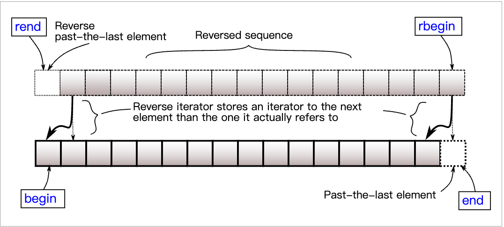

# C++ STL 标准模版库`(Standard Template Library)`

## 第一章 容器（Containers）

### 1.1 顺序容器

#### 1.1.1 array 静态的连续数组
成员函数

| 隐式定义的成员函数 |                                                                                     |
| ------------------ | ----------------------------------------------------------------------------------- |
| (构造函数)         | 遵循聚合初始化的规则初始化 array （注意默认初始化可以导致非类的 T 的不确定值）<br/> |
| (析构函数)         | 销毁 array 的每个元素<br />                                                         |
| operator=          | 以来自另一 array 的每个元素重写 array 的对应元素<br />                              |


| 元素访问   |                                       |
| ---------- | ------------------------------------- |
| at         | 访问指定的元素，同时进行越界检查<br/> |
| operator[] | 访问指定的元素<br/>                   |
| front      | 访问第一个元素<br/>                   |
| back       | 访问最后一个元素<br/>                 |
| data       | 直接访问底层数组<br/>                 |

下列代码使用`operator[]`读取并写入 `std::vector<int>`

```c++
#include <vector>
#include <iostream>
 
int main()
{
    std::vector<int> numbers {2, 4, 6, 8};
 
    std::cout << "Second element: " << numbers[1] << '\n';
 
    numbers[0] = 5;
 
    std::cout << "All numbers:";
    for (auto i : numbers) {
        std::cout << ' ' << i;
    }
    std::cout << '\n';
}
```

输出：

```c++
Second element: 4
All numbers: 5 4 6 8
```


| 迭代器             |                               |
| ------------------ | ----------------------------- |
| begin<br/>cbegin   | 返回指向起始的迭代器<br/>     |
| end<br/>cend       | 返回指向末尾的迭代器<br/>     |
| rbegin<br/>crbegin | 返回指向起始的逆向迭代器<br/> |
| rend<br/>crend     | 返回指向末尾的逆向迭代器      |


| 容量     |                        |
| -------- | ---------------------- |
| empty    | 检查容器是否为空       |
| size     | 返回容纳的元素数       |
| max_size | 返回可容纳的最大元素数 |


| 操作 |                  |
| ---- | ---------------- |
| fill | 以指定值填充容器 |
| swap | 交换内容         |

`array swap()`函数样例

```c++
#include <array>
#include <iostream>
 
template<class Os, class V> Os& operator<<(Os& os, const V& v) {
    os << "{";
    for (auto i : v) os << ' ' << i;
    return os << " } ";
}
 
int main()
{
    std::array<int, 3> a1{1, 2, 3}, a2{4, 5, 6};
 
    auto it1 = a1.begin();
    auto it2 = a2.begin();
    int& ref1 = a1[1];
    int& ref2 = a2[1];
 
    std::cout << a1 << a2 << *it1 << ' ' << *it2 << ' ' << ref1 << ' ' << ref2 << '\n';
    a1.swap(a2);
    std::cout << a1 << a2 << *it1 << ' ' << *it2 << ' ' << ref1 << ' ' << ref2 << '\n';
 
    // 注意交换后迭代器与引用保持与原 array 关联，
    // 例如 `it1` 仍指向元素 a1[0] ， `ref1` 仍指代 a1[1] 。
}
```

输出：

```c++
{ 1 2 3 } { 4 5 6 } 1 4 2 5
{ 4 5 6 } { 1 2 3 } 4 1 5 2
```


非成员函数

|                                                                                     |                                |
| ----------------------------------------------------------------------------------- | ------------------------------ |
| operator==<br/>operator!=<br/>operator<<br/>operator<=<br/>operator><br/>operator>= | 按照字典顺序比较 array 中的值  |
| std::get(std::array)                                                                | 访问 array 的一个元素          |
| std::swap(std::array)                                                               | 特化 std::swap 算法            |
| to_array                                                                            | 从内建数组创建 std::array 对象 |


#### 1.1.2 vector 动态的连续数组

```c++
#include <iostream>
#include <vector>
using namespace std;

int main(){
	  vector<int> nums {1, 2, 4, 8, 16};
	  vector<std::string> fruits {"orange", "apple", "raspberry"};
	  vector<char> empty;
 
	// 求和 vector nums 中的所有整数（若存在），仅打印结果。
	  cout << "Sum of nums: " << std::accumulate(nums.begin(), nums.end(), 0) << endl;
 
	// 打印 vector fruits 中的首个 fruis ，不检查是否有一个。
	  cout << "First fruit: " << *fruits.begin() << endl;
 
    if (empty.begin() == empty.end())
		    cout << "vector 'empty' is indeed empty." << endl;
  
    vector<int> vec;
    int i;

    // 显示 vec 的原始大小
    cout << "vector size=" << vec.size() << endl;

    // 推入 5 个值到向量中
    for( i = 0 ; i < 5 ; i++ ){
        vec.push_back(i);
    }

    // 显示 vec 拓展后的大小
    cout << "extended vector size = " << vec.size() << endl;

    // 使用下标访问向量中的值
    for( i = 0 ; i < 5 ; i++){
        cout << "value of vec [" << i << "]=" << vec[i] << endl;
    }

    // 使用迭代器 iterator 访问值
    vector<int>::iterator ite = vec.begin();
    while(ite!=vec.end()){
        cout<<"value of v = "<< *ite <<endl;
        ite++;
    }

    return 0;
}
```


成员函数

| [(构造函数)](https://zh.cppreference.com/w/cpp/container/vector/vector)           | 构造 `vector`    |
| --------------------------------------------------------------------------------- | ---------------- |
| [(析构函数)](https://zh.cppreference.com/w/cpp/container/vector/~vector)          | 析构 `vector`    |
| [operator=](https://zh.cppreference.com/w/cpp/container/vector/operator%3D)       | 赋值给容器       |
| [assign](https://zh.cppreference.com/w/cpp/container/vector/assign)               | 将值赋给容器     |
| [get_allocator](https://zh.cppreference.com/w/cpp/container/vector/get_allocator) | 返回相关的分配器 |

`operator=` 示例

下列代码用 `operator=` 赋值一个 [std::vector](http://zh.cppreference.com/w/cpp/container/vector) 给另一个：

```c++
#include <vector>
#include <iostream>
 
void display_sizes(char const* comment,
                   const std::vector<int>& nums1,
                   const std::vector<int>& nums2,
                   const std::vector<int>& nums3)
{
    std::cout << comment
              << " nums1: " << nums1.size() << ','
              << " nums2: " << nums2.size() << ','
              << " nums3: " << nums3.size() << '\n';
}
 
void display(char const* comment, const std::vector<int>& v)
{
    std::cout << comment << "{ ";
    for (int e : v) {
        std::cout << e << ' ';
    }
    std::cout << "}\n";
}
 
int main()
{
    std::vector<int> nums1 {3, 1, 4, 6, 5, 9};
    std::vector<int> nums2;
    std::vector<int> nums3;
 
    display_sizes("Initially:\n", nums1, nums2, nums3);
 
    // 从 nums1 复制赋值数据到 nums2
    nums2 = nums1;
 
    display_sizes("After assigment:\n", nums1, nums2, nums3);
 
    // 从 nums1 移动赋值数据到 nums3,
    // 修改 nums1 和 nums3
    nums3 = std::move(nums1);
 
    display_sizes("After move assigment:\n", nums1, nums2, nums3);
 
    display("Now nums3 = ", nums3);
 
    // initializer_list 的复制赋值复制数据给 nums3
    nums3 = {1, 2, 3};
 
    display("After assignment of initializer_list \n nums3 = ", nums3);
}
```

输出：

```c++
Initially:
 nums1: 6, nums2: 0, nums3: 0
After assigment:
 nums1: 6, nums2: 6, nums3: 0
After move assigment:
 nums1: 0, nums2: 6, nums3: 6
Now nums3 = { 3 1 4 6 5 9 }
After assignment of initializer_list
 nums3 = { 1 2 3 }
```

`assign()` 示例

下列代码用 `assign` 添加数个字符到 `std::vector<char>`：

void assign( size_type count, const T& value );

template< class InputIt > void assign( InputIt first, InputIt last );

void assign( std::initializer_list ilist );

替换容器的内容。

1) 以 count 份 value 的副本替换内容。
2) 以范围 `[first, last)` 中元素的副本替换内容。其中有任何一个迭代器是指向 *this 中的迭代器时行为未定义。

3) 以来自 initializer_list ilist 的元素替换内容。

所有指向容器元素的迭代器、指针及引用均被非法化。尾后迭代器也会无效化。

```c++
#include <vector>
#include <iostream>
#include <string>
 
int main()
{
    std::vector<char> characters;
 
    auto print_list = [&]()
    {
        for (char c : characters)
            std::cout << c << ' ';
        std::cout << '\n';  
    };
 
    characters.assign(5, 'a');
    print_list();
 
    const std::string extra(6, 'b');
    characters.assign(extra.begin(), extra.end());
    print_list();
 
    characters.assign({'C', '+', '+', '1', '1'});
    print_list();
}
```

输出：

```c++
a a a a a 
b b b b b b 
C + + 1 1
```

| `vector`元素访问 |                                                                                                                                                                               |
| ---------------- | ----------------------------------------------------------------------------------------------------------------------------------------------------------------------------- |
| at               | 返回位于指定位置 `pos` 的元素的引用，有边界检查。<br />若 `pos` 不在容器范围内，则抛出 [std::out_of_range](https://zh.cppreference.com/w/cpp/error/out_of_range) 类型的异常。 |
| operator[]       | 访问指定的元素                                                                                                                                                                |
| data             | 返回指向作为元素存储工作的底层数组的指针。返回的指针使得范围 `[data(),data()+size())` 始终是合法范围，即使容器为空（此时 `data()` 不可解引用）。                              |
| front            | 返回首元素的引用，对于容器c，表达式`c.front()`等价于`*c.begin()`                                                                                                              |
| back             | 返回最后元素的引用，对于非空容器c，表达式`c.back()`等价于`*std::prev(c.end())`                                                                                                |

使用`at`进行元素访问代码样例

```c++
#include <iostream>
#include <vector>
using namespace std;

int main()
{
    vector<int> data = { 1, 2, 4, 5, 5, 6 };
 
    // Set element 1
    data.at(1) = 88;
 
    // Read element 2
    cout << "Element at index 2 has value " << data.at(2) << '\n';
 
    cout << "data size = " << data.size() << '\n';
 
    try {
        // Set element 6
        data.at(6) = 666;
    } catch (out_of_range const& exc) {
        cout << exc.what() << '\n';
    }
 
    // Print final values
    cout << "data:";
    for (int elem : data)
        cout << " " << elem;
    cout << '\n';
    return 0;
}
```

`data()`示例

```c++
#include <cstddef>
#include <iostream>
#include <span>
#include <vector>
 
void pointer_func(const int* p, std::size_t size)
{
    std::cout << "data = ";
    for (std::size_t i = 0; i < size; ++i)
        std::cout << p[i] << ' ';
    std::cout << '\n';
}
 
void span_func(std::span<const int> data) // C++20 起
{
    std::cout << "data = ";
    for (const int e : data)
        std::cout << e << ' ';
    std::cout << '\n';
}
 
int main()
{
    std::vector<int> container{1, 2, 3, 4};
 
    // container.data() 优于 &container[0]
    pointer_func(container.data(), container.size());
 
    // std::span (C++20) 相比分开的指针/大小是更安全的选择。
    span_func({container.data(), container.size()});
}
```

输出：

```c++
data = 1 2 3 4 
data = 1 2 3 4
```



| `vector`迭代器      |                                                                                                                                                |
| ------------------- | ---------------------------------------------------------------------------------------------------------------------------------------------- |
| begin<br />cbegin   | 返回指向 `vector` 首元素的迭代器<br />若 `vector`为空，则返回的迭代器将等于 `end()`                                                            |
| end<br />cend       | 返回指向 `vector` 末元素后一元素的迭代器。<br />此元素表现为占位符；试图访问它导致未定义行为。                                                 |
| rbegin<br />crbegin | 返回指向逆向 `vector` 首元素的逆向迭代器。它对应非逆向 `vector` 的末元素。<br />若 `vector` 为空，则返回的迭代器等于`rend()` 。                |
| rend<br />crend     | 返回指向逆向 `vector` 末元素后一元素的逆向迭代器。它对应非逆向 `vector` 首元素的前一元素。<br />此元素表现为占位符，试图访问它导致未定义行为。 |

| 容量                                                                              |                                                                                                                |
| --------------------------------------------------------------------------------- | -------------------------------------------------------------------------------------------------------------- |
| [empty](https://zh.cppreference.com/w/cpp/container/vector/empty)                 | 检查容器是否为空，即是否`begin()==end()`                                                                       |
| [size](https://zh.cppreference.com/w/cpp/container/vector/size)                   | 返回容纳的元素数                                                                                               |
| [max_size](https://zh.cppreference.com/w/cpp/container/vector/max_size)           | 返回可容纳的最大元素数，此值通常反映容器大小上的理论极限，至多为 `std::numeric_limits<difference_type>::max()` |
| [reserve](https://zh.cppreference.com/w/cpp/container/vector/reserve)             | 预留存储空间                                                                                                   |
| [capacity](https://zh.cppreference.com/w/cpp/container/vector/capacity)           | 返回当前存储空间能够容纳的元素数                                                                               |
| [shrink_to_fit](https://zh.cppreference.com/w/cpp/container/vector/shrink_to_fit) | 通过释放未使用的内存减少内存的使用                                                                             |

`std::vector<T,Allocator>::capacity`

| size_type capacity() const noexcept; | (C++11 起) (C++20 前) |
| ------------------------------------ | --------------------- |

返回容器当前已为之分配空间的元素数。

参数：（无）

返回值：当前分配存储的容量。

复杂度：常数。

`capacity()`示例

```c++
#include <iostream>
#include <vector>
 
int main()
{
    int sz = 200;
    std::vector<int> v1;
 
    auto cap = v1.capacity();
    std::cout << "initial capacity=" << cap << '\n';
 
    for (int n = 0; n < sz; ++n) {
        v1.push_back(n);
        if (cap != v1.capacity()) {
            cap = v1.capacity();
            std::cout << "new capacity=" << cap << '\n';
        }
    }
 
    std::cout << "final size=" << v1.size() << '\n';
    std::cout << "final capacity=" << v1.capacity() << '\n';
}
```

输出：

```c++
initial capacity=0
new capacity=1
new capacity=2
new capacity=4
new capacity=8
new capacity=16
new capacity=32
new capacity=64
new capacity=128
new capacity=256
final size=200
final capacity=256
```

`std::vector<T,Allocator>::reserve`

| void reserve( size_type new_cap ); |     | (C++20 前) |
| ---------------------------------- | --- | ---------- |

增加 `vector` 的容量（即 `vector` 在不重新分配存储的情况下能最多能持有的元素的数量）到大于或等于 new_cap 的值。如果 new_cap 大于当前的 [capacity()](https://zh.cppreference.com/w/cpp/container/vector/capacity)，那么就会分配新存储，否则该方法不做任何事。

`reserve()` 不会更改 `vector` 的大小。

如果 `new_cap` 大于 [capacity()](https://zh.cppreference.com/w/cpp/container/vector/capacity)，那么所有迭代器，包含 [end()](https://zh.cppreference.com/w/cpp/container/vector/end) 迭代器和所有到元素的引用都会失效。否则，没有迭代器或引用会失效。

在调用 `reserve()` 后，插入只会在它将导致 `vector` 的大小大于 [capacity()](https://zh.cppreference.com/w/cpp/container/vector/capacity) 的值时触发重新分配。

```c++
#include <cstddef>
#include <new>
#include <vector>
#include <iostream>
 
// 带调试输出的最小 C++11 分配器
template<class Tp>
struct NAlloc
{
    typedef Tp value_type;
 
    NAlloc() = default;
    template<class T>
    NAlloc(const NAlloc<T>&) {}
 
    Tp* allocate(std::size_t n)
    {
        n *= sizeof(Tp);
        Tp* p = static_cast<Tp*>(::operator new(n));
        std::cout << "在 " << p << " 分配 " << n << " 个字节\n";
        return p;
    }
 
    void deallocate(Tp* p, std::size_t n)
    {
        std::cout << "在 " << p << "解分配 " << n * sizeof *p << " 个字节\n";
        ::operator delete(p);
    }
};
 
template<class T, class U>
bool operator==(const NAlloc<T>&, const NAlloc<U>&) { return true; }
 
template<class T, class U>
bool operator!=(const NAlloc<T>&, const NAlloc<U>&) { return false; }
 
int main()
{
    constexpr int max_elements = 32;
 
    std::cout << "使用 reserve：\n";
    {
        std::vector<int, NAlloc<int>> v1;
        v1.reserve(max_elements); // 预留至少 max_elements * sizeof(int) 个字节
 
        for (int n = 0; n < max_elements; ++n)
            v1.push_back(n);
    }
 
    std::cout << "不使用 reserve：\n";
    {
        std::vector<int, NAlloc<int>> v1;
 
        for (int n = 0; n < max_elements; ++n)
        {
            if (v1.size() == v1.capacity())
                std::cout << "size() == capacity() == " << v1.size() << '\n';
            v1.push_back(n);
        }
    }
}
```

输出：

```c++
使用 reserve：
在 0xa6f840 分配 128 个字节
在 0xa6f840 解分配 128 个字节
 
不使用 reserve：
size() == capacity() == 0
在 0xa6f840 分配 4 个字节
 
size() == capacity() == 1
在 0xa6f860 分配 8 个字节
在 0xa6f840 解分配 4 个字节
 
size() == capacity() == 2
在 0xa6f840 分配 16 个字节
在 0xa6f860 解分配 8 个字节
 
size() == capacity() == 4
在 0xa6f880 分配 32 个字节
在 0xa6f840 解分配 16 个字节
 
size() == capacity() == 8
在 0xa6f8b0 分配 64 个字节
在 0xa6f880 解分配 32 个字节
 
size() == capacity() == 16
在 0xa6f900 分配 128 个字节
在 0xa6f8b0 解分配 64 个字节
 
在 0xa6f900 解分配 128 个字节
```


| 修改器                                                                                 |                                                                                                                   |
| -------------------------------------------------------------------------------------- | ----------------------------------------------------------------------------------------------------------------- |
| [clear](https://zh.cppreference.com/w/cpp/container/vector/clear)                      | 清除内容，从容器擦除所有元素。此调用后 [size()](https://zh.cppreference.com/w/cpp/container/vector/size) 返回零。 |
| [insert](https://zh.cppreference.com/w/cpp/container/vector/insert)                    | 插入元素                                                                                                          |
| [emplace](https://zh.cppreference.com/w/cpp/container/vector/emplace)(C++11)           | 原位构造元素                                                                                                      |
| [erase](https://zh.cppreference.com/w/cpp/container/vector/erase)                      | 擦除元素                                                                                                          |
| [push_back](https://zh.cppreference.com/w/cpp/container/vector/push_back)              | 将元素添加到容器末尾                                                                                              |
| [emplace_back](https://zh.cppreference.com/w/cpp/container/vector/emplace_back)(C++11) | 在容器末尾就地构造元素                                                                                            |
| [pop_back](https://zh.cppreference.com/w/cpp/container/vector/pop_back)                | 移除末元素                                                                                                        |
| [resize](https://zh.cppreference.com/w/cpp/container/vector/resize)                    | 改变容器中可存储元素的个数                                                                                        |
| [swap](https://zh.cppreference.com/w/cpp/container/vector/swap)                        | 交换内容                                                                                                          |

| insert                                                                                                                              |                                                                                                                            | 返回值                                                              |       |
| ----------------------------------------------------------------------------------------------------------------------------------- | -------------------------------------------------------------------------------------------------------------------------- | ------------------------------------------------------------------- | :---: |
| iterator insert( const_iterator pos, const T& value );                                                                              | 1-2) 在 `pos` 前插入 `value`                                                                                               | 1-2) 指向被插入 `value` 的迭代器。                                  | （1） |
| iterator insert( const_iterator pos, T&& value );                                                                                   |                                                                                                                            |                                                                     |  (2)  |
| iterator insert( const_iterator pos, size_type count, const T& value );                                                             | 3)在 `pos` 前插入 `value` 的 `count` 个副本                                                                                | 3)指向首个被插入元素的迭代器，或者在 `count == 0` 时返回 `pos`。    | （3） |
| template< class InputIt > iterator insert( const_iterator pos, InputIt first, InputIt last );                                       | 4)在 `pos` 前插入来自范围 `[first, last)` 的元素。<br />如果 `first` 和 `last` 是指向 `*this` 中的迭代器，那么行为未定义。 | 4)指向首个被插入元素的迭代器，或者在 `first == last` 时返回 `pos`。 |  (4)  |
| iterator insert( const_iterator pos, [std::initializer_list](http://zh.cppreference.com/w/cpp/utility/initializer_list)<T> ilist ); | 5)在 `pos` 前插入来自 `initializer_list ilist` 的元素。                                                                    | 5)指向首个被插入元素的迭代器，或者在 `ilist` 为空时返回 `pos`。     |  (5)  |

`clear()`示例

```c++
#include <algorithm>
#include <iostream>
#include <vector>
 
int main()
{
    std::vector<int> container{1, 2, 3};
 
    auto print = [](const int& n) { std::cout << " " << n; };
 
    std::cout << "clear 前：";
    std::for_each(container.begin(), container.end(), print);
    std::cout << "\n大小=" << container.size() << '\n';
 
    std::cout << "执行 clear()\n";
    container.clear();
 
    std::cout << "clear 后：";
    std::for_each(container.begin(), container.end(), print);
    std::cout << "\n大小=" << container.size() << '\n';
}
```

输出：

```c++
clear 前：1 2 3
大小=3
执行 clear()
clear 后：
大小=0
```


`insert()`示例

```c++
#include <iostream>
#include <iterator>
#include <vector>
 
void print(int id, const std::vector<int>& container)
{
    std::cout << id << ". ";
    for (const int x: container)
        std::cout << x << ' ';
    std::cout << '\n';
}
 
int main ()
{
    std::vector<int> c1(3, 100);
    print(1, c1);
 
    auto it = c1.begin();
    it = c1.insert(it, 200);
    print(2, c1);
 
    c1.insert(it, 2, 300);
    print(3, c1);
 
    // it 已经失效，提供新迭代器
    it = c1.begin();
 
    std::vector<int> c2(2, 400);
    c1.insert(std::next(it, 2), c2.begin(), c2.end());
    print(4, c1);
 
    int arr[] = {501, 502, 503};
    c1.insert(c1.begin(), arr, arr + std::size(arr));
    print(5, c1);
 
    c1.insert(c1.end(), {601, 602, 603});
    print(6, c1);
}
```

输出：

```c++
1. 100 100 100
2. 200 100 100 100
3. 300 300 200 100 100 100
4. 300 300 400 400 200 100 100 100
5. 501 502 503 300 300 400 400 200 100 100 100
6. 501 502 503 300 300 400 400 200 100 100 100 601 602 603
```


#### 1.1.3 deque 双端队列

#### 1.1.4 forward_list 单链表

#### 1.1.5 list 双链表

### 1.2 关联容器

### 1.3 无序关联容器

### 1.4 容器适配器

