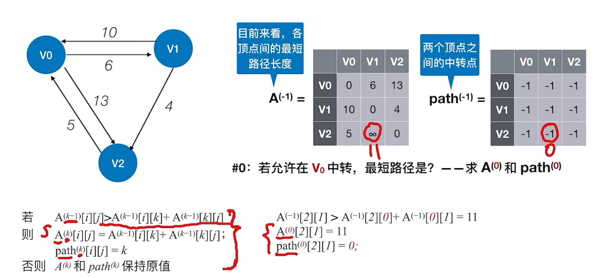

- [第一章——绪论](#第一章绪论)
- [第二章——线性表](#第二章线性表)
  - [2.1 线性表的定义和基本操作](#21-线性表的定义和基本操作)
  - [2.2 线性表的顺序表示](#22-线性表的顺序表示)
  - [2.3 线性表的链式表示](#23-线性表的链式表示)
    - [2.3.1 单链表](#231-单链表)
    - [2.3.2 双链表](#232-双链表)
    - [2.3.3 循环链表\&\&静态链表](#233-循环链表静态链表)
- [第三章——栈、队列和数组](#第三章栈队列和数组)
  - [3.1 栈](#31-栈)
    - [3.1.1 栈的基本概念](#311-栈的基本概念)
    - [3.1.2 栈的顺序存储（顺序栈）](#312-栈的顺序存储顺序栈)
      - [共享栈](#共享栈)
    - [3.1.3 栈的链式存储（链式栈）](#313-栈的链式存储链式栈)
    - [3.1.4 栈的应用](#314-栈的应用)
  - [3.2 队列](#32-队列)
    - [3.2.1 队列的基本结构](#321-队列的基本结构)
    - [3.2.2 队列的顺序存储](#322-队列的顺序存储)
    - [3.2.3 队列的链式存储](#323-队列的链式存储)
    - [3.2.4 双端队列（不受限和受限）](#324-双端队列不受限和受限)
    - [3.2.5 队列的应用](#325-队列的应用)
  - [3.3 数组和特殊矩阵](#33-数组和特殊矩阵)
- [第四章——串(不考，可略过)](#第四章串不考可略过)
  - [4.1 串的定义和实现](#41-串的定义和实现)
    - [串的顺序存储](#串的顺序存储)
    - [串的链式存储](#串的链式存储)
  - [4.2 串的模式匹配](#42-串的模式匹配)
    - [4.2.1 朴素模式匹配（定位操作）](#421-朴素模式匹配定位操作)
    - [4.2.2 KMP](#422-kmp)
    - [4.2.3 KMP算法优化——nextval数组](#423-kmp算法优化nextval数组)
- [第五章——树与二叉树](#第五章树与二叉树)
  - [5.1 树的基本概念](#51-树的基本概念)
  - [5.2 二叉树的基本概念](#52-二叉树的基本概念)
    - [5.2.1 二叉树的定义及其主要特征](#521-二叉树的定义及其主要特征)
    - [5.2.2 二叉树的存储结构、遍历](#522-二叉树的存储结构遍历)
  - [5.3 线索二叉树](#53-线索二叉树)
    - [5.3.1 线索化二叉树](#531-线索化二叉树)
    - [5.3.2 线索二叉树找前驱(后继)——没整理完整](#532-线索二叉树找前驱后继没整理完整)
  - [5.4 树、森林](#54-树森林)
    - [5.4.1 树的存储结构](#541-树的存储结构)
    - [5.4.2 树、森林与二叉树的转换](#542-树森林与二叉树的转换)
    - [5.4.3 树和森林的遍历](#543-树和森林的遍历)
  - [5.5 树与二叉树的应用](#55-树与二叉树的应用)
    - [5.5.1 哈夫曼树和哈夫曼编码](#551-哈夫曼树和哈夫曼编码)
    - [5.5.2 并查集](#552-并查集)
- [第六章——图](#第六章图)
  - [6.1 图的基本概念](#61-图的基本概念)
  - [6.2 图的存储及基本操作](#62-图的存储及基本操作)
    - [6.2.1 邻接矩阵法（顺序存储）](#621-邻接矩阵法顺序存储)
    - [6.2.2 邻接表法（顺序+链式存储）](#622-邻接表法顺序链式存储)
  - [6.3 图的遍历](#63-图的遍历)
    - [6.3.1 BFS 广度优先遍历算法](#631-bfs-广度优先遍历算法)
    - [6.3.2 DFS 深度优先遍历算法](#632-dfs-深度优先遍历算法)
  - [6.4 应用](#64-应用)
    - [6.4.1 最小生成树](#641-最小生成树)
  - [适合用于边稠密图](#适合用于边稠密图)
    - [6.4.2 最短路径](#642-最短路径)
    - [6.4.3 有向无环图（DAG）描述表达式](#643-有向无环图dag描述表达式)
    - [6.4.4 拓扑排序(逆拓扑排序)](#644-拓扑排序逆拓扑排序)
    - [6.4.5 关键路径](#645-关键路径)
- [第七章——查找](#第七章查找)
  - [7.1 查找的基本概念](#71-查找的基本概念)
  - [7.2 顺序、折半、分块](#72-顺序折半分块)
    - [7.2.1 顺序查找](#721-顺序查找)
    - [7.2.2 折半查找](#722-折半查找)
    - [7.2.3 分块查找——(手算)](#723-分块查找手算)
  - [7.3 树型查找](#73-树型查找)
    - [7.3.1 二叉排序树（二叉搜索树BST）](#731-二叉排序树二叉搜索树bst)
    - [7.3.2 平衡二叉树](#732-平衡二叉树)
    - [7.3.3 红黑树](#733-红黑树)
  - [7.4 B树和B+树](#74-b树和b树)
    - [7.4.1 B树](#741-b树)
    - [7.4.2 B+树](#742-b树)
  - [7.5 散列表（哈希表）](#75-散列表哈希表)
- [第八章——排序](#第八章排序)
  - [8.1 插入排序](#81-插入排序)
  - [8.2 交换排序](#82-交换排序)
  - [8.3 选择排序](#83-选择排序)
  - [8.4 归并排序和基数排序](#84-归并排序和基数排序)
    - [8.4.1 归并排序——稳定](#841-归并排序稳定)
    - [8.4.2 基数排序——稳定](#842-基数排序稳定)
- [第九章——算法](#第九章算法)
  - [9.1 分治法](#91-分治法)
  - [9.2 动态规划](#92-动态规划)
  - [9.3 贪心](#93-贪心)

# 第一章——绪论

# 第二章——线性表

## 2.1 线性表的定义和基本操作

## 2.2 线性表的顺序表示
- 静态分配
  - ```data[MaxSize]```
  - 基本操作：插入、删除、查找

```c++
// 静态数组插入
bool ListInsert(SqList &L, int i, int ele) {
  if (i < 1 || i > L.length + 1)
    return false;
  if (L.length >= MaxSize)
    return false;
  for (int j = L.length; j >= i; j--) {
    L.data[j] = L.data[j - 1];
  }                  // 将第i个元素及之后的元素后移
  L.data[i - 1] = ele; // 在位置i处放入ele
  L.length++;
  return true;
}

//静态数据删除
bool ListDelete(SqList &L, int i, int &deletedData) {
  if (i < 1 || i > L.length) // 判断i的范围是否有效
    return false;
  deletedData = L.data[i - 1]; // 将被删除的元素赋值给e
  for (int j = i; j < L.length; j++)
    L.data[j - 1] = L.data[j]; // 将第i个位置后的元素前移
  L.length--;
  return true;
}

// 按位查找
int GetElem(SqList L, int i) { return L.data[i - 1]; }

// 按值查找
int LocateElem(SqList L, int ele) {
  for (int i = 0; i < L.length; i++) {
    if (L.data[i] == ele)
      return i + 1;
  }
  return 0;
}
```

插入操作平均情况：

> 假设新元素插入到任何一个位置的概率相同，即 $i=1,2,3,\cdots,length,length+1$ 的概率都是 $p=\frac{1}{n+1}$
>
> - i=1, 移动n个数, 循环n次【最坏情况时间复杂度 $O(n)$ 】
> - i=2, 移动n-1个数, 循环n-1次
> - i=3, 移动n-2个数, 循环n-2次
> - ……
> - i=n, 移动1个数, 循环1次
> - i=n+1, 无需移动数组, 循环0次【最好情况时间复杂度 $O(1)$ 】
>
> 平均循环次数 = $[n+(n-1)+(n-2)+\cdots+1+0]*\frac{1}{n+1}=\frac{(1+n)n}{2}\frac{1}{n+1}=\frac{n}{2}$
>
> 平均时间复杂度为 $O(n)$

删除操作平均情况：

> 假设删除任何一个位置元素的概率相同，即 $i=1,2,3,\cdots,length$ 的概率都是 $p=\frac{1}{n}$
>
> - i=1, 移动n-1个数, 循环n-1次【最坏情况时间复杂度 $O(n)$ 】
> - i=2, 移动n-2个数, 循环n-2次
> - i=3, 移动n-3个数, 循环n-3次
> - ……
> - i=n-1, 移动1个数, 循环1次
> - i=n, 移动0个数, 循环0次【最好情况时间复杂度 $O(1)$ 】
>
> 平均循环次数 = $[(n-1)+(n-2)+\cdots+1+0]*\frac{1}{n}=\frac{(n-1)n}{2}\frac{1}{n}=\frac{n-1}{2}$
>
> 平均时间复杂度为 $O(n)$

- 动态分配

```c++
#define InitSize 10 // 顺序表的初始长度
typedef struct {
  int *data;   // 指示动态分配数组的指针
  int MaxSize; // 顺序表的最大容量
  int length;  // 顺序表的当前长度
} SeqList;     // 顺序表的类型定义(动态分配方式)

void InitList(SeqList &L) {
  // 用 malloc 函数申请一片连续的存储空间
  L.data = (int *)malloc(InitSize * sizeof(int));
  L.length = 0;
  L.MaxSize = InitSize;
}

// 增加动态数组的长度
void IncreaseSize(SeqList &L, int len) {
  L.data = (int *)realloc(L.data, (L.MaxSize + len) * sizeof(int));
  L.MaxSize = L.MaxSize + len;
}
```

## 2.3 线性表的链式表示

### 2.3.1 单链表
```c++
#include <iostream>
using namespace std;

typedef int Elemtype;

typedef struct LNode { // 定义单链表结点类型
  Elemtype data;       // 数据域，ElemType为可修改的data属性值
  struct LNode *next;  // 指针域
} LNode, *LinkList;

// 初始化一个带头结点的单链表
bool initLinkList(LinkList &L) {
  L = (LNode *)malloc(sizeof(LNode));
  if (L == NULL) // 如果初始头结点内存分配失败,则返回false
    return false;
  L->next = NULL;
  return true;
}

// 使用头插法建立单链表(带头结点)
LinkList createList_Head(LinkList &L) {
  LNode *s;
  int x;
  L = (LinkList)malloc(sizeof(LNode)); // 创建头结点
  L->next = NULL;                      // 初始为空链表
  while (cin >> x) {
    s = (LNode *)malloc(sizeof(LNode));
    s->data = x;
    s->next = L->next;
    L->next = s;
  }
  // 输入的值不是数值型数据，跳出程序
  if (cin.fail()) {
    cout << "非法输入，创建单链表结束" << std::endl;
  }
  return L;
}

// 使用尾插法建立单链表(带头结点)
LinkList createList_Tail(LinkList &L) {
  L = (LinkList)malloc(sizeof(LNode));
  LNode *s, *r = L;
  int x;
  while (cin >> x) {
    s = (LNode *)malloc(sizeof(LNode));
    s->data = x;
    r->next = s;
    r = s; // r 指向新的表尾结点
  }
  r->next = NULL; // 尾指针指向空
  // 输入的值不是数值型数据，跳出程序
  if (cin.fail()) {
    cout << "非法输入，创建单链表结束" << std::endl;
  }
  return L;
}

// 按位查找，使用 下标 返回 该单链表结点(带头结点)
LNode *GetElem(LinkList L, int i) {
  if (i < 0)
    return NULL;
  int j = 0;    // j表示指向的第几个结点
  LNode *p = L; // p 指向 L 的头结点(不带数据)
  while (p && j < i) {
    p = p->next;
    j++;
  }
  return p;
}

// 按值查找，使用 值data 返回 该点链表结点
LNode *LocateElem(LinkList L, int e) {
  LNode *p = L->next;
  while (p != NULL && p->data != e) {
    p = p->next;
  }
  return p;
}

// 按位置顺序插入(带头结点),已知要插入的位置n与新插入的结点数据e
bool InsertElem(LinkList &L, Elemtype e, int n) {
  LNode *p = GetElem(L, n - 1);
  if (p == NULL)
    return false;
  LNode *s = (LNode *)malloc(sizeof(LNode));
  if (s == NULL)
    return false; // 新结点 s 内存分配失败
  s->data = e;  
  s->next = p->next;
  p->next = s;
  return true;
}

// 按位序删除结点(带头结点),删除表L中第n个位置的元素，并用e返回删除元素的值
bool DeleteElem(LinkList &L, Elemtype &e, int n) {
  LNode *p = GetElem(L, n - 1);
  if (p == NULL || p->next == NULL)
    return false;
  LNode *q = p->next;
  e = q->data;
  p->next = q->next;
  free(q);
  return true;
}

// 后插操作，在 p 结点之后插入元素 e
bool InsertNextNode(LNode *p, int e) {
  if (p == NULL)
    return false;
  LNode *s = (LNode *)malloc(sizeof(LNode));
  if (s == NULL)
    return false; // 新结点 s 内存分配失败
  s->data = e;
  s->next = p->next;
  p->next = s;
  return true;
}

// 前插操作：在 p 结点之前插入元素 e
bool InsertPriorNode(LNode *p, int e) {
  if (p == NULL)
    return false;
  LNode *s = (LNode *)malloc(sizeof(LNode));
  if (s == NULL)
    return false; // 新结点 s 内存分配失败
  s->next = p->next;
  p->next = s;
  s->data = p->data;
  p->data = e;
  return true;
}

// 删除指定 p 结点
bool DeleteNode(LNode *p) {
  if (p == NULL)
    return false;
  LNode *q = p->next; // q 指向 p 的后继结点
  p->data = q->data;
  p->next = q->next;
  free(q);
  return true;
}

// 求表的长度
int Length(LinkList L) {
  int len = 0;
  LNode *p = L->next;
  while (p != NULL) {
    p = p->next;
    len++;
  }
  return len;
}

int main() {
  LinkList L;
  initLinkList(L);
  createList_Head(L);
  cout << L;
  return 0;
}
```

### 2.3.2 双链表

```c++
#include <iostream>
using namespace std;

typedef struct DNode {        // 定义双链表结点类型
  int data;                   // 数据域
  struct DNode *prior, *next; // 前驱和后驱指针
} DNode, *DLinkList;

// 初始化双链表
bool initDLinkList(DLinkList &L) {
  L = (DNode *)malloc(sizeof(DNode)); // 分配一个头结点
  if (L == NULL)
    return false;
  L->prior = NULL; // 头结点的prior永远指向NULL
  L->next = NULL;  // 头结点之后暂时没有结点
  return true;
}

// 在 p 结点后插入 s 结点
bool insertNextDNode(DNode *p, DNode *s) {
  if (p == NULL || s == NULL)
    return false;
  s->next = p->next;
  if (p->next != NULL) // 如果p有后继结点
    p->next->prior = s;
  s->prior = p;
  p->next = s;
  return true;
}

// 删除 p 结点的后继结点
bool deleteNextDNode(DNode *p) {
  if (p == NULL)
    return false;
  DNode *q = p->next; // 找到p结点的后继结点q
  if (q == NULL)
    return false; // p没有后继结点，q为空
  p->next = q->next;
  if (q->next != NULL) // q不是最后一个结点
    q->next->prior = p;
  free(q); // 释放结点空间
  return true;
}

// Destroy a doubly linked list by freeing each node in a loop.
void DestroyDLinkList(DLinkList &L) {
  while (L->next != NULL)
    deleteNextDNode(L);
  free(L);  // 释放头结点
  L = NULL; // 指针置空
}

void checkAllDNode(DLinkList &L) {
  DNode *p = L->next;
  while (p != NULL) { // 后向遍历
    p = p->next;
    cout << p->data << " ";
  }
  while (p != NULL) { // 前向遍历
    p = p->prior;
    cout << p->data << " ";
  }
  while (p->prior != NULL) { // 前向遍历(跳过头结点)
    p = p->prior;
    cout << p->data << " ";
  }
}

// check the DLinkList is empty or not
bool isEmptyDLinkList(DLinkList &L) { return L->next == NULL; }

void testDLinkList() {
  DLinkList L;
  initDLinkList(L);
  insertNextDNode(L, (DNode *)malloc(sizeof(DNode)));
  insertNextDNode(L->next, (DNode *)malloc(sizeof(DNode)));
  DestroyDLinkList(L);
}
```

### 2.3.3 循环链表&&静态链表

- 循环单链表:循环单链表和单链表的区别在于，表中最后一个结点的指针不是NULL，而改为指向头结点，从而整个链表形成一个环
- 循环双链表:首尾结点构成环
- 静态链表:数组第一个元素不存储数据，它的指针域存储第一个元素所在的数组下标。链表最后一个元素的指针域值为-1

```c++
#define MaxSize 100;
typedef int Elemtype;
typedef struct { // 静态链表元素结构
  Elemtype data; // 数据域
  int next;      // 指针域
} *SLinkList;
```

# 第三章——栈、队列和数组

## 3.1 栈

### 3.1.1 栈的基本概念

### 3.1.2 栈的顺序存储（顺序栈）

> n个不同元素进栈，出栈元素不同排列的个数为 $\frac{1}{n+1}C^n_{2n}$，上述公式成为卡特兰数

```c++
#include <iostream>
using namespace std;

#define MaxSize 10 // 定义栈中元素的最大个数
typedef struct {
  int data[MaxSize]; // 静态数据存放栈中元素
  int top;           // 栈顶指针
} SqStack;

// 初始化栈
void InitStack(SqStack &S) {
  S.top = -1; // 初始化栈顶指针
}

// 判断栈空与否
bool StackEmpty(SqStack S) {
  if (S.top == -1)
    return true; // 栈空
  else
    return false; // 不空
}

// 进栈
bool Push(SqStack &S, int x) {
  if (S.top == MaxSize - 1) // 栈满
    return false;
  S.top = S.top + 1; // 指针+1
  S.data[S.top] = x; // 新元素进栈
  return true;
}

// 出栈
bool Pop(SqStack &S, int &x) {
  if (S.top == -1)
    return false;    // 栈空，报错
  x = S.data[S.top]; // 栈顶元素出栈
  S.top = S.top - 1; // 指针-1
  return true;
}

// 读栈顶指针
bool GetTop(SqStack S, int &x) {
  if (S.top == -1)
    return false;
  x = S.data[S.top]; // x 记录栈顶元素
  return true;
}
```

#### 共享栈

```c++
#include <iostream>
using namespace std;

#define MaxSize 100 // 定义栈中元素的最大个数
typedef struct {
  int data[MaxSize]; // 静态数据存放栈中元素
  int top1;          // 栈顶指针1
  int top2;          // 栈顶指针2
} SqDouStack;

// 初始化栈
void InitStack(SqDouStack &S) {
  S.top1 = -1; // 初始化栈顶指针
  S.top2 = MaxSize;
}

// 判断栈空
bool StackEmpty(SqDouStack S) {
  if (S.top1 == -1 && S.top2 == MaxSize)
    return true; // 栈空
  else
    return false; // 不空
}

// 进栈
bool Push(SqDouStack &S, int x, int StackNum) {
  if (S.top1 + 1 == S.top2) // 栈满
    return false;
  if (StackNum == 1) {
    S.top1 = S.top1 + 1; // 1指针+1
    S.data[S.top1] = x;  // 新元素进栈1
  } else {
    S.top2 = S.top2 - 1; // 2指针-1
    S.data[S.top1] = x;  // 新元素进栈2
  }
  return true;
}

// 出栈
bool Pop(SqDouStack &S, int x, int StackNum) {
  if (StackNum == 1) {
    if (S.top1 == -1)
      return false;      // 栈空，报错
    x = S.data[S.top1];  // 栈顶元素出栈
    S.top1 = S.top1 - 1; // 指针-1
    return true;
  } else {
    if (S.top2 == MaxSize)
      return false;      // 栈空，报错
    x = S.data[S.top2];  // 栈顶元素出栈
    S.top2 = S.top2 + 1; // 指针-1
    return true;
  }
}

// 读栈顶指针
bool GetTop(SqDouStack S, int &x, int StackNum) {
  if (StackNum == 1) {
    if (S.top1 == -1)
      return false;
    x = S.data[S.top1]; // x 记录栈顶元素
    return true;
  } else {
    if (S.top2 == MaxSize)
      return false;
    x = S.data[S.top2]; // x 记录栈顶元素
    return true;
  }
}
```

### 3.1.3 栈的链式存储（链式栈）

```c++
#include <iostream>
using namespace std;

typedef struct LinkNode {
  int data;
  struct LinkNode *next;
} *LiStack;

typedef struct LinkStack {
  LiStack top;
  int count;
} LinkStack;

bool Push(LinkStack &s, int x) {
  LiStack p = (LiStack)malloc(sizeof(LinkNode));
  p->data = x;
  p->next = s.top;
  s.top = p;
  s.count++;
  return true;
}

bool Pop(LinkStack &s, int &x) {
  if (s.top == NULL)
    return false;
  x = s.top->data;
  LinkNode *p = s.top;
  s.top = s.top->next;
  free(p);
  s.count--;
  return true;
}
```

### 3.1.4 栈的应用

1. 括号匹配问题
```c++
#include <iostream>
using namespace std;

#define MaxSize 10
typedef struct {
  char data[MaxSize];
  int top;
} SqStack;

// 初始化栈
void InitStack(SqStack &S) { S.top = -1; }

// 判断栈是否为空
bool StackEmpty(SqStack S) {
  if (S.top == -1)
    return true;
  else
    return false;
}

// 新元素入栈
bool Push(SqStack &S, char x) {
  if (S.top == MaxSize - 1)
    return false;
  else {
    S.top++;
    S.data[S.top] = x;
    return true;
  }
}

// 栈顶元素出栈，用x返回
bool Pop(SqStack &S, char &x) {
  if (S.top == -1)
    return false;
  else {
    x = S.data[S.top];
    S.top--;
    return true;
  }
}

bool bracketCheck(char str[], int length) {
  SqStack S;
  InitStack(S); // 初始化一个栈
  for (int i = 0; i < length; i++) {
    if (str[i] == '(' || str[i] == '{' || str[i] == '[') {
      Push(S, str[i]); // 扫描到左括号，入栈操作
    } else {
      if (StackEmpty(S)) { // 扫描到右括号，然而栈空，匹配错误
        return false;
      }
      char topElem;
      Pop(S, topElem); // 栈顶元素出栈
      if (str[i] == ')' && topElem != '(')
        return false;
      if (str[i] == ']' && topElem != '[')
        return false;
      if (str[i] == '}' && topElem != '{')
        return false;
    }
  }
  return StackEmpty(S); // 检索完全部括号后，栈空说明匹配成功
}
```

2. 三种算术表达式（转换及求值）
  - 中缀表达式
  - 后缀表达式 = 逆波兰表达式【**重要**】
  - 前缀表达式 = 波兰表达式

> 后缀表达式（手算）
> 【中缀转后缀】
> “左优先”原则：只要左边的运算符能先计算，就优先算左边的


> 后缀表达式（机算）
> > ①从左往右扫描下一个元素，直到处理完所有元素
> > ②若扫描到操作数则压入栈，并回到①：否则执行③
> > ③若扫描到运算符，则弹出两个栈顶元素(<font color='red'>注意：先出栈的是“右操作数”</font>)，执行相应运算，运算结果压回栈顶，回到①

---
> 前缀表达式（手算）
> 【中缀转前缀】
> “右优先”原则：只要右边的运算符能先计算，就优先算右边的


> 前缀表达式（机算）
> > ①从右往左扫描下一个元素，直到处理完所有元素
> > ②若扫描到操作数则压入栈，并回到①：否则执行③
> > ③若扫描到运算符，则弹出两个栈顶元素(<font color='red'>注意：先出栈的是“左操作数”</font>)，执行相应运算，运算结果压回栈顶，回到①

---
> **中缀表达式转后缴表达式**（机算）
> 从左到右处理各个元素，直到末尾。可能遇到三种情况：
>
> ① 遇到操作数。直接加入后缀表达式。
> ② 遇到界限符。遇到 `(` 直接入栈；遇到 `)` 则依次弹出栈内运算符并加入后缀表达式，直到弹出  `(`  为止。注意:  `(`  不加入后缀表达式。
> ③ 遇到运算符。依次弹出栈中优先级高于或等于当前运算符的所有运算符，并加入后缀表达式， 若碰到  `(`  或栈空则停止。之后再将当前运算符入栈。
>
> 按上述方法处理完所有字符后，将栈中剩余运算符依次弹出，并加入后缀表达式。

3. 递归

```c++
#include <iostream>
#include <unordered_map>
using namespace std;

int Fib(int n) {
  static std::unordered_map<int, int> memo;

  if (n == 0)
    return 0;
  else if (n == 1)
    return 1;

  auto it = memo.find(n);
  if (it != memo.end())
    return it->second;

  int result = Fib(n - 1) + Fib(n - 2);
  memo.insert({n, result});

  for (const auto &pair : memo) {
    std::cout << "Key: " << pair.first << ", Value: " << pair.second
              << std::endl;
  }
  return result;
}

int main() {
  int x = Fib(10);
  cout << x << "  奥里给！！！" << endl;
  return 0;
}
```

## 3.2 队列

### 3.2.1 队列的基本结构

### 3.2.2 队列的顺序存储

以下Code采用队列的顺序存储，且使用循环队列存储  
为了区分队空和队满，采取入队时**少用一个队列单元**  

1. 队列空的条件为 `Q.front == Q.rear`
2. 队列满的条件为 `(Q.rear+1) % MaxSize == Q.front`
3. 队列中元素的个数 `(rear + MaxSize - front)%MaxSize`

```c++
#include <iostream>
using namespace std;

#define MaxSize 10
typedef struct SqQueue {
  int data[MaxSize];
  int front, rear;
} SqQueue;

// 初始化队列
void InitQueue(SqQueue &Q) { Q.front = Q.rear = 0; }

// 判断队列是否为空
bool QueueEmpty(SqQueue Q) {
  if (Q.front == Q.rear)
    return true;
  else
    return false;
}

// 入队（队尾入队）
bool EnQueue(SqQueue &Q, int x) {
  if ((Q.rear + 1) % MaxSize == Q.front) // 判断队满
    return false;
  Q.data[Q.rear] = x;              // 新元素插入队尾
  Q.rear = (Q.rear + 1) % MaxSize; // 队尾指针加1取模
  return true;
}

// 出队（队头出队）
bool DeQueue(SqQueue &Q, int &x) {
  if (Q.front == Q.rear) // 队空则报错
    return false;
  x = Q.data[Q.front];
  Q.front = (Q.front + 1) % MaxSize;
  return true;
}

// 获得队头元素的值,用x返回
int GetHead(SqQueue Q, int &x) {
  if (Q.front == Q.rear)
    return false; // 队空则报错
  x = Q.data[Q.front];
  return x;
}
```


### 3.2.3 队列的链式存储

队列的链式存储结构，其实就是线性表的单链表+限制，表头删除元素，表尾插入元素

基本操作：队头出队，队尾入队

```c++
#include <iostream>
using namespace std;

typedef struct LinkNode { // 队列结点
  int data;
  struct LinkNode *next;
} LinkNode;

typedef struct {          // 链式队列
  LinkNode *front, *rear; // 队头和队尾指针
} LinkQueue;

// 初始化队列(带头结点)
void InitQueue(LinkQueue &Q) {
  // 初始化,front rear 都指向头结点
  Q.front = Q.rear = (LinkNode *)malloc(sizeof(LinkNode));
  Q.front->next = NULL;
}

// 初始化队列（不带头结点）
void InitQueue_NoHead(LinkQueue &Q) {
  // 初始化,front rear 都指向NULL
  Q.front = Q.rear = NULL;
}

// 判断队列是否为空(带头结点)
bool IsEmpty(LinkQueue Q) {
  if (Q.front == Q.rear)
    return true;
  else
    return false;
}

// 判断队列是否为空（不带头结点）
bool IsEmpty_NoHead(LinkQueue Q) {
  if (Q.front == NULL)
    return true;
  else
    return false;
}

// 新元素入队（带头结点）
void EnQueue(LinkQueue &Q, int x) {
  LinkNode *s = (LinkNode *)malloc(sizeof(LinkNode));
  s->data = x;
  s->next = NULL;
  Q.rear->next = s; // 新结点插入到rear之后
  Q.rear = s;       // 修改队尾指针
}

// 新元素入队（不带头结点）
void EnQueue_NoHead(LinkQueue &Q, int x) {
  LinkNode *s = (LinkNode *)malloc(sizeof(LinkNode));
  s->data = x;
  s->next = NULL;
  if (Q.front == NULL) { // 在空队列中插入第一个元素
    Q.front = s;
    Q.rear = s;
  } else {
    Q.rear->next = s; // 新结点插入到rear结点之后
    Q.rear = s;       // 修改rear队尾指针
  }
}

// 队头元素出队（带头结点）
bool DeQueue(LinkQueue &Q, int &x) {
  if (Q.front == Q.rear) // 队空
    return false;
  LinkNode *p = Q.front->next; // p指向此次出队的队头结点
  x = p->data;                 // 用 x 返回队头的数据
  Q.front->next = p->next;     // 修改头结点的next指针

  if (Q.rear == p)    // 如果是最后一个结点出队
    Q.rear = Q.front; // 修改 rear 指针
  free(p);            // 释放结点空间
  return true;
}

// 队头元素出队（不带头结点）
bool DeQueue_NoHead(LinkQueue &Q, int &x) {
  if (Q.front == NULL)
    return false;        // 队空
  LinkNode *p = Q.front; // p指向此次出队的队头结点
  x = p->data;           // 用变量 x 返回队头的数据
  Q.front = p->next;     // 修改 front 指针
  if (Q.rear == p) {     // 倘若是队中最后一个结点出队
    Q.front = NULL;      // front 指向 NULL
    Q.rear = NULL;       // rear 指向 NULL
  }
  free(p); // 释放结点空间
  return true;
}
```

### 3.2.4 双端队列（不受限和受限）

> 1. 双端队列（不受限制）
>> 双端队列是指允许两端都可以进行入队和出队操作的队列 
>> 队列的两端分别称为前端和后端，两端都可以入队和出队
>
> 2. 输出受限的双端队列
>> 允许在一端进行插入和删除，但在另一端只允许插入的双端队列  
>
> 3. 输入受限的双端队列
>> 允许在一端进行插入和删除，但在另一端只允许删除的双端队列 

### 3.2.5 队列的应用
1. 树的层次遍历
2. 图的广度优先遍历
3. 操作系统 FCFS(先来先服务) 缓冲区

## 3.3 数组和特殊矩阵

1. 对称矩阵: 策略：只存储主对角线+下三角区
2. 三角矩阵:
   1. 下三角矩阵：除了主对角线和下三角区，其余的元素都相同
   2. 上三角矩阵：除了主对角线和上三角区，其余的元素都相同
   3. 存储策略：最后一个位置存储常量 `C`
3. 三对角矩阵【带状矩阵】： $当 |i-j|>1 时, a_{i,j}=0 (1 \leqslant i,j \leqslant n)$
4. 稀疏矩阵
   1. 顺序存储使用三元组 <行, 列, 值>
   2. 链式存储使用十字链表法

# 第四章——串(不考，可略过)

## 4.1 串的定义和实现

### 串的顺序存储
```c++
#include<iostream>
using namespace std;

#define MAXLEN 255
typedef struct SString{
    char ch[MAXLEN];
    int length;
};

typedef struct HString{
    char *ch;
    int length;
};

void initHString(HString &s){
    S.ch=(char *)malloc(MAXLEN*sizeof(char));
    S.length=0;
}

//赋值操作，将串T赋值为chars
bool StrAssign(SString &T,chars){

}

//复制操作，将串S复制得到串T
bool StrCopy(){

}

//判空操作，S空串返回TRUE，否则False
bool StrEmpty(){
    
}

//求串长，返回串的元素个数
bool StrLength(){
    
}

//求子串，用Sub返回串S的第pos个字符起长度为len的子串
bool SubString(SString &Sub,SString S,int pos,int len){
    if(pos+len-1 > S.length)        //子串
        return false;
    for(int i = pos;i<pos+len;i++)
        Sub.ch[i-pos+1] = S.ch[i];
    Sub.length = len;
    return true;
}

//比较操作,若S>T,则返回值>0;若S=T,则返回值=0;若S<T,则返回值<0
int StrCompare(SString S,SString T){
    for(int i=1; i<S.length && i<T.length; i++){
        if(S.ch[i]!=T.ch[i])
            return S.ch[i]-T.ch[i];
    }
    cout<<"字符串长度不相等,其差值为"<<S.length-T.length;
    return S.length-T.length;
}

//定位操作。若主串S中存在与串T值相同的子串，则返回它在主串S中第一次出现的位置，否则函数值为0
int Index(SString S,SString T){
    int i=1;
    SString sub;
    while(i<=S.length-T.length+1){
        SubString(sub,S,i,T.length);
        if(StrCompare(sub,T)!=0)
            ++i;
        else
            return i;
    }
    return 0;
}

//清空操作，将S清空为空串
bool ClearString(){
    
}

//销毁操作，回收存储空间
bool DestoryString(){

}

//串连接，用T返回由S1和S2联结而成的新串
bool Concat(){

}
```

### 串的链式存储
```c++
#include<iostream>
using namespace std;

#define MAXLEN 255
typedef struct StringNode{
    char ch;        //每个结点存储1个字符，存储密度低，每个字符1B，每个指针4B
    char ch[4];     //存储密度提高
    struct StringNode *next;
}StringNode,*String;

```

## 4.2 串的模式匹配

### 4.2.1 朴素模式匹配（定位操作）

主串的扫描指针 i 经常回溯，导致时间开销增加，<font color='red'>最坏时间复杂度 O ( n m ) </font>

```c++
int Index(SString S,SString T){
    int k=1;
    int i=k,j=1;
    while(i<=S.length&&j<=T.length){
        if(S.ch[i]==T.ch[j]){
            ++i;
            ++j;        //继续比较后继字符
        }else{
            k++;        //检查后一个字符串
            i=k;
            j=1;
        }
        if(j>T.length)
            return k;
        else
            return 0;
    }
}
```

### 4.2.2 KMP

改进思路：当子串和模式串不匹配时，主串指针不回溯，只有模式串指针回溯 j = next [ j ]

<font color='red'>算法平均时间复杂度：O ( n + m )</font>

```c++
int Index_KMP(SString S,SString T,int next[]){
    int i=1,j=1;
    while(i<=S.length&&j<=T.length){
        if(j==0 || S.ch[i]==T.ch[i]){
            ++i;
            ++j;
        }else{
            j=next[j];
        }
        if(j>T.length)
            return i-T.length;
        else
            return 0; 
    }
}
```
💡 next数组：当模式串的第 j 个字符匹配失败时，令模式串跳到 next [ j ] 再继续匹配   
模式串向右移动看匹配程度

> 串的前缀：包含第一个字符，且不包含最后一个字符的子串
串的后缀：包含最后一个字符，且不包含第一个字符的子串
> 

💡 当第 j 个字符匹配失败，由前 1 ～ j - 1 个字符组成的串记为 S ,则：  
next [ j ] = S 的最长相等前后缀长度 + 1  
>特别的，next [ 1 ] = 0 且 next [ 2 ] = 1


### 4.2.3 KMP算法优化——nextval数组

# 第五章——树与二叉树

## 5.1 树的基本概念

常考性质:
1. 结点数 = 总度数 + 1
2. 

3. 度为 $m$ 的树( $m$ 叉树)第 $i$ 层至多有 $m^{i-1}$ 个结点（ $i>=1$ ）
4. 高度为 $h$ 的 $m$ 叉树至多有 $\frac{m^h-1}{m-1}$ 个结点
5. - 高度 $h$ 的 $m$ 叉树至少有 $h$ 个结点
   - 高度为 $h$ 、度为 $m$ 的树至少有 $h+m-1$ 个结点
6. 具有 $n$ 个结点的 $m$ 叉树的最小高度为 $\lceil\log_m(n(m-1)+1)\rceil$

## 5.2 二叉树的基本概念

### 5.2.1 二叉树的定义及其主要特征

1. 

$$
\begin{aligned}
  ① \quad n &=n_0+n_1+n_2    \\
  ② \quad n &= n_1+2n_2+1    \\
  ②-① \quad n_0&=n_2+1   
\end{aligned}
$$

2. $非空二叉树上第 i 层上至多有 2^{i−1} 个结点（i \geqslant 1）\\[5px]$
   
3. $m叉树第 i 层至多有 m^{i - 1}个结点\\[5px]$
   
4. $高度为 h 的 二叉树 至多有 2^h - 1 个结点（满二叉树）\\[5px]$
   
5. $高度为 h 的 m叉树 至多有 \frac{m^h - 1}{m -1}个结点（h \geqslant 1）\\[5px]$
   
6. 

$$
高度为 h 的 m 叉树 至少有h个结点 \\ 高度为h 、度为m 的树至少有h+m-1个结点 
$$

7. $具有N个（N>0）结点的完全二叉树的高度为 \lceil log_{2}(N+1) \rceil 或 \lfloor log_{2}N \rfloor+1。\\[5px]$


### 5.2.2 二叉树的存储结构、遍历

1. 顺序存储(适用于完全二叉树)

```c++
#include <iostream>
#define MaxSize 100
struct TreeNode {
  int value;    // 结点中的数据元素
  bool isEmpty; // 结点是否为空
};

TreeNode t[MaxSize];

void initTree() { // 初始化
  for (int i = 0; i < MaxSize; i++) {
    t[i].isEmpty = true;
  }
};
```

2. 链式存储（遍历）
    - 先序遍历
    - 中序遍历
    - 后序遍历
    - 递归算法和非递归算法的转换
    - 层次遍历
    - 由遍历序列构造二叉树（必须由中序遍历序列）

$n$ 个结点的二叉链表共有 $n+1$ 个空链域

> 三种遍历（先序中序后序）

```c++
#include <iostream>

struct ElemType {
  int value;
};

typedef struct BiTNode {
  ElemType data;                   // 数据域
  struct BiTNode *lchild, *rchild; // 左右孩子指针
  struct BiTNode *parent; // 父结点指针(方便查找当前结点的父结点)
} BiTNode, *BiTree;

void visit(BiTree T) { std::cout << T->data.value << std::endl; }

// 先序遍历
void PreOrder(BiTree T) {
  if (T != NULL) {
    visit(T);            // 访问根结点
    PreOrder(T->lchild); // 递归遍历左子树
    PreOrder(T->rchild); // 递归遍历右子树
  }
}

// 中序遍历
void InOrder(BiTree T) {
  if (T != NULL) {
    InOrder(T->lchild); // 递归遍历左子树
    visit(T);           // 访问根结点
    InOrder(T->rchild); // 递归遍历右子树
  }
}

// 后序遍历
void PostOrder(BiTree T) {
  if (T != NULL) {
    PostOrder(T->lchild); // 递归遍历左子树
    PostOrder(T->rchild); // 递归遍历右子树
    visit(T);             // 访问根结点
  }
}

int main() {
  // 定义一棵空树
  BiTree root = NULL;

  // 插入根结点 root
  root = (BiTree)malloc(sizeof(BiTNode));
  root->data = {1};
  root->lchild = NULL;
  root->rchild = NULL;

  // 插入新结点 p
  BiTNode *p = (BiTNode *)malloc(sizeof(BiTNode));
  p->data = {2};
  p->lchild = NULL;
  p->rchild = NULL;

  // 作为根节点的左孩子插入结点 p
  root->lchild = p;
}
```

> 层序遍历

```c++
#include <iostream>

// 二叉树的结点（链式存储）
typedef struct BiTNode {
  char data;                       // 数据域
  struct BiTNode *lchild, *rchild; // 左右孩子指针
} BiTNode, *BiTree;

// 链式队列结点
typedef struct LinkNode {
  BiTNode *data; // 存指针而不是结点
  struct LinkNode *next;
} LinkNode;

typedef struct {
  LinkNode *front, *rear; // 队头队尾
} LinkQueue;

// 层序遍历
void LevelOrder(BiTree T) {
  LinkQueue Q;
  InitQueue(Q); // 初始化辅助队列
  BiTree p;
  EnQueue(Q, T);        // 将根结点入队
  while (!isEmpty(Q)) { // 队列不空则循环
    DeQueue(Q, p);      // 队头结点出队，T赋值p
    visit(p);           // 访问出队结点
    if (p->lchild != NULL)
      EnQueue(Q, p->lchild); // 左孩子入队
    if (p->rchild != NULL)
      EnQueue(Q, p->rchild); // 右孩子入队
  }
}
```

> 用土办法找到中序前驱

思路：

从根节点出发，重新进行一次中序遍历，指针 q 记录当前访问的结点，指针 pre 记录上一个被访问的结点  

① 当 $q==p$ 时，pre 为前驱  

② 当 $pre=p$ 时，q 为后继  

```c++
#include <iostream>

// 二叉树的结点（链式存储）
typedef struct BiTNode {
  char data;                       // 数据域
  struct BiTNode *lchild, *rchild; // 左右孩子指针
} BiTNode, *BiTree;

// 辅助的全局变量，用于查找结点p的前驱
BiTNode *p;            // p指向目标结点
BiTNode *pre = NULL;   // 指向当前访问结点的前驱
BiTNode *final = NULL; // 用于记录最终结果

void visit(BiTNode *q) {
  if (q == p)    // 当前访问结点刚好是结点p
    final = pre; // 找到p的前驱
  else
    pre = q; // pre指向当前访问的结点
}

// 中序遍历
void InOrder(BiTree T) {
  if (T != NULL) {
    InOrder(T->lchild); // 递归遍历左子树
    visit(T);           // 访问根结点
    InOrder(T->rchild); // 递归遍历右子树
  }
}
```

## 5.3 线索二叉树

### 5.3.1 线索化二叉树

tag == 0 , 表示指针指向的是孩子

tag == 1 , 表示指针指向的是线索  

- 中序线索化
```c++
#include <iostream>

typedef struct ElemType {
  int data;
} ElemType;

// 线索二叉树结点
typedef struct ThreadNode {
  ElemType data;
  struct ThreadNode *lchild, *rchild;
  int ltag, rtag; // 左、右线索标志，初始化为0，假设都有左右孩子
} ThreadNode, *ThreadTree;

// 全局变量 pre ，指向当前访问结点的前驱
ThreadNode *pre = NULL;

void visit(ThreadNode *q) {
  if (q->lchild == NULL) { // 左子树为空，建立前驱线索
    q->lchild = pre;
    q->ltag = 1;
  }
  if (pre != NULL && pre->rchild == NULL) {
    pre->rchild = q; // 建立前驱结点的后继线索
    pre->rtag = 1;
  }
  pre = q;
}

// 中序遍历二叉树，一边遍历一边线索化
void InThread(ThreadTree T) {
  if (T != NULL) {
    InThread(T->lchild);
    visit(T);
    InThread(T->rchild);
  }
}

// 中序线索化二叉树T，主函数
void CreateInThread(ThreadTree T) {
  pre = NULL;
  if (T != NULL) {
    InThread(T);
    // 最后检查 pre 的 rchild 是否为 NULL,如果是,则令 rtag=1
    if (pre->rchild == NULL)
      pre->rtag = 1;
  }
}
```

- 先序线索化
> 先序线索化 **有个坑**，在处理根结点之后，处理左孩子之前，需要判断改当前遍历结点的 **ltag** 标志是否为0，如果为0，则lchild不是前驱线索
>> 【综上是为了避免陷入遍历的 **死循环**】

```c++
#include <iostream>

typedef struct ThreadNode {
  int data;
  struct ThreadNode *lchild, *rchild;
  int ltag, rtag; // 左、右线索标志，初始化为0，假设都有左右孩子
} ThreadNode, *ThreadTree;

// 全局变量 pre ，指向当前访问结点的前驱
ThreadNode *pre = NULL;

void visit(ThreadNode *q) {
  if (q->lchild == NULL) { // 左子树为空，建立前驱线索
    q->lchild = pre;
    q->ltag = 1;
  }
  if (pre != NULL && pre->rchild == NULL) {
    pre->rchild = q; // 建立前驱结点的后继线索
    pre->rtag = 1;
  }
  pre = q;
}

// 先序遍历二叉树，一边遍历一边线索化
void PreThread(ThreadTree T) {
  if (T != NULL) {
    visit(T); // 先处理根结点
    if (T->ltag == 0) {
      PreThread(T->lchild); // 如果lchild不是前驱线索,继续遍历左子树
    }
    PreThread(T->rchild);
  }
}

// 先序线索化二叉树T
void CreatePreThread(ThreadTree T) {
  pre = NULL;      // pre初始为NULL
  if (T != NULL) { // 非空二叉树才能线索化
    PreThread(T);
    if (pre->rchild == NULL)
      pre->rtag = 1; // 处理遍历的最后一个结点
  }
}
```

- 后序线索化
```c++
#include <iostream>

typedef struct ThreadNode {
  int data;
  struct ThreadNode *lchild, *rchild;
  int ltag, rtag; // 左、右线索标志，初始化为0，假设都有左右孩子
} ThreadNode, *ThreadTree;

// 全局变量pre，指向当前访问结点的前驱
ThreadNode *pre = NULL;

void visit(ThreadNode *q) {
  if (q->lchild == NULL) { // 左子树为空，建立前驱线索
    q->lchild = pre;
    q->ltag = 1;
  }
  if (pre != NULL && pre->rchild == NULL) {
    pre->rchild = q; // 建立前驱结点的后继线索
    pre->rtag = 1;
  }
  pre = q;
}

// 后序遍历二叉树，一边遍历一边线索化
void PostThread(ThreadTree T) {
  if (T != NULL) {
    PostThread(T->lchild); // 后序遍历左子树
    PostThread(T->rchild); // 后序遍历右子树
    visit(T);              // 访问根结点
  }
}

// 后序线索化二叉树T
void CreatePostThread(ThreadTree T) {
  pre = NULL;      // pre初始化为NULL
  if (T != NULL) { // 非空二叉树才能线索化
    PostThread(T); // 后续线索化二叉树
    if (pre->lchild == NULL) {
      pre->rtag = 1; // 处理遍历的最后一个结点
    }
  }
}
```

### 5.3.2 <font color='red'>线索二叉树找前驱(后继)——没整理完整</font>

> 中序线索二叉树

- 中序线索二叉树找中序后继
```c++
// 找到以P为根的子树中，第一个被中序遍历的结点
ThreadNode *FirstNode(ThreadNode *p) {
  while (p->ltag == 0) // 循环寻找最左下结点（不一定是叶节点）
    p = p->lchild;
  return p;
}

// 在中序线索二叉树中找到结点p的后继结点
ThreadNode *NextNode(ThreadNode *p) {
  if (p->rtag == 0) // 右子树的最左👈下结点
    return FirstNode(p->rchild);
  else // rtag==1，直接返回后继线索
    return p->rchild;
}

// 对中序线索二叉树进行中序遍历（利用线索实现的非递归算法）
void InOrder(ThreadNode *T) {
  for (ThreadNode *p = FirstNode(T); p != NULL; p = NextNode(p))
    visit(p);
}
```

- 中序线索二叉树找中序前驱
```c++
// 找到以p为根的子树中，最后一个被中序遍历的结点
ThreadNode *LastNode(ThreadNode *p) {
  while (p->rtag == 0) // 循环寻找最右👉下结点（不一定是叶节点）
    p = p->rchild;
  return p;
}

// 在中序线索二叉树中找到结点p的前驱结点
ThreadNode *PreNode(ThreadNode *p) {
  if (p->ltag == 0) // 左子树的最右下结点
    return LastNode(p->lchild);
  else // rtag==1，直接返回前驱线索
    return p->lchild;
}

// 对中序线索二叉树进行逆向中序遍历（利用线索实现的非递归算法）
void RevInOrder(ThreadNode *T) {
  for (ThreadNode *p = LastNode(T); p != NULL; p = PreNode(p))
    visit(p);
}
```

---

> 先序线索二叉树

- 先序线索二叉树找先序前驱
- 先序线索二叉树找先序后继

---

> 后序线索二叉树

- 后序线索二叉树找后序前驱
- 后序线索二叉树着后序后继

## 5.4 树、森林

### 5.4.1 树的存储结构

- 双亲表示法（顺序存储）:每个结点中保存指向双亲的“指针”
```c++
#define MAX_TREE_SIZE 100           //树中最多结点树

typedef struct{                     //树的结点定义
    ElemType data;                  //数据元素
    int parent;                     //双亲位置域
}PTNode;

typedef struct{                     //树的结构类型
    PTNode nodes[MAX_TREE_SIZE];    //双亲表示
    int n;                          //结点数
}PTree;
```

- 孩子表示法（顺序+链式存储）
```c++
struct CTNode{
    int child;                  //孩子结点在数组中的位置
    struct CTNode *next;        //下一个孩子
};

typedef struct{
    ElemType data;
    struct CTNode *firstChild;  //第一个孩子
}CTBox;

typedef struct{
    CTBox nodes[MAX_TREE_SIZE];
    int n,r;
}CTree;
```

- 孩子兄弟表示法（链式存储）:树和二叉树的转化
```c++
typedef struct CSNode{
    ElemType data;                          //数据域
    struct CSNode *firstChild,*nextSibling; //第一个孩子和右兄弟指针
}CSNode,*CSTree;
```

### 5.4.2 树、森林与二叉树的转换
1. 树 与 二叉树 
2. 森林 -> 二叉树  
3. 二叉树 -> 森林

### 5.4.3 树和森林的遍历
| 树                   | 森林                             | 二叉树   |
| -------------------- | -------------------------------- | -------- |
| 先根遍历（深度优先） | 先序遍历（依次对每棵树先根遍历） | 先序遍历 |
| 后根遍历（深度优先） | 中序遍历（依次对每棵树后根遍历） | 中序遍历 |
| 层序遍历（广度优先） | 无                               | 无       |

## 5.5 树与二叉树的应用

### 5.5.1 哈夫曼树和哈夫曼编码

如何构造哈夫曼树:每次选两个根结点权值最小的树合并，并将二者权值之和作为新的根结点的权值

编码：固定长度，可变长度，前缀

### 5.5.2 并查集

并查集（Disjoint Set）是逻辑结构——集合的一种具体实现，只进行 “并”和“查”两种基本操作  

以下操作 :

“查”的最坏时间复杂度为 $O(n)$ 

“并”的时间复杂度为 $O(1)$  

```c++
#define SIZE 13
int UFSets[SIZE]; // 集合元素数组

// 初始化并查集
void Initial(int S[]) {
  for (int i = 0; i < SIZE; i++)
    S[i] = -1;
}

// Find "查"操作，找x所属集合（返回x所属根结点）
int Find(int S[], int x) {
  while (S[x] >= 0) // 循环寻找x的根
    x = S[x];
  return x; // 返回的根的S[]小于0
}

// Union "并"操作,将两个集合合并为一个
void Union(int S[], int Root1, int Root2) {
  // 要求Root1与Root2是不同的集合
  if (Root1 == Root2)
    return;
  // 将根Root2连接到另一根Root1下面
  S[Root2] = Root1;
}
```

优化操作  
①用根节点的绝对值表示树的结点总数  
②Union操作，让小树合并到大树，保持树的高度  

该方法构造的树高不超过 $\lfloor \log_{2}{n} \rfloor+1$  
Union操作优化后,Find操作最坏时间复杂度: $\log_{2}{n}$  

```c++
// 进行并操作，将小树合并到大树
void Union(int S[], int Root1, int Root2) {
  if (Root1 == Root2)
    return;
  // 小树接到大树下
  if (S[Root1] < S[Root2]) { // Root1的结点数量更多
    S[Root1] += S[Root2];
    S[Root2] = Root1;
  } else { // Root2的结点数量更多
    S[Root2] += S[Root1];
    S[Root1] = Root2;
  }
}
```

压缩路径——Find 操作，先找到根节点， 再将查找路径上所有结点都挂到根结点下
```c++
// 优化“查”操作,先找到根结点,再递归压缩路径
int Find_good(int S[], int x) {
  int root = x;
  while (S[root] > 0)
    root = S[root];   // 循环找到根结点
  while (x != root) { // 压缩路径
    int tmp = S[x];   // tmp指向x的父结点
    S[x] = root;      // 将x的父结点设为根结点
    x = tmp;          // 继续循环
  }
  return root;
}
```

# 第六章——图

## 6.1 图的基本概念 

> **简单路径**、**简单回路**
>> 在路径序列中，顶点不重复出现的路径称为简单路径。除第一个顶点和最后一个顶点外，其余顶点不重复出现的回路称为简单回路。

## 6.2 图的存储及基本操作

### 6.2.1 邻接矩阵法（顺序存储）

> 对于 **不带权** 的无向图、有向图
```c++
#define MaxVertexNum 100                    //顶点数目的最大值
typedef struct{
    char Vex[MaxVertexNum];                 //顶点表
    int Edge[MaxVertexNum][MaxVertexNum];   //邻接矩阵，边表
    int vexnum,arcnum;                      //图的当前顶点数和边数/弧数
}MGraph;
```
- 性质

$设图G的邻接矩阵为A（矩阵元素为 0/1），则  A^n 的元素 A^n[i][j] \\ 等于 由顶点 i 到顶点 j 的长度为 n 的路径的数目$

> 对于带权图（网）
```c++
#define MaxVertexNum 100                        //顶点数目的最大值
#define INFINITY 最大的int值                     //宏定义 常量 “无穷”
typedef char VertexType;                        //顶点的数据类型
typedef int EdgeType;                           //带权图中边上权值的数据类型
typedef struct{
    VertexType Vex[MaxVertexNum];               //顶点表
    EdgeType Edge[MaxVertexNum][MaxVertexNum];  //邻接矩阵，边的权值表
    int vexnum,arcnum;                          //图的当前顶点数和边数/弧数
}MGraph;
```

### 6.2.2 邻接表法（顺序+链式存储）
```c++
#define MaxVertexNum 100

//用邻接表存储的图
typedef struct{
    AdjList vertices;
    int vexnum,arcnum;
}ALGraph;

//顶点
typedef struct VNode{
    VertexType data;        //顶点信息
    ArcNode *first;         //第一条边/弧
}VNode,AdjList[MaxVertexNum];

//“边/弧”
typedef struct ArcNode{
    int adjvex;             //边/弧指向哪个结点
    struct ArcNode *next;   //指向下一条弧的指针
    //InfoType info;        //边权值
}ArcNode;
```

## 6.3 图的遍历
### 6.3.1 BFS 广度优先遍历算法
```c++
#include <iostream>

#define MaxVertexNum 100    // 结点的最大个数
bool visited[MaxVertexNum]; // 访问标记数组

// 广度优先遍历算法
void BFS(Graph G, int v) { // 从顶点v出发，广度优先遍历图G
  visit(v);                // 访问初始顶点v
  visited[v] = true;       // 对顶点 v 做已访问标记
  Enqueue(Q, v);           // 顶点v入队列Q
  while (!isEmpty(Q)) {
    Dequeue(v); // 顶点v出队列Q
    for (int w = FirstNeighbor(G, v); w >= 0;
         w = NextNeighbor(G, v, w)) { // 检测v的所有邻接点
      if (!visited[w]) {              // w为v的未访问的邻接顶点
        visit(w);                     // 访问w
        visited[w] = true;            // 对w做 已访问标记
        Enqueue(Q, w);                // 顶点w入队列
      }
    }
  }
}

void BFSTraverse(Graph G) { // 对图G进行广度优先遍历
  for (int i = 0; i < G.vexnum; i++) {
    visited[i] = false; // 访问标记数组初始化
  }
  InitQueue(Q);                        // 初始化辅助队列Q
  for (int i = 0; i < G.vexnum; i++) { // 从0号顶点开始遍历
    if (!visited[i]) { // 对每个连通分量调用一次BFS算法
      BFS(G, i);       // 若第i个顶点未被访问过，则执行BFS
    }
  }
}

```

时间复杂度：
1. 邻接矩阵存储的图：
   访问 $|V|$ 个顶点需要 $O(|V|)$ 的时间
   查找每个顶点的邻接点都需要 $O(|V|)$ 的时间，总共有 $|V|$ 个顶点
   总的时间复杂度为 $O(|V|^2)$
2. 邻接表存储的图：
   访问 $|V|$ 个顶点需要 $O(|V|)$ 的时间
   查找所有顶点的邻接点总共需要 $O(|E|)$ 的时间
   总的时间复杂度为 $O(|V|+|E|)$

### 6.3.2 DFS 深度优先遍历算法
```c++
#define MaxVertexNum 100    // 结点的最大个数
bool visited[MaxVertexNum]; // 访问标记数组

// 深度优先遍历算法
void DFS(Graph G, int v) { // 从顶点v出发，深度优先遍历图G
  visit(v);                // 访问初始顶点v
  visited[v] = true;       // 对顶点 v 做已访问标记
  for (int w = FirstNeighbor(G, v); w >= 0;
       w = NextNeighbor(G, v, w)) { // 检测v的所有邻接点
    if (!visited[w]) {              // w为v的未访问的邻接顶点
      DFS(G, w);
    }
  }
}

void DFSTraverse(Graph G) { // 对图G进行深度优先遍历
  for (int i = 0; i < G.vexnum; i++) {
    visited[i] = false; // 访问标记数组初始化
  }
  for (int i = 0; i < G.vexnum; i++) { // 从0号顶点开始遍历
    if (!visited[i]) { // 对每个连通分量调用一次DFS算法
      DFS(G, i);       // 若第i个顶点未被访问过，则执行DFS
    }
  }
}
```

时间复杂度：
1. 邻接矩阵存储的图：
   访问 $|V|$ 个顶点需要 $O(|V|)$ 的时间
   查找每个顶点的邻接点都需要 $O(|V|)$ 的时间，总共有 $|V|$ 个顶点
   总的时间复杂度为 $O(|V|^2)$
2. 邻接表存储的图：
   访问 $|V|$ 个顶点需要 $O(|V|)$ 的时间
   查找所有顶点的邻接点总共需要 $O(|E|)$ 的时间
   总的时间复杂度为 $O(|V|+|E|)$

## 6.4 应用
### 6.4.1 最小生成树
1. Prim算法
   从某一个顶点开始构建生成树
   每次将代价最小的新顶点纳入生成树，直到所有顶点都纳入为止
   时间复杂度 $O(|V|^2)$
   适合用于边稠密图
---
2. Kruskal算法
   每次选择一条权值最小的边，使这条边的两头连通（原本已经连通的就不选）
   直到所有结点都连通
   时间复杂度 $O(|E|\log_{2}{|E|})$
   适合用于边稀疏图

### 6.4.2 最短路径

> 单源最短路径
1. BFS 求单源最短路径（无权图）
```c++
// 求顶点 U 到其他顶点的最短路径
void BFS_MIN_Distance(Graph G, int u) {
  // d[i] 表示从 u 到 i 结点的最短路径
  for (int i = 0; i < G.vexnum; i++) {
    d[i] = ∞;     // 初始化路径长度
    path[i] = -1; // 最短路径从哪个顶点过来
  }
  d[u] = 0;
  visited[u] = true;
  EnQueue(Q, u);
  while (!isEmpty(Q)) { // BFS主过程
    DeQueue(Q, u);      // 队头元素出队
    for (w = FirstNeighbor(G, u); w >= 0; w = NextNeighbor(G, u)) {
      if (!visited[w]) {   // w 为 u 尚未访问的邻接结点
        d[w] = d[u] + 1;   // 路径长度+1
        path[w] = u;       // 最短路径应当从 u 到 w
        visited[w] = true; // 设置已访问标记
        EnQueue(Q, w);     // 顶点 w 入队
      }
    }
  }
}
```

2. Dijkstra算法 （迪杰斯特拉——带权图、无权图）

**不适合带负权值的图**

final[] ：初始化为false，循环遍历所有结点，找到还没确定最短路径，且 dist 最小的顶点 $V_i$ ,使得 final[i]=true
dist[] ：记录了从源点 $V_0$ 到其他各顶点当前的最短路径长度
path[] ：path[i]表示从源点到顶点i之间的最短路径的前驱结点，初始化为 -1


> 各个顶点之间的最短距离

Floyd算法 

初始化矩阵



$$
\begin{aligned}
& 若 A^{(k-1)}[i][j] > A^{(k-1)}[i][k] + A^{(k-1)}[k][j] \\
& 则 A^{(k)}[i][j] = A^{(k-1)}[i][k] + A^{(k-1)}[k][j]  \\
& path^{(k)}[i][j]=k  \\
& 否则 A^{(k)} 和 path^{(k)} 保持原值
\end{aligned}
$$

```c++
// 准备工作，根据图的信息初始化矩阵 A 和 path（如上图）
for(int k=0;k<n;k++){                   //考虑以 Vk 作为中转点
    for(int i=0;i<n;i++){               //遍历整个矩阵，i为行号，j为列号
        for(int j=0;j<n;j++){
            if(A[i][j]>A[i][k]+A[k][j]){//以 Vk 为中转点的路径更短
                A[i][j]=A[i][k]+A[k][j];//更新最短路径长度
                path[i][j]=k;           //中转点
            }
        }
    }
}
```

$ 时间复杂度 O(|V|^3) $  
$ 空间复杂度 O(|V|^2) $

### 6.4.3 有向无环图（DAG）描述表达式
**顶点中不可能出现重复的操作数**


Step 1：把各个操作数不重复地排成一排  
Step 2：标出各个运算符的生效顺序（先后顺序有点出入无所谓）  
Step 3：按顺序加入运算符，注意“分层” 
Step 4：从底向上逐层检章同层的运算符是否可以合体  

### 6.4.4 拓扑排序(逆拓扑排序)

AOV网：用DAG图表示一个工程，其顶点表示活动，用有向边 $ < V_i,V_j > $ 表示活动 $V_i$ 必须先于活动 $V_j$ 的这样一种关系，则将这种有向图称为顶点表示活动的网络，记为AOV网。

---

拓扑排序算法：
1. 从AOV网中选择一个入度为0的顶点输出
2. 删去此顶点，并删除以此顶点为弧尾的弧
3. 重复步骤直到输出图中全部顶点，或者找不到入度为0的顶点为止【后者表示该图不是DAG（有向无环图）】

```c++
#include <iostream>
#include <stack>
#define MaxVertexNum 100 // 图中顶点的最大数目

struct VertexType {
  int data;
};

typedef struct ArcNode {   // 边表结点
  int adjvex;              // 该弧所指向的顶点的位置
  struct ArcNode *nextArc; // 指向下一条弧的指针
  // InfoType info;       //网的边权值
} ArcNode;

typedef struct VNode { // 顶点表结点
  VertexType data;     // 顶点信息
  ArcNode *firstArc;   // 指向第一条依附于该顶点的弧的指针
} VNode, AdjList[MaxVertexNum];

typedef struct {
  AdjList vertices;   // 邻接表
  int vexnum, arcnum; // 图的顶点数和弧数
} Graph;              // Graph 是以邻接表存储的图类型

std::stack<int> S; // 用栈来实现拓扑排序

int indegree[MaxVertexNum]; // 记录每个顶点的入度

int print[MaxVertexNum]; // 记录拓扑序列

bool TopologicalSort(Graph G) {
  for (int i = 0; i < G.vexnum; i++) {
    if (indegree[i] == 0) // degree数组记录当前顶点的入度
      S.push(i);          // 将所有入度为0的顶点入栈
  }
  int count = 0; // 计数，记录当前已经输出的顶点数
  while (!S.empty()) {
    int i = S.top(); // 栈顶元素出栈
    S.pop();
    print[count++] = i; // print数组记录拓扑序列，输出顶点i
    for (
        ArcNode *p = G.vertices[i].firstArc; p;
        p = p->nextArc) { // 将所有i指向的顶点的入度减1，并且将入度为0的顶点压入栈S
      int v = p->adjvex;
      if (!(--indegree[v]))
        S.push(v); // 入度为0，则入栈
    }
  }

  if (count < G.vexnum)
    return false; // 排序失败，有向图中有回路
  else
    return true; // 拓扑排序成功
}
```

---

逆拓扑排序算法：
1. 从AOV网中选择一个出度为0的顶点输出
2. 删去此顶点，并删除以此顶点为弧头的弧
3. 重复步骤直到输出图中全部顶点，或者找不到出度为0的顶点为止【后者表示该图不是DAG（有向无环图）】

- 实现逆拓扑排序算法：（两个）

  1. 逆邻接表

  2. DFS算法
```c++
#define MaxVertexNum 100    // 结点的最大个数
bool visited[MaxVertexNum]; // 访问标记数组

void DFSTraverse(Graph G) { // 对图G进行深度优先遍历
  for (int i = 0; i < G.vexnum; i++) {
    visited[i] = false; // 访问标记数组初始化
  }
  for (int i = 0; i < G.vexnum; i++) { // 从0号顶点开始遍历
    if (!visited[i]) { // 对每个连通分量调用一次DFS算法
      DFS(G, i);       // 若第i个顶点未被访问过，则执行DFS
    }
  }
}

// 深度优先遍历算法
void DFS(Graph G, int v) { // 从顶点v出发，深度优先遍历图G
  visit(v);                // 访问初始顶点v
  visited[v] = true;       // 对顶点 v 做已访问标记
  for (int w = FirstNeighbor(G, v); w >= 0;
       w = NextNeighbor(G, v, w)) { // 检测v的所有邻接点
    if (!visited[w]) {              // w为v的未访问的邻接顶点
      DFS(G, w);
    }
  }
  print(v); // 输出顶点
}
```

### 6.4.5 关键路径
AOE网：在带权有向图中，以顶点代表事件，以有向边表示活动，以边上的权值表示完成该活动的开销（时间），称之为用边表示活动的网络。

仅有一个入度为0的顶点，称为开始顶点（源点），它表示整个工程的开始；

仅有一个出度为0的顶点，称为结束顶点（汇点），它表示整个工程的结束。

从源点到汇点的有向路径可能有多条，所有路径中，具有最大路径长度的路径称为关键路径，而把关键路径上的活动称为关键活动

- 若关键活动耗时增加，则整个工程的工期将增长
- 缩短关键活动的时间，可以缩短整个工程的工期
- 当缩短到一定程度时，关键活动可能会变成非关键活动

> 1. 事件 $V_k$ 的最早发生时间 $ve(k)$ - 决定了所有从 $V_k$ 开始的活动能够开工的最早时间
> 2. 活动 $a_i$ 的最早开始时间 $e(i)$ - 指该活动 $a_i$ 弧的起点所表示的事件的最早发生时间
> 3. 事件 $V_k$ 的最迟发生时间 $vl(k)$ - 它是指在不推迟整个工程完成的前提下，该事件最迟必须发生的时间。
> 4. 活动 $a_i$ 的最迟开始时间 $l(i)$ - 它是指该活动 $a_i$ 弧的终点所表示事件的最迟发生时间与该活动所需时间之差。
> 5. 活动的时间余量 $d(i)=l(i)-e(i)$ - 表示在不增加完成整个工程所需总时间的情况下，活动a可以拖延的时间
>> ps: $d(i)=0$ 的活动是关键活动，由关键活动组成的路径就是关键路径

# 第七章——查找

## 7.1 查找的基本概念

## 7.2 顺序、折半、分块

### 7.2.1 顺序查找

```c++
struct ElemType {
  int key;
  int operator!=(ElemType e) { return key != e.key; }
};

typedef struct {  // 查找表的数据结构（顺序表）
  ElemType *elem; // 动态数据基址
  int TableLen;   // 表的长度
} SSTable;

// 顺序查找_非哨兵
int Search_Seq(SSTable ST, ElemType key) {
  int i;
  for (i = 0; i < ST.TableLen && ST.elem[i] != key; i++) {
  }
  // 查找成功，则返回元素下标；查找失败，则返回-1
  return i == ST.TableLen ? -1 : i;
}

// 顺序查找_哨兵，数据从下标1开始存储
int Search_Seq_sentinel(SSTable ST, ElemType key) {
  ST.elem[0] = key; // 哨兵
  int i;
  for (i = ST.TableLen; ST.elem[i] != key; --i) { // 从后往前查找
  }
  return i; // 查找成功，则返回元素下标；查找失败，则返回0
}
```

查找成功 $ASL_{成功}=\frac{1+2+3+\cdots+n}{n}=\frac{n+1}{2}$  
查找失败 $ASL_{失败}=n+1$  

顺序查找的优化（对于顺序表）【递增或递减】  
查找失败 $ASL_{失败}=\frac{1+2+3+\cdots+n+n}{n+1}=\frac{n}{2}+\frac{n}{n+1}$

### 7.2.2 折半查找
又称二分查找，仅适用于 <font color='red'>有序</font> 的 <font color='red'>顺序表</font>

$具有n个 (n>0) 结点的完全二叉树的高度为 \log_{2}{(n+1)} 或 \log_{2}{n}+1$

$时间复杂度 O(\log_{2}{n})$

```c++
struct ElemType {
  int key;
  int operator!=(ElemType e) { return key != e.key; }
  int operator==(ElemType e) { return key == e.key; }
  int operator>(ElemType e) { return key > e.key; }
  int operator<(ElemType e) { return key < e.key; }
};

typedef struct {  // 查找表的数据结构（顺序表）
  ElemType *elem; // 动态数据基址
  int TableLen;   // 表的长度
} SSTable;

int Binary_Search(SSTable L, ElemType key) {
  int low = 0, high = L.TableLen - 1;
  while (low <= high) {
    int mid = (low + high) / 2; // 取中间位置
    if (L.elem[mid] == key) {
      return mid; // 查找成功则返回所在位置
    } else if (L.elem[mid] > key) {
      high = mid - 1; // 从前半部分继续查找
    } else {
      low = mid + 1; // 从后半部分继续查找
    }
  }
  return -1; // 查找失败，返回 -1
}
```

折半查找判定树的构造  
平衡二叉树  
右子树结点数-左子树结点数 = 0 或 1  
判定树结点关键字：左＜中＜右，满足二叉排序树的定义  
失败结点：n+1个（等于成功结点的空链域数量）  

### 7.2.3 分块查找——(手算)

索引块之间有序, 索引块内无序

对索引表进行折半查找时，若索引表中不包含目标关键字， 则折半查找最终停在 low > high ，要在 low 所指分块中查找

```c++
//索引表
typedef struct{
    ElemType maxValue;  //每个分块的最大关键字
    int low,high;       //存储空间的索引下标范围
}Index;

//顺序表实际存储的元素
ElemType List[100];
```

假设，长度为 n 的查找表被均匀地分为 b 块，每块 s 个元素
分块查找的平均查找长度为 $ASL_{分块查找}=ASL_{索引查找}+ASL_{块内查找}$
① 用 <font color='blue'>顺序</font> 查找索引表

$$
\begin{aligned}
n &=b*s   \\[5px]
ASL_{分块查找} &=ASL_{索引顺序}+ASL_{块内顺序}    \\[5px] 
ASL_{索引顺序} &=\frac{1+2+ \dots +b}{b}=\frac{b+1}{2}    \\[5px]
ASL_{块内顺序} &=\frac{1+2+ \dots +s}{s}=\frac{s+1}{2}
\end{aligned}
$$

$$
\begin{aligned}
    ASL &=\frac{b+1}{2}+\frac{s+1}{2} \\[5px]
        &=\frac{\frac{n}{s}+1}{2}+\frac{s+1}{2} \\[5px]
        &=\frac{s^2+2s+n}{2s},当s=\sqrt{n}时，ASL_{最小}=\sqrt{n}+1
\end{aligned}
$$

② 用 <font color='blue'>折半</font> 查找索引表

$$
ASL=\lceil \log_{2}{(b+1)} \rceil+\frac{s+1}{2}
$$

## 7.3 树型查找

### 7.3.1 二叉排序树（二叉搜索树BST）

建立、查找、插入等相关操作

```c++
#include <iostream>

// 二叉排序树结点
typedef struct BSTNode {
  int key;
  struct BSTNode *lchild, *rchild;
} BSTNode, *BSTree;

// 在二叉排序树中查找值为 key 的结点
BSTNode *BST_Search(BSTree T, int key) {
  while (T != NULL && key != T->key) { // 若树空或等于根结点值，则结束循环
    if (key < (T->key))
      T = T->lchild; // 小于，则在左子树上查找
    else
      T = T->rchild; // 大于，则在右子树上查找
  }
  return T;
}

// 在二叉排序树中查找值为 key 的结点（递归实现）
BSTNode *BSTSearch(BSTree T, int key) {
  if (T == NULL)
    return NULL; // 查找失败
  if (key == T->key)
    return T; // 查找成功
  else if (key < T->key)
    return BSTSearch(T->lchild, key); // 在左子树中查找
  else
    return BSTSearch(T->rchild, key); // 在右子树中查找
}

// 在二叉排序树插入关键字为 k 的新结点（递归实现）
int BST_Insert(BSTree &T, int k) {
  if (T == NULL) { // 原树为空，新插入的结点为根结点
    T = (BSTree)malloc(sizeof(BSTNode));
    T->key = k;
    T->lchild = T->rchild = NULL;
    return 1;             // 返回 1 ，插入成功
  } else if (k == T->key) // 树中存在相同关键字的结点，插入失败，返回 0
    return 0;
  else if (k < T->key) // 插入到 T 的左子树
    return BST_Insert(T->lchild, k);
  else // 插入到 T 的右子树
    return BST_Insert(T->rchild, k);
}

// 按照 str[] 中的关键字序列建立二叉排序树
void Create_BST(BSTree &T, int str[], int n) {
  T = NULL; // 初始化 T 为空树
  int i = 0;
  while (i < n) { // 依次将每个关键字插入到二叉排序树中
    BST_Insert(T, str[i]);
    i++;
  }
}
```

### 7.3.2 平衡二叉树

```c++
#include<iostream>
using namespace std;
typedef struct AVLNode{
    int key;        //结点关键词
    int balance;    //平衡因子
    struct AVLNode *lchild,*rchild;
}AVLNode,*AVLTree
```

基本操作：插入
1. 调整LL（右旋操作）: 实现 f 向右下旋转，p 向右上旋转:

> 其中 f 是爹，p 为左孩子，gf 为 f 他爹  
> ① f -> lchild = p -> rchild;  
> ② p -> rchild = f;  
> ③ gf -> lchild/rchild = p;  

2. 调整RR（左旋操作）: 实现 f 向左下旋转，p 向左上旋转:

> 其中 f 是爹，p 为右孩子，gf 为 f 他爹  
> ① f -> rchild = p -> lchild;  
> ② p -> lchild = f;  
> ③ gf -> lchild/rchild = p;  

3. 调整LR 左旋再右旋

4. 调整RL 右旋再左旋

基本操作：删除
1. 删除结点（方法同“二叉排序树”）
   - 若删除的结点是叶子，直接删。
   - 若删除的结点只有一个子树，用子树顶替删除位置
   - 若删除的结点有两棵子树，用前驱（或后继）结点顶替，并转换为对前驱（或后继）结点的删除。
2. 一路向北找到最小不平衡子树，找不到就完结撒花
3. 找最小不平衡子树下，“个头”最高的儿子、孙子
4. 根据孙子的位置，调整平衡（LL/RR/LR/RL） 
   - 孙子在LL: 儿子右单旋
   - 孙子在RR: 儿子左单旋
   - 孙子在LR: 孙子先左旋，再右旋
   - 孙子在RL: 孙子先右旋，再左
5. 如果不平衡向上传导，继续②


### 7.3.3 红黑树
红黑树是二叉排序树:左子树结点值≤根结点值≤右子树结点值

①每个结点或是红色，或是黑色的  
②根节点是黑色的  
③叶结点（外部结点、NULL结点、失败结点）均是黑色的  
④不存在两个相邻的红结点（即红结点的父节点和孩子结点均是黑色）  
⑤对每个结点，从该节点到任一叶结点的简单路径上，所含黑结点的数目相同  

**口诀：左根右，根叶黑，不红红，黑路同**

```c++
struct RBnode {   // 红黑树的结点定义
  int key;        // 关键字的值
  RBnode *parent; // 父结点指针
  RBnode *lChild; // 左孩子指针
  RBnode *rChild; // 右孩子指针
  int color; // 结点颜色,可用 0/1 代表 黑/红,也可用enum枚举表示颜色
};
```

性质：
1. 从根节点到叶结点的最长路径不大于最短路径的2倍
2. 有n个内部节点的红黑树高度 $h \leqslant 2\log_{2}{(n+1)}$
3. 红黑树的查找操作时间复杂度为 $O(\log_{2}{n})$
4. 结点的黑高bh——从某结点出发（不含该结点）到达任一叶结点的路径上黑结点总数

> 结论：若根节点黑高为h，内部结点数（关键字）最少有 $2^h-1$ 个【满二叉树的状态】  
> 性质2证明：若红黑树总高度 = h ，则根节点黑高 $bh \geqslant \frac{h}{2}$ ,因此内部结点数 $n \geqslant 2^{\frac{h}{2}}-1$ ,由此推出 $h \leqslant 2\log_2(n+1)$

插入操作：
- 先查找，确定插入位置（原理同二叉排序树），插入新结点 
- <font style="background-color:#00ff90">新结点</font>是<font style="background-color:black;color:white">根</font>--染为<font style="background-color:black;color:white">黑色</font>
- <font style="background-color:#00ff90">新结点</font><font style="background-color:red;color:white">非根</font>--染为<font style="background-color:red;color:white">红色</font>
  - 若插入新结点后依然满足红黑树定义，则插入结束
  - 若插入新结点后不满足红黑树定义，需要<font style="background-color:yellow">调整</font>，使其重新满足红黑树定义
    - <font style="background-color:black;color:white">黑叔</font>：旋转+染色
      - LL型：右单旋，父换爷+染色
      - RR型：左单旋，父换爷+染色
      - LR型：左、右双旋，儿换爷+染色
      - RL型：右、左双旋，儿换爷＋染色
    - <font style="background-color:red;color:white">红叔</font>：染色+变新
      - 叔父爷染色，爷变为新结点
## 7.4 B树和B+树

### 7.4.1 B树

```c++
// 5叉排序树的结点定义
struct Node{
    ElemType keys[4];       // 最多4个关键字
    struct Node *child[5];  // 最多5个孩子
    int num;                // 结点中有几个关键字
}
```

> m阶B树【多路平衡查找树】的核心特性
> 1. 树中每个结点至多有m棵子树，即至多含有m-1个关键字。
> 2. 根结点的子树数 $ \in [ 2 , m ]$ , 关键字个数 $ \in[1 , m-1] $
>     其他子树的子树数 $ \in [\lceil m/2 \rceil,m]$,关键字个数 $ \in [ \lceil m/2\rceil-1 ,m-1]$
> 3. 对任一结点，其所有子树的高度相同
> 4. 所有的叶结点都出现在同一层次上，并且不带信息【失败结点，空指针】
> 6. 关键字的值：子树0 < 关键字1 < 子树1 < 关键字2 ...

<font size=5px>如何保证查找效率</font>

策略1：m叉查找树中，规定 <font color='red'>除了根结点外</font>，任何结点至少有 $\color{red}{\lceil m/2 \rceil}$ 个分叉，即至少含有 $\color{red}{\lceil m/2 \rceil-1}$ 个关键字
&emsp;example:
&emsp;对于5叉排序树，除了根结点外，任何结点都至少有3个分支，2个关键字

---

策略2：m叉查找树中，规定对于任何一个结点，其所有子树的高度都要相同

---

所有非叶节点的结构如下：

$$
K_i 代表结点的关键字    \\[5px]
P_i 代表指向子树根结点的指针    \\[5px]
\begin{array}{|c|c|c|c|c|c|c|c|c|}
 n & P_0 & K_1 & P_1 & K_2 & P_2 & \dots & K_n & P_n 
\end{array}
$$

最小高度——让每个结点尽可能的满，有 $m-1$ 个关键字, $m$ 个分叉，则有 $n<=(m-1)(1+m+m^2+m^3+\cdots+m^{h-1})=m^h-1$ ,因此 $h>=\log_m(n+1)$

最大高度——让各层的分叉尽可能的少，即根节点只有2个分叉，其他结点只有 $\lceil m/2 \rceil$ 个分叉
各层结点至少有:
第一层 $1$ 
第二层 $2$ 
第三层 $2\lceil m/2 \rceil$
第h层 $2(\lceil m/2 \rceil)^{h-2}$
第h+1层【叶子结点】 $2(\lceil m/2 \rceil)^{h-1}$

n个关键字的B树必有n+1个叶子结点，则 $n+1>=2(\lceil m/2 \rceil)^{h-1}$ ,即 $ h<=\log_{\lceil m/2 \rceil}\frac{n+1}{2}+1$

基本操作：插入【注意溢出分裂】、删除【如果为终端结点，则直接删除；若不是终端结点，使用直接前驱或者直接后继取代被删除的元素,若元素数量不够可向兄弟结点借元素，倘若兄弟结点数量也不够，可考虑合并结点】

### 7.4.2 B+树
一棵m阶的B+树需满足下列条件：

1. 每个分支结点最多有m棵子树（孩子结点）。
2. 非叶根结点至少有两棵子树，其他每个分支结点至少有 $\lceil m/2 \rceil$ 棵子树。
3. 结点的子树个数与关键字个数相等。
4. 所有叶结点包含全部关键字及指向相应记录的指针，叶结点中将关键字按大小顺序排列，并且相邻叶结点按大小顺序相互链接起来。

## 7.5 散列表（哈希表）

散列函数可能会把两个或两个以上的不同关键字映射到同一地址，称这种情况为 **冲突**  
这些发生碰撞的不同关键字成为称为 **同义词**

在开放定址法中散列到同一个地址而产生的"堆积"问题，是同义词冲突的探查序列和非同义词之间不同的探查序列交织在一起，导致关键字查询需要经过较长的探测距离，降低了散列的效率。因此要选择好的处理冲突的方法来避免"堆积"

装填因子 $ \alpha =\frac{表中记录数}{散列表长度} $

构造方法：
1. 除留余数法 $\quad H(key)=key\mod{p} \quad$  
    散列表表长为m，取一个不大于m但最接近或等于m的质数p
2. 直接定址法 $\quad H(key)=key \quad 或者 \quad H(key)=a*key+b \quad$ 计算简单，不会产生冲突，适用于关键字分布基本连续的情况
3. 数字分析法  &emsp; 选取数码分布较为均匀的若干位作为散列地址【比如手机号】
4. 平方取中法  &emsp; 取关键字的平方值的中间几位作为散列地址

解决冲突的方法：
1. 开放定址法 $H_i = (H(key)+d_i)\mod{m}, d_i为增量数列, m为表长度 $ 
   1. 线性探测法，即发生冲突时，每次往后探测相邻的下一个单元是否为空, $d_i=0,1,2,3,\cdots,m-1$
   2. 平方探测法, $d_i=0^2,1^2,-1^2,2^2,-2^2,\cdots,k^2,-k^2\quad 其中 k<=\frac{m}{2}$
   3. 伪随机序列法
   4. 再散列法
      <font style="background-color:red;color:white">注意：采用“开放定址法”时，删除结点不能简单地将被删结点的空间置为空，否则将截断在它之后填入散列表的同义词结点的查找路径，可以做一个“删除标记”，进行逻辑删除</font>
2. 拉链法

# 第八章——排序

## 8.1 插入排序
1. 直接插入排序（哨兵与否）[稳定]
   - 最好时间复杂度 $ O(n) $
   - 最坏时间复杂度 $ O(n^2) $
   - 平均时间复杂度 $ O(n^2) $
   - 适用于顺序表、链表
2. 折半插入排序[稳定]
   - 最好时间复杂度 $ O(n) $
   - 最坏时间复杂度 $ O(n^2) $
   - 平均时间复杂度 $ O(n^2) $
   - 仅适用于顺序表
3. 希尔排序[不稳定]
   - 时间复杂度:未知
   - 仅用于顺序表
```c++
// 直接插入排序
void InsertSort(int A[], int n) {
  int i, j, temp;
  for (i = 1; i < n; i++) { // 将各元素插入已排好序的序列中
    if (A[i] < A[i - 1]) {  // 若A[i]关键字小于前驱
      temp = A[i];
      for (j = i - 1; j >= 0 && A[j] > temp; --j) {        // 检查所有前面已排好序的元素
        A[j + 1] = A[j]; // 所有大于temp也就是A[i]的元素都往后挪位
      }
      A[j + 1] = temp; // 复制到插入位置
    }
  }
}

// 直接插入排序（带哨兵）数组存储从下标1开始
void _InsertSort(int A[], int n) {
  int i, j;
  for (i = 2; i < n; i++) {
    if (A[i] < A[i - 1]) {
      A[0] = A[i];
      for (j = i - 1; A[0] < A[j]; --j) {
        A[j + 1] = A[j];
      }
      A[j + 1] = A[0];
    }
  }
}

// 折半插入排序
void HalfInsertSort(int A[], int n) {
  int i, j, low, high, mid;
  for (i = 2; i <= n; i++) { // 依次将A[2]~A[n]插入前面的已排序序列
    A[0] = A[i];             // 将A[i]暂存到A[0]
    low = 1;
    high = i - 1;         // 设置折半查找的范围
    while (low <= high) { // 折半查找（递增有序序列）
      mid = (low + high) / 2;
      if (A[mid] > A[0])
        high = mid - 1;
      else
        low = mid + 1;
    }
    for (j = i - 1; j >= high + 1; --j) {
      A[j + 1] = A[j]; // 统一后移元素，空出插入位置
    }
    A[high + 1] = A[0]; // 插入操作
  }
}

// 希尔排序
void ShellSort(int A[], int n) {
  int d, i, j; // A[0]只是暂存单元，不是哨兵，当j<=0时，插入位置已到
  for (d = n / 2; d >= 1; d = d / 2) { // 步长变化
    for (i = d + 1; i <= n; i++) {
      if (A[i] < A[i - d]) { // 需将A[i]插入有序增量子表
        A[0] = A[i];         // 暂存A[0]
        for (j = i - d; j > 0 && A[0] < A[j]; j -= d) {
          A[j + d] = A[j]; // 记录后移，寻找插入位置
        }
        A[j + d] = A[0]; // 插入
      }
    }
  }
}
```

## 8.2 交换排序
1. 冒泡排序[稳定]
   - 从后往前，两两比较，若为逆序，则交换次序
   - 每一躺效果就是，最小的元素依次来到头部
   - 最好情况(有序): $$比较次数=n-1;交换次数=0 \\ 最好时间复杂度=O(n)$$
   - 最坏情况(逆序): $$比较次数=(n-1)+(n-2)+\cdots+1=\frac{n(n-1)}{2}=交换次数 \\ 最坏时间复杂度为O(n^2)$$
   - 平均时间复杂度 $O(n^2)$
   - 适用性：顺序表、链表都可以
2. 快速排序[不稳定]
   - 时间复杂度 $O(n*递归层数)$
   - 最好时间复杂度 $=O(n\log_{2}{n})$ 最坏时间复杂度 $=O(n^2)$
   - 平均时间复杂度 $=O(n\log_{2}{n})$
   - 当每次的枢轴都把表等分为长度相近的两个子表时，速度是最快的;当表本身已经有序或逆序时，速度最慢
   - 快排的阶段性排序结果的特点是，第i趟完成时，至少会有i个以上的数出现在它最终将要出现的位置

```c++
// 冒泡排序
void swap(int &a, int &b) {
  int temp = a;
  a = b;
  b = temp;
}

void BubbleSort(int A[], int n) {
  for (int i = 0; i < n - 1; i++) {
    bool flag = false; // 表示本趟冒泡是否发生交换的标志
    for (int j = n - 1; j > i; j--) { // 一趟冒泡过程
      if (A[j - 1] > A[j]) {          // 若为逆序
        swap(A[j - 1], A[j]);
        flag = true;
      }
      if (flag == false) // 本趟遍历后没有发生交换，说明表已经有序
        return;
    }
  }
}

// 快速排序, 对于顺序表
int Partition(int A[], int low, int high) {
  int pivot = A[low];  // 第一个元素作为枢轴
  while (low < high) { // 用low、high搜索枢轴的最终位置
    while (low < high && A[high] >= pivot)
      --high;
    A[low] = A[high]; // 比枢轴小的元素移动到左端
    while (low < high && A[low] <= pivot)
      ++low;
    A[high] = A[low]; // 比枢轴大的元素移动到右侧
  }
  A[low] = pivot; // 枢轴元素存放到最终位置
  return low;     // 返回存放枢轴的最终位置
}

void QuickSort(int A[], int low, int high) {
  if (low < high) {                         // 递归跳出的条件
    int pivotpos = Partition(A, low, high); // 划分
    QuickSort(A, low, pivotpos - 1);        // 划分左子表
    QuickSort(A, pivotpos + 1, high);       // 划分右子表
  }
}

// 快速排序, 对于单链表
typedef struct LNode {
  int data;
  struct LNode *next;
} LNode;

/**
 * Swaps the data between two LNode objects.
 *
 * @param pA Reference to the first LNode object.
 * @param pB Reference to the second LNode object.
 */
void swap(LNode &pA, LNode &pB) {
  int tmp = pA.data;
  pA.data = pB.data;
  pB.data = tmp;
}

/**
 * Partitions the linked list around a pivot element.
 *
 * @param pHead Pointer to the head of the linked list.
 * @param pTail Pointer to the tail of the linked list.
 *
 * @return Pointer to the pivot element after partition.
 */
LNode *GetMid(LNode *pHead, LNode *pTail) {
  LNode *p = pHead;
  LNode *q = pHead->next;
  while (q != pTail) {
    if (q->data < key) {
      p = p->next;
      swap(p,q);
    }
    q=q->next;
  }
  swap(pHead, p);
  return p;
}

void QuickSort(LNode *pHead, LNode *pTail) {
  if (pHead == pTail) {
    return;
  } else {
    LNode *pMid = GetMid(pHead, pTail);
    QuickSort(pHead, pMid);
    QuickSort(pMid->next, pTail);
  }
}
```

## 8.3 选择排序

选择排序:每一趟在待排序元素中选取关键字最小（或最大）的元素加入有序子序列

1. 简单选择排序[不稳定]:
   - 总共需要对比关键字次数 $ =(n-1)+(n-2)+\cdots+1=\frac{n(n-1)}{2} $
   - 元素交换次数 $＜ n-1$ 次
   - 适用于顺序表、链表
2. 推排序[不稳定]
   - 大根堆：根>=左、右
   - 处理过程：每个结点与左右孩子对比，若不满足大根堆要求，则将结点与孩子中最大的那个互换
   - 若元素互换破坏了下一级的堆，则采用相同的方法继续往下调整（小元素不断“下坠”）
   - 时间复杂度:建堆 $O(n)$ 、排序 $O(n\log_{2}{n})$ ;总的时间复杂度= $O(n\log_{2}{n}）$
   - 基于大根堆的堆排序得到"递增序列",基于小根堆的堆排序得到"递减序列"

堆排序的简单操作:
1. 插入
   - 对于小根堆，新元素放到表尾，与父节点对比， 若新元素比父节点更小，则将二者互换。新元素就这样一路“上升”，直到无法继续上升为止
2. 删除
   - 被删除的元素用堆底元素替代，然后让该元素不断“下坠”，直到无法下坠为止

```c++
void swap(int &a, int &b) {
  int temp = a;
  a = b;
  b = temp;
}

// 简单选择排序
void SelectSort(int A[], int n) {
  for (int i = 0; i < n - 1; i++) {   // 一共进行n-1趟
    int min = i;                      // 记录最小元素位置
    for (int j = i + 1; j < n; j++) { // 在A[i...n-1]中选择最小的元素
      if (A[j] < A[min])
        min = j; // 更新最小元素位置
    }
    if (min != i)
      swap(A[i], A[min]); // 封装交换元素
  }
}

// 将以k为根的子树调整为大根堆
void HeadAdjust(int A[], int k, int len) {
  A[0] = A[k];                            // A[0]暂存子树的根结点
  for (int i = 2 * k; i <= len; i *= 2) { // 沿着key较大的结点往下筛选
    if (i < len && A[i] < A[i + 1])
      i++;           // 取key较大的结点子结点的下标
    if (A[0] > A[i]) // 筛选结束
      break;
    else {
      A[k] = A[i]; // 将A[i]调整到双亲结点上
      k = i;       // 修改k值，以便继续向下筛选
    }
  }
  A[k] = A[0]; // 被筛选的值放入最终位置
}

// 建立大根堆
void BuildMaxHeap(int A[], int len) {
  for (int i = len / 2; i > 0; i--) // 从后往前调整所有非终端结点
    HeadAdjust(A, i, len);
}

// 堆排序
void HeapSort(int A[], int len) {
  BuildMaxHeap(A, len);           // 初始建堆
  for (int i = len; i > 1; i--) { // n-1趟的交换和建堆过程
    swap(A[i], A[1]);             // 堆顶元素和堆底元素交换
    HeadAdjust(A, 1, i - 1);      // 剩余待排序元素整理成堆
  }
}
```

## 8.4 归并排序和基数排序

### 8.4.1 归并排序——稳定

归并:把两个或多个已经有序的序列合并成一个有序序列
1. 结论：n个元素进行2路归并排序，归并趟数= $\lceil \log_{2}{n} \rceil$
2. 每趟归并时间复杂度为 $O(n)$
3. 则算法时间复杂度为 $O(n\log_{2}{n})$

<font style="color:red">m路归并，每选出一个元素需要对比关键字 m-1 次</font>


```c++
#include <iostream>
#define MaxSize 100

int *B = (int *)malloc(MaxSize * sizeof(int)); // 辅助数组B

// A[low...mid] A[mid+1...high]各自有序，将两部分归并
void Merge(int A[], int low, int mid, int high) {
  int i, j, k;
  for (k = low; k <= high; k++)
    B[k] = A[k]; // 将A中所有元素复制到B中
  for (i = low, j = mid + 1, k = i; i <= mid && j <= high; k++) {
    if (B[i] <= B[j])
      A[k] = B[i++]; // 将较小值复制到A中
    else
      A[k] = B[j++];
  }
  while (i <= mid)
    A[k++] = B[i++];
  while (j <= high)
    A[k++] = B[j++];
}

void MergeSort(int A[], int low, int high) {
  if (low < high) {
    int mid = (low + high) / 2;  // 从中间划分
    MergeSort(A, low, mid);      // 对左半部分归并排序
    MergeSort(A, mid + 1, high); // 对右半部分归并排序
    Merge(A, low, mid, high);    // 归并
  }
}
```

### 8.4.2 基数排序——稳定
擅长解决的问题：
1. 数据元素的关键字可以方便地拆分为 d 组，且 d 较小
2. 每组关键字的取值范围不大，即 r 较小
3. 数据元素个数 n 较大


# 第九章——算法

## 9.1 分治法

时间复杂度的计算:表示把规模为 $n$ 的问题分成 $k$ 个规模为 $\frac{n}{m}$ 的问题

$$
T_n= \left\{ 
\begin{array}{rl}
O(1) & ,n=1 \\
kT(\frac{n}{m})+O(f(n)) &,n>1
\end{array} \right.
$$

计算步骤:
① $令 \frac{n}{m^x}=1, 解出 x=\log_{m}{n }$
② $令 T(n)=O(k^x+x*f(n)), 取最高次幂$

举例:
$$
T_n= \left\{ 
\begin{array}{rl}
O(1) & ,n=1 \\
4T(\frac{n}{2})+O(n) &,n>1
\end{array} \right.
$$

① $令 \frac{n}{2^x}=1, 解出 x=\log_{2}{n}$
② $令 T(n)=O(k^x+x*f(n))=O(4^{\log_{2}{n}}+n\log_{2}{n})=O(n^2+n\log_{2}{n})=O(n^2)$

1. 折半查找

---

> 大整数的乘法: 有X、Y是n位二进制数，现计算X、Y的乘积
> 算法思路: 把X、Y各拆成一半，进行一半一半的相乘得 $XY=(A*2^{\frac{n}{2}}+B)(C*2^{\frac{n}{2}}+D)=AC*2^n+(AD+BC)*2^{\frac{n}{2}}+BD$
> 4次n/2位乘法，3次不超过2n位的加法。

$$
T_n= \left\{ 
\begin{array}{rl}
O(1) & ,n=1 \\
4T(\frac{n}{2})+O(n) &,n>1
\end{array} \right.
$$

> 时间复杂度 $O(n^2)$ 空间复杂度 $O(n)$

---

> 矩阵相乘——有A、B是n阶方阵，现计算矩阵A、B的乘积
> 算法思路: 把A、B各拆成四瓣子矩阵，进行子矩阵的相乘, 8次n/2位乘法, 4次加法

$$
T_n= \left\{ 
\begin{array}{rl}
O(1) & ,n=1 \\
8T(\frac{n}{2})+O(n^2) &,n>1
\end{array} \right.
$$

> 时间复杂度 $O(n^3)$ 空间复杂度 $O(n^2)$

---

> 棋盘覆盖算法
> 1. 将棋盘四等分
> 2. 把当前棋盘靠近分割线最中间的位置，并且该棋盘中没有特殊点，用一个L形骨牌覆盖
> 3. 重复上述步骤

$$
T_n= \left\{ 
\begin{array}{rl}
O(1) & ,n=1 \\
4T(n-1)+O(1) &,n>1
\end{array} \right.
$$

> 4. 时间复杂度 $O(4^n)$ 空间复杂度 $O(n^2)$

---

1. 合并排序
2. 快速排序
3. 线性时间选择: 给定一数组A和一个整数k，找出这n个元素中第k小的元素


```c++
#include <iostream>
#include <vector>

using namespace std;

/**
 * 棋盘覆盖算法
 * Recursively covers a chessboard with L-shaped tiles.
 *
 * @param board: 棋盘
 * @param tr: 棋盘左上角方格的行索引
 * @param tc: 棋盘左上角方格的列索引
 * @param dr: 特殊方格的行索引
 * @param dc: 特殊方格的列索引
 * @param size: 棋盘的大小
 * @param tile: 当前要使用的L型骨牌编号
 *
 * @throws None.
 */
void chessboard_cover(vector<vector<int>> &board, int tr, int tc, int dr,
                      int dc, int size, int &tile) {
  if (size == 1) {
    return;
  }

  int t = tile++;
  int s = size / 2; // 分割棋盘

  // 覆盖左上角子棋盘
  if (dr < tr + s && dc < tc + s) {
    chessboard_cover(board, tr, tc, dr, dc, s, tile);
  } else {
    board[tr + s - 1][tc + s - 1] = t; // 用t号L型骨牌覆盖右下角
    chessboard_cover(board, tr, tc, tr + s - 1, tc + s - 1, s, tile);
  }

  // 覆盖右上角子棋盘
  if (dr < tr + s && dc >= tc + s) {
    chessboard_cover(board, tr, tc + s, dr, dc, s, tile);
  } else {
    board[tr + s - 1][tc + s] = t; // 用t号L型骨牌覆盖左下角
    chessboard_cover(board, tr, tc + s, tr + s - 1, tc + s, s, tile);
  }

  // 覆盖左下角子棋盘
  if (dr >= tr + s && dc < tc + s) {
    chessboard_cover(board, tr + s, tc, dr, dc, s, tile);
  } else {
    board[tr + s][tc + s - 1] = t; // 用t号L型骨牌覆盖右上角
    chessboard_cover(board, tr + s, tc, tr + s, tc + s - 1, s, tile);
  }

  // 覆盖右下角子棋盘
  if (dr >= tr + s && dc >= tc + s) {
    chessboard_cover(board, tr + s, tc + s, dr, dc, s, tile);
  } else {
    board[tr + s][tc + s] = t; // 用t号L型骨牌覆盖左上角
    chessboard_cover(board, tr + s, tc + s, tr + s, tc + s, s, tile);
  }
}

int main() {
  const int SIZE = 4;                                    // 棋盘大小为4x4
  vector<vector<int>> board(SIZE, vector<int>(SIZE, 0)); // 创建4x4棋盘
  int tile = 1; // L型骨牌的起始编号

  // 假设特殊方格在(1, 1)位置，标记为-1
  int special_row = 1, special_col = 1;
  board[special_row][special_col] = -1;

  // 调用函数覆盖棋盘
  chessboard_cover(board, 0, 0, special_row, special_col, SIZE, tile);

  // 打印棋盘
  for (const auto &row : board) {
    for (int val : row) {
      cout << val << " ";
    }
    cout << endl;
  }

  return 0;
}
```

```c++
#include <iostream>
#define M 100
using namespace std;

int a[M] = {6, 7, 5, 2, 5, 8, 3, 5, 1};
int n = 9;

/**
 * 线性时间选择
 * Partitions an array segment by selecting a random
 * pivot element and reorders so that elements less
 * than pivot are on the left and others on the right.
 *
 * @param left The starting index of the segment.
 * @param right The ending index of the segment.
 *
 * @return The index of the pivot element after
 *         partitioning.
 */
int RandomizedPatition(int left, int right) {
  srand((unsigned)time(NULL));
  int t = rand() % (right - left) + left;

  swap(a[t], a[left]); // 随机元素作为标准

  int flag = a[left];

  while (left < right) {
    while (left < right && a[right] >= flag)
      right--;
    if (left < right) {
      swap(a[right], a[left]);
    }
    while (left < right && a[left] <= flag)
      left++;
    if (left < right) {
      swap(a[right], a[left]);
    }
  }

  a[left] = flag;
  return left;
}

/**
 * Selects the k-th smallest element from an array using a randomized 
 * selection algorithm, which is an expected O(n) on average.
 *
 * @param left The starting index of the array to consider.
 * @param right The ending index of the array to consider.
 * @param k The rank of the element to find.
 *
 * @return The k-th smallest element in the array.
 */
int RandomizedSelect(int left, int right, int k) {
  if (left == right)
    return a[right];
  int p = RandomizedPatition(left, right); // 将数组分成两部分
  int s = p - left + 1;
  if (k <= s)
    return RandomizedSelect(left, p, k);
  else {
    return RandomizedSelect(p + 1, right, k - s);
  }
}

int main() {
  cout << RandomizedSelect(0, n - 1, 8);
  getchar();
  return 0;
}
```

## 9.2 动态规划

矩阵连乘

$$
m[i][j]= \left\{ 
\begin{array}{rl}
0 & ,i=j \\
\min\limits_{i \leqslant k \leqslant j}\{m[i][k]+m[i+1][j]+p_{i-1}p_{k}p_{j}\} &,i<j
\end{array} \right.
$$

```c++
#include <iostream>
#include <limits>
#include <vector>

// Helper function to print the optimal parenthesization.
void printOptimalParens(const std::vector<std::vector<int>> &s, int i, int j) {
  if (i == j) {
    std::cout << "A" << i;
  } else {
    std::cout << "(";
    printOptimalParens(s, i, s[i][j]);
    printOptimalParens(s, s[i][j] + 1, j);
    std::cout << ")";
  }
}

// Function to find the minimum number of multiplications needed to multiply a
// chain of matrices.
void matrixChainOrder(const std::vector<int> &p) {
  int n = p.size() - 1;
  std::vector<std::vector<int>> m(n + 1, std::vector<int>(n + 1, 0));
  std::vector<std::vector<int>> s(n + 1, std::vector<int>(n + 1, 0));

  // Cost is zero when multiplying one matrix.
  for (int i = 1; i <= n; i++) {
    m[i][i] = 0;
  }

  // L is chain length.
  for (int L = 2; L <= n; L++) {
    for (int i = 1; i <= n - L + 1; i++) {
      int j = i + L - 1;
      m[i][j] = std::numeric_limits<int>::max();
      for (int k = i; k <= j - 1; k++) {
        // q = cost/scalar multiplications
        int q = m[i][k] + m[k + 1][j] + p[i - 1] * p[k] * p[j];
        if (q < m[i][j]) {
          m[i][j] = q;
          s[i][j] = k; // Save the index where we split the product.
        }
      }
    }
  }

  std::cout << "Minimum number of multiplications is " << m[1][n] << std::endl;
  std::cout << "Optimal Parenthesization is: ";
  printOptimalParens(s, 1, n);
  std::cout << std::endl;
}

```

最长公共子序列

$$
c[i][j]记录序列 X_i 和 Y_j 的最长公共子序列长度 \\
c[i][j]= \left\{ 
\begin{array}{rl}
0 & i=0或j=0 \\
c[i-1][j-1]+1 & i>0, j>0; X_i=Y_i \\
\max\{c[i-1][j],c[i][j-1]\} & i>0, j>0; X_i!=Y_i
\end{array} \right.
$$

```c++
#include <iostream>
#include <vector>
#include <algorithm>

std::vector<std::vector<int>> lcs_length(const std::string &X, const std::string &Y) {
    int m = X.size();
    int n = Y.size();
    std::vector<std::vector<int>> dp(m + 1, std::vector<int>(n + 1));

    for (int i = 1; i <= m; i++) {
        for (int j = 1; j <= n; j++) {
            if (X[i - 1] == Y[j - 1]) {
                dp[i][j] = dp[i - 1][j - 1] + 1;
            } else {
                dp[i][j] = std::max(dp[i - 1][j], dp[i][j - 1]);
            }
        }
    }

    return dp;
}

std::string lcs_construct(const std::vector<std::vector<int>> &dp, const std::string &X, const std::string &Y) {
    std::string lcs;
    int i = X.size();
    int j = Y.size();

    while (i > 0 && j > 0) {
        if (X[i - 1] == Y[j - 1]) {
            lcs.push_back(X[i - 1]);
            i--;
            j--;
        } else if (dp[i - 1][j] > dp[i][j - 1]) {
            i--;
        } else {
            j--;
        }
    }

    std::reverse(lcs.begin(), lcs.end());
    return lcs;
}

int main() {
    std::string X = "ABCBDAB";
    std::string Y = "BDCABC";

    std::vector<std::vector<int>> dp = lcs_length(X, Y);
    std::string lcs = lcs_construct(dp, X, Y);

    std::cout << "The Longest Common Subsequence of " << X << " and " << Y << " is: " << lcs << std::endl;

    return 0;
}
```

最长上升子序列: 给定一个序列 $A=\{x_0,x_1,\cdots,x_n\}$

求A的最长上升子序列的长度，子序列不要求连续
$$
A[\quad] = [1, 7, 3, 5, 9, 4, 8] \\
设: dp[i]代表以a[i]结尾的最长上升子序列的长度\\
递归公式: dp[i]=\max(dp[i],dp[j]+1)(0 \leqslant j < i, a[j]<a[i]) \\
边界处理: dp[i]=1 (0 \leqslant j < n) \\
解释: 在 0-j 范围内, 找到a[i]前面比a[i]小的元素, 取其对应元素中最大的dp值+1, 就是dp[i]的值, 逐行更新，直到最后
$$

```c++
#include <iostream>
#include <vector>
#include <algorithm>

int longest_increasing_subsequence(const std::vector<int>& sequence) {
    if (sequence.empty()) return 0;

    std::vector<int> dp(sequence.size(), 1); // 初始化 dp 数组，所有元素值为 1
    int max_length = 1; // 最长上升子序列的长度至少为 1

    for (size_t i = 1; i < sequence.size(); ++i) {
        for (size_t j = 0; j < i; ++j) {
            // 如果当前元素大于之前的某个元素，并且之前元素的 LIS 加 1 大于当前元素的 LIS
            if (sequence[i] > sequence[j]) {
                dp[i] = std::max(dp[i], dp[j] + 1);
            }
        }
        max_length = std::max(max_length, dp[i]); // 更新最长上升子序列的长度
    }

    return max_length;
}

int main() {
    std::vector<int> sequence = {10, 22, 9, 33, 21, 50, 41, 60, 80};
    int lis_length = longest_increasing_subsequence(sequence);

    std::cout << "The length of the Longest Increasing Subsequence is: " << lis_length << std::endl;

    return 0;
}
```

最长公共连续子序列: 最长公共子序列改版

最大子段和
```c++
int max_subarray_sum(const std::vector<int>& nums) {
    if (nums.empty()) return 0;

    int max_sum = nums[0]; // 初始化最大和为数组的第一个元素
    int current_sum = nums[0]; // 初始化当前和为数组的第一个元素

    for (size_t i = 1; i < nums.size(); ++i) {
        // 更新当前和为当前元素与之前当前和的较大者
        current_sum = std::max(nums[i], current_sum + nums[i]);
        // 更新最大和
        max_sum = std::max(max_sum, current_sum);
    }

    return max_sum;
}
```

0-1 背包问题

设 $m[i][j]$ 表示背包容量为 $j$ 时，考虑装前 $i$ 个物品时的最大价值

$$
m[i][j]= \left\{ 
\begin{array}{rl}
0 & i=0或j=0 \\
m[i-1][j] & w[i]>j \\
\max\{m[i-1][j],m[i][j-w[i]]+v[i]\} & w[i] \leqslant j
\end{array} \right.
$$

解释:  
- i=0 可选的物品为0
- j=0 背包容量为0
- 由于第i个物品太重了装不下, $m[i-1][j]$ 容量不变, 只考虑装前 $i-1$ 个物品
- 倘若第i个物品不重, $m[i][j-w[i]]+v[i]$ 表示把第 $i$ 个物品装下来的价值

```c++
// Returns the maximum value that can be put in a knapsack of capacity W
int knapSack(int W, vector<int>& wt, vector<int>& val, int n) {
    // Create a vector to store the maximum value that can be obtained for each weight
    vector<vector<int>> dp(n + 1, vector<int>(W + 1));

    // Build table dp[][] in bottom up manner
    for (int i = 0; i <= n; i++) {
        for (int w = 0; w <= W; w++) {
            if (i == 0 || w == 0) {
                dp[i][w] = 0; // Base case: no items or no capacity
            } else if (wt[i - 1] <= w) {
                // Item i can be included if it does not exceed the current weight w
                dp[i][w] = max(val[i - 1] + dp[i - 1][w - wt[i - 1]], dp[i - 1][w]);
            } else {
                // Item i cannot be included if it exceeds the current weight w
                dp[i][w] = dp[i - 1][w];
            }
        }
    }

    return dp[n][W]; // Return the maximum value that can be obtained for the given knapsack capacity
}
```

## 9.3 贪心

1. 哈夫曼编码
2. 最小生成树: Prim 算法 Kruskal 算法
3. 单源最短路径: Dijkstra 算法

```c++
#include <iostream>
using namespace std;

#define MaxVertexNum 10 // 顶点数目的最大值
#define INF 1000        // 宏定义 常量 “无穷”

typedef char VertexType; // 顶点的数据类型
typedef int EdgeType;    // 带权图中边上权值的数据类型

typedef struct {
  VertexType Vex[MaxVertexNum];              // 顶点表
  EdgeType Edge[MaxVertexNum][MaxVertexNum]; // 邻接矩阵，边的权值表
  int vexnum, arcnum; // 图的当前顶点数和边数/弧数
} MGraph;

// Prim 算法
void Prim(MGraph G, int currentVex, int &sum) {
  int set[MaxVertexNum];     // 记录染色的顶点
  int lowcost[MaxVertexNum]; // 记录染色顶点的最小权值

  for (int i = 0; i < G.vexnum; i++) {
    set[i] = 0;
    lowcost[i] = G.Edge[currentVex][i];
  }

  set[currentVex] = 1;

  for (int i = 0; i < G.vexnum - 1; i++) {
    int min = INF; // 记录最小权值
    // 找到当前最小权值的顶点
    for (int j = 0; j < G.vexnum; j++) {
      if (set[j] == 0 && lowcost[j] < min) {
        min = lowcost[j];
        currentVex = j;
      }
    }
    set[currentVex] = 1;
    sum += min;

    // 更新lowcost
    for (int j = 0; j < G.vexnum; j++) {
      if (set[j] == 0 && G.Edge[currentVex][j] < lowcost[j]) {
        lowcost[j] = G.Edge[currentVex][j];
      }
    }
  }
}

int main() {
  MGraph G;
  const int size = 5;
  G.vexnum = size;
  EdgeType A[size][size] = {{INF, 5, 1, 2, INF},
                            {5, INF, 3, INF, 4},
                            {1, 3, INF, 6, 2},
                            {2, INF, 6, INF, 3},
                            {INF, 4, 2, 3, INF}};

  for (int i = 0; i < size; ++i) {
    for (int j = 0; j < size; ++j) {
      G.Edge[i][j] = A[i][j];
    }
  }

  int sum;
  Prim(G, 0, sum);
  cout << sum << endl;

  return 0;
}
```

