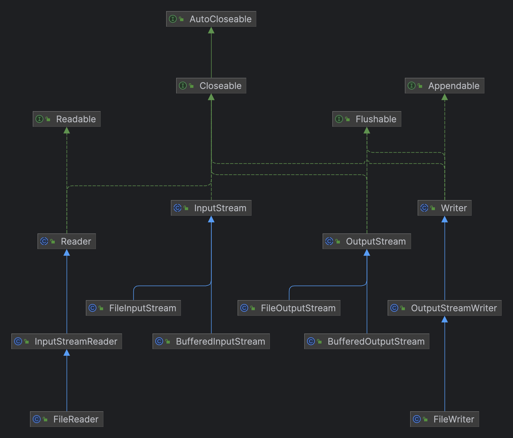
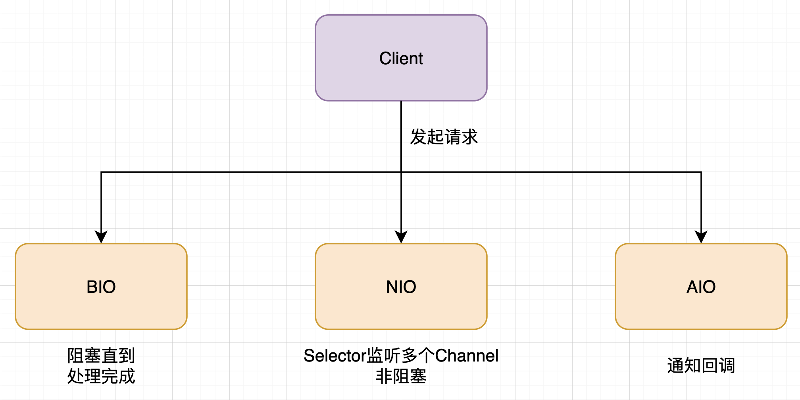

## Java基本语法

| 函数式编程                                                                                                                                                                                                                                                                                                                                                                                       | 面向对象编程                                                   | 面向过程编程                                                                                                                                                                                                                                                                                                                                                                                        |
| ------------------------------------------------------------------------------------------------------------------------------------------------------------------------------------------------------------------------------------------------------------------------------------------------------------------------------------------------------------------------------------------------ | -------------------------------------------------------------- | --------------------------------------------------------------------------------------------------------------------------------------------------------------------------------------------------------------------------------------------------------------------------------------------------------------------------------------------------------------------------------------------------- |
| 此编程范例强调使用功能，其中每个功能执行特定任务。                                                                                                                                                                                                                                                                                                                                               | 该编程范例基于面向对象的概念。在创建对象实例的地方使用类。     | 使用过程：在面向过程编程中，程序由一系列的过程组成，每个过程都有一个特定的功能。每个过程都是独立的，可以单独调用和执行。                                                                                                                                                                                                                                                                            |
| 使用的基本元素是变量和函数。函数中的数据是不可变的（创建后无法更改）。                                                                                                                                                                                                                                                                                                                           | 使用的基本元素是对象和方法，此处使用的数据是可变数据。         | 没有类和对象：在面向过程编程中，没有类和对象的概念。程序由一系列的过程组成，每个过程都有一个特定的功能。过程之间可以通过函数调用互相调用，实现不同功能的组合。<br />  使用变量和函数：在面向过程编程中，程序使用变量和函数。变量用于存储和管理数据，函数用于执行特定的功能。 <br />使用基本元素：在面向过程编程中，程序使用基本元素，如变量和函数。变量用于存储和管理数据，函数用于执行特定的功能。 |
| 重要性不在于数据，而在于功能。                                                                                                                                                                                                                                                                                                                                                                   | 重视数据而不是程序。                                           | 重视功能：在面向过程编程中，重要的不是数据，而是功能。程序的设计和实现应该围绕特定的功能，而不是数据。                                                                                                                                                                                                                                                                                              |
| 遵循声明式编程模型。                                                                                                                                                                                                                                                                                                                                                                             | 遵循命令式编程模型。                                           |                                                                                                                                                                                                                                                                                                                                                                                                     |
| 使用递归进行迭代。                                                                                                                                                                                                                                                                                                                                                                               | 使用循环进行迭代。                                             |                                                                                                                                                                                                                                                                                                                                                                                                     |
| 支持并行编程。                                                                                                                                                                                                                                                                                                                                                                                   | 不支持并行编程。                                               |                                                                                                                                                                                                                                                                                                                                                                                                     |
| 该编程范例中的语句在执行时不需要遵循特定的顺序。                                                                                                                                                                                                                                                                                                                                                 | 该编程范例中的语句在执行时需要遵循一个顺序，即自下而上的方法。 |                                                                                                                                                                                                                                                                                                                                                                                                     |
| 没有任何访问说明符。                                                                                                                                                                                                                                                                                                                                                                             | 具有三个访问说明符，即“公共”，“专用”和“受保护”。               |                                                                                                                                                                                                                                                                                                                                                                                                     |
| 添加新数据和功能并非易事。                                                                                                                                                                                                                                                                                                                                                                       | 提供添加新数据和功能的简便方法。                               |                                                                                                                                                                                                                                                                                                                                                                                                     |
| 隐藏数据是不可能的。因此，安全性是不可能的。                                                                                                                                                                                                                                                                                                                                                     | 提供数据隐藏。可能会生成安全的程序。                           |                                                                                                                                                                                                                                                                                                                                                                                                     |
| **Haskell**：Haskell是一种纯函数式编程语言，强调不可变性和纯函数。<br /> **Lisp**：Lisp是一种函数式编程语言，具有强大的元编程能力和函数式编程的特性。<br /> **Erlang**：Erlang是一种函数式编程语言，专注于并发和容错性。 <br />**Clojure**：Clojure是一种基于Lisp的函数式编程语言，运行在Java虚拟机上。<br /> **Scala**：Scala是一种结合了面向对象编程和函数式编程的语言，具有函数式编程的特性。 | Java，Python，C++，C#，Ruby                                    | **C**：强调简洁和高效性，并支持面向过程的编程范式。 <br />**Fortran**：主要用于科学和工程领域，具有严格的语法和结构。 <br />**COBOL**：主要用于商业应用程序开发，具有固定的语法和结构。 <br />**BASIC**：适用于初学者，具有简单易学的语法和结构。                                                                                                                                                   |


### 移位运算符

在Java中，移位运算符用于对整数进行二进制位的移动。Java中的移位运算符包括三项，并且支持的类型只有`int`和`long`，编译器在对`short`、`byte`、`char`类型进行移位前，都会将其转换为`int`类型再操作。

而Java中的int类型是32位的，long类型是64位的，下面举例以32位的int类型

1. **左移运算符 (`<<`)：**
   - 格式：`a << b`
   - 功能：将`a`的二进制表示向左移动`b`位，右侧用0填充。
   - 示例：`5 << 2` 的结果是 20，因为 5 的二进制表示是 `101`，向左移动两位后变成 `10100`，对应的十进制是 20。
2. **右移运算符 (`>>`)：**
   - 格式：`a >> b`
   - 功能：将`a`的二进制表示向右移动`b`位，左侧用原来的符号位填充（即正数补0，负数补1）。
   - 示例：`-10 >> 2` 的结果是 `-3`
     - 因为 `10` 的二进制表示是 `00001010`，`-10`的二进制表示为其正数的二进制取反的`11110101`加`1`得`11110110`
     - 向右移动两位后其二进制表示变成 `11111101`，最左侧为`1`表示为负数，减`1`后得`11111100`，取反得`00000011`，其转换成负数表示为`-3`。
3. **无符号右移运算符 (`>>>`)：**
   - 格式：`a >>> b`
   - 功能：将`a`的二进制表示向右移动`b`位，左侧用0填充。
   - 示例：`-10 >>> 2` 的结果是 `1073741821`
     - 因为 -10 的二进制表示是 `00000000` `00000000` `00000000` `00001010`，取反后加`1`得 `11111111` `11111111` `11111111` `11110110`
     - 向右移动两位后变成 `00111111` `11111111` `11111111` `11111101`，最左侧为`0`表示为正数，直接转换成十进制为 `1073741821`

> **当 int 类型左移/右移位数大于等于 32 位操作时，会先求余（%）后再进行左移/右移操作。**


## 数据类型

| 类型    | 位数 | 字节 | 默认值   | 十进制范围                                                  | 二进制范围                                                                                                                           |
| ------- | ---- | ---- | -------- | ----------------------------------------------------------- | ------------------------------------------------------------------------------------------------------------------------------------ |
| boolean | -    | -    | false    | true 或 false                                               | true 或 false                                                                                                                        |
| byte    | 8    | 1    | 0        | -128(-2^7) 到 127(2^7-1)                                    | 10000000 到 01111111                                                                                                                 |
| short   | 16   | 2    | 0        | -32768(-2^7) 到 32767(2^7-1)                                | 1000000000000000 到 0111111111111111                                                                                                 |
| int     | 32   | 4    | 0        | -2147483648(-2^31)  到 2147483647(2^31-1)                   | 10000000000000000000000000000000 到 01111111111111111111111111111111                                                                 |
| long    | 64   | 8    | 0L       | -9223372036854775808(-2^63)  到 9223372036854775807(2^63-1) | 1000000000000000000000000000000000000000000000000000000000000000 到 0111111111111111111111111111111111111111111111111111111111111111 |
| float   | 32   | 4    | 0.0f     | IEEE 754标准表示范围                                        | IEEE 754标准表示范围                                                                                                                 |
| double  | 64   | 8    | 0.0      | IEEE 754标准表示范围                                        | IEEE 754标准表示范围                                                                                                                 |
| char    | 16   | 2    | '\u0000' | 0 到 65535                                                  | 00000000 00000000 到 11111111 11111111                                                                                               |

### 基本类型和包装类型

区别：

- **用途**：除了定义一些常量和局部变量之外，我们在其他地方比如方法参数、对象属性中很少会使用基本类型来定义变量。并且，包装类型可用于泛型，而基本类型不可以。

- **存储方式**：基本数据类型的局部变量存放在 Java 虚拟机栈中的局部变量表中，基本数据类型的成员变量（未被 `static` 修饰 ）存放在 Java 虚拟机的堆中。包装类型属于对象类型，我们知道几乎所有对象实例都存在于堆中。

- **占用空间**：相比于包装类型（对象类型）， 基本数据类型占用的空间往往非常小。

- **默认值**：成员变量包装类型不赋值就是 `null` ，而基本类型有默认值且不是 `null`。

- **比较方式**：对于基本数据类型来说，`==` 比较的是值。对于包装数据类型来说，`==` 比较的是对象的内存地址。所有整型包装类对象之间值的比较，全部使用 `equals()` 方法。


Java 基本数据类型的包装类型的大部分都用到了缓存机制来提升性能。

- `Byte`,`Short`,`Integer`,`Long` 这 4 种包装类默认创建了数值 **[-128，127]** 的相应类型的缓存数据，`Character` 创建了数值在 **[0,127]** 范围的缓存数据，`Boolean` 直接返回 `True` or `False`。

- 两种浮点数类型的包装类 `Float`,`Double` 并没有实现缓存机制。


## 变量

**语法形式**：从语法形式上看，成员变量是属于类的，而局部变量是在代码块或方法中定义的变量或是方法的参数；成员变量可以被 `public`,`private`,`static` 等修饰符所修饰，而局部变量不能被访问控制修饰符及 `static` 所修饰；但是，成员变量和局部变量都能被 `final` 所修饰。

**存储方式**：从变量在内存中的存储方式来看，如果成员变量是使用 `static` 修饰的，那么这个成员变量是属于类的，如果没有使用 `static` 修饰，这个成员变量是属于实例的。而对象存在于堆内存，局部变量则存在于栈内存。

**生存时间**：从变量在内存中的生存时间上看，成员变量是对象的一部分，它随着对象的创建而存在，而局部变量随着方法的调用而自动生成，随着方法的调用结束而消亡。

**默认值**：从变量是否有默认值来看，成员变量如果没有被赋初始值，则会自动以类型的默认值而赋值（一种情况例外:被 `final` 修饰的成员变量也必须显式地赋值），而局部变量则不会自动赋值。


**静态变量有什么作用**

静态变量也就是被 `static` 关键字修饰的变量。它可以被类的所有实例共享，无论一个类创建了多少个对象，它们都共享同一份静态变量。也就是说，静态变量只会被分配一次内存，即使创建多个对象，这样可以节省内存。

> 通常情况下，静态变量会被 `final` 关键字修饰成为常量。


在Java中，继承下的父子类的初始化和消亡（构造函数和析构函数）的顺序遵循以下规则：

**初始化（构造函数）顺序：**

1. 父类的静态变量和静态初始化块（按它们在类中出现的顺序）。
2. 子类的静态变量和静态初始化块（按它们在类中出现的顺序）。
3. 父类的实例变量和实例初始化块（按它们在类中出现的顺序）。
4. 父类的构造函数。
5. 子类的实例变量和实例初始化块（按它们在类中出现的顺序）。
6. 子类的构造函数。


**实现接口的要求**【两同两小一大原则】

1. 方法名相同，参数类型相同
2. 子类返回类型小于等于父类方法返回类型
3. 子类抛出异常小于等于父类方法抛出异常
4. 子类访问权限大于等于父类方法访问权限


## IO

IO 即 `Input/Output`，输入和输出。数据输入到计算机内存的过程即输入，反之输出到外部存储（比如数据库，文件，远程主机）的过程即输出。数据传输过程类似于水流，因此称为 IO 流。IO 流在 Java 中分为输入流和输出流，而根据数据的处理方式又分为字节流和字符流。

Java IO 流的 40 多个类都是从如下 4 个抽象类基类中派生出来的。

- `InputStream`/`Reader`: 所有的输入流的基类，前者是字节输入流，后者是字符输入流。
- `OutputStream`/`Writer`: 所有输出流的基类，前者是字节输出流，后者是字符输出流。




## NIO

NIO 弥补了同步阻塞 I/O 的不足，它在标准 Java 代码中提供了非阻塞、面向缓冲、基于通道的 I/O，可以使用少量的线程来处理多个连接，大大提高了 I/O 效率和并发。




> [!caution]
>
> 需要注意：使用 NIO 并不一定意味着高性能，它的性能优势主要体现在高并发和高延迟的网络环境下。当连接数较少、并发程度较低或者网络传输速度较快时，NIO 的性能并不一定优于传统的 BIO 。


### NIO 核心组件

NIO 主要包括以下三个核心组件：

- **Buffer（缓冲区）**：NIO 读写数据都是通过缓冲区进行操作的。读操作的时候将 Channel 中的数据填充到 Buffer 中，而写操作时将 Buffer 中的数据写入到 Channel 中。
- **Channel（通道）**：Channel 是一个双向的、可读可写的数据传输通道，NIO 通过 Channel 来实现数据的输入输出。通道是一个抽象的概念，它可以代表文件、套接字或者其他数据源之间的连接。
- **Selector（选择器）**：允许一个线程处理多个 Channel，基于事件驱动的 I/O 多路复用模型。所有的 Channel 都可以注册到 Selector 上，由 Selector 来分配线程来处理事件。


## 内存

Java 虚拟机在执行 Java 程序的过程中会把它管理的内存划分成若干个不同的数据区域


**线程私有的：**

- 程序计数器
- 虚拟机栈
- 本地方法栈

**线程共享的：**

- 堆
- 方法区
- 直接内存 (非运行时数据区的一部分)

Java 虚拟机规范对于运行时数据区域的规定是相当宽松的。以堆为例：堆可以是连续空间，也可以不连续。堆的大小可以固定，也可以在运行时按需扩展 。虚拟机实现者可以使用任何垃圾回收算法管理堆，甚至完全不进行垃圾收集也是可以的。

### 程序计数器

程序计数器是一块较小的内存空间，可以看作是当前线程所执行的字节码的行号指示器。字节码解释器工作时通过改变这个计数器的值来选取下一条需要执行的字节码指令，分支、循环、跳转、异常处理、线程恢复等功能都需要依赖这个计数器来完成。

另外，为了线程切换后能恢复到正确的执行位置，每条线程都需要有一个独立的程序计数器，各线程之间计数器互不影响，独立存储，我们称这类内存区域为“线程私有”的内存。


### 虚拟机栈

与程序计数器一样，Java 虚拟机栈（后文简称栈）也是线程私有的，它的生命周期和线程相同，随着线程的创建而创建，随着线程的死亡而死亡。

栈绝对算的上是 JVM 运行时数据区域的一个核心，除了一些 Native 方法调用是通过本地方法栈实现的(后面会提到)，其他所有的 Java 方法调用都是通过栈来实现的（也需要和其他运行时数据区域比如程序计数器配合）。

方法调用的数据需要通过栈进行传递，每一次方法调用都会有一个对应的栈帧被压入栈中，每一个方法调用结束后，都会有一个栈帧被弹出。

栈由一个个栈帧组成，而每个栈帧中都拥有：局部变量表、操作数栈、动态链接、方法返回地址。和数据结构上的栈类似，两者都是先进后出的数据结构，只支持出栈和入栈两种操作。


- **局部变量表** 主要存放了编译期可知的各种数据类型（boolean、byte、char、short、int、float、long、double）、对象引用（reference 类型，它不同于对象本身，可能是一个指向对象起始地址的引用指针，也可能是指向一个代表对象的句柄或其他与此对象相关的位置）。

- **操作数栈** 主要作为方法调用的中转站使用，用于存放方法执行过程中产生的中间计算结果。另外，计算过程中产生的临时变量也会放在操作数栈中。

- **动态链接** 主要服务一个方法需要调用其他方法的场景。Class 文件的常量池里保存有大量的符号引用比如方法引用的符号引用。当一个方法要调用其他方法，需要将常量池中指向方法的符号引用转化为其在内存地址中的直接引用。动态链接的作用就是为了将符号引用转换为调用方法的直接引用，这个过程也被称为 **动态连接** 。


### 本地方法栈

和虚拟机栈所发挥的作用非常相似，区别是：**虚拟机栈为虚拟机执行 Java 方法 （也就是字节码）服务，而本地方法栈则为虚拟机使用到的 Native 方法服务。** 在 HotSpot 虚拟机中和 Java 虚拟机栈合二为一。

本地方法被执行的时候，在本地方法栈也会创建一个栈帧，用于存放该本地方法的局部变量表、操作数栈、动态链接、出口信息。

方法执行完毕后相应的栈帧也会出栈并释放内存空间，也会出现 `StackOverFlowError` 和 `OutOfMemoryError` 两种错误。


### 堆

Java 虚拟机所管理的内存中最大的一块，Java 堆是所有线程共享的一块内存区域，在虚拟机启动时创建。**此内存区域的唯一目的就是存放对象实例，几乎所有的对象实例以及数组都在这里分配内存。**


Java 堆是垃圾收集器管理的主要区域，因此也被称作 **GC 堆（Garbage Collected Heap）**。从垃圾回收的角度，由于现在收集器基本都采用分代垃圾收集算法，所以 Java 堆还可以细分为：新生代和老年代；再细致一点有：Eden、Survivor、Old 等空间。进一步划分的目的是更好地回收内存，或者更快地分配内存。


### 字符串常量池

**字符串常量池** 是 JVM 为了提升性能和减少内存消耗针对字符串（String 类）专门开辟的一块区域，主要目的是为了避免字符串的重复创建。

```java
// 在堆中创建字符串对象”ab“
// 将字符串对象”ab“的引用保存在字符串常量池中
String aa = "ab";
// 直接返回字符串常量池中字符串对象”ab“的引用
String bb = "ab";
System.out.println(aa==bb);// true
```

HotSpot 虚拟机中字符串常量池的实现是 `src/hotspot/share/classfile/stringTable.cpp` ,`StringTable` 可以简单理解为一个固定大小的`HashTable` ，容量为 `StringTableSize`（可以通过 `-XX:StringTableSize` 参数来设置），保存的是字符串（key）和 字符串对象的引用（value）的映射关系，字符串对象的引用指向堆中的字符串对象。


### 方法区

方法区属于是 JVM 运行时数据区域的一块逻辑区域，是各个线程共享的内存区域。

《Java 虚拟机规范》只是规定了有方法区这么个概念和它的作用，方法区到底要如何实现那就是虚拟机自己要考虑的事情了。也就是说，在不同的虚拟机实现上，方法区的实现是不同的。

当虚拟机要使用一个类时，它需要读取并解析 Class 文件获取相关信息，再将信息存入到方法区。方法区会存储已被虚拟机加载的 **类信息、字段信息、方法信息、(运行时/字符串)常量、静态变量、即时编译器(JIT)编译后的代码缓存** 等数据。

> [!caution]
>
> JDK 1.7 之后，字符串常量池与静态变量从方法区转移至堆中

**方法区和永久代以及元空间是什么关系呢？** 方法区和永久代以及元空间的关系很像 Java 中接口和类的关系，类实现了接口，这里的类就可以看作是永久代和元空间，接口可以看作是方法区，也就是说永久代以及元空间是 HotSpot 虚拟机对虚拟机规范中方法区的两种实现方式。并且，永久代是 JDK 1.8 之前的方法区实现，JDK 1.8 及以后方法区的实现变成了元空间。


### 运行时常量池

Class 文件中除了有类的版本、字段、方法、接口等描述信息外，还有用于存放编译期生成的各种 **字面量(Literal)** 和 **符号引用(Symbolic Reference)** 的 **常量池表(Constant Pool Table)** 。

- 字面量是源代码中的固定值的表示法，即通过字面我们就能知道其值的含义。字面量包括整数、浮点数和字符串字面量。
- 符号引用常见包括类符号引用、字段符号引用、方法符号引用、接口方法符号。


### 直接内存

直接内存是一种特殊的内存缓冲区，并不在 Java 堆或方法区中分配的，而是通过 JNI 的方式在本地内存上分配的。

直接内存并不是虚拟机运行时数据区的一部分，也不是虚拟机规范中定义的内存区域，但是这部分内存也被频繁地使用。而且也可能导致 `OutOfMemoryError` 错误出现。

JDK1.4 中新加入的 **NIO** ( **Non-Blocking I/O** ），引入了一种基于通道（**Channel**）与缓存区（**Buffer**）的 I/O 方式，它可以直接使用 **Native** 函数库直接分配堆外内存，然后通过一个存储在 Java 堆中的 **DirectByteBuffer** 对象作为这块内存的引用进行操作。这样就能在一些场景中显著提高性能，因为避免了在 Java 堆和 Native 堆之间来回复制数据。

直接内存的分配不会受到 Java 堆的限制，但是，既然是内存就会受到本机总内存大小以及处理器寻址空间的限制。

类似的概念还有 **堆外内存** 。在一些文章中将直接内存等价于堆外内存，个人觉得不是特别准确。

堆外内存就是把内存对象分配在堆外的内存，这些内存直接受操作系统管理（而不是虚拟机），这样做的结果就是能够在一定程度上减少垃圾回收对应用程序造成的影响。


## 进程和线程

### 创建多线程的方式

#### 1.1、继承Thread类

这是最普通的方式，继承`Thread`类，重写`run`方法，如下：

```java
public class ExtendsThread extends Thread {
    @Override
    public void run() {
        System.out.println("1......");
    }

    public static void main(String[] args) {
        new ExtendsThread().start();
    }
}
```

#### 1.2、实现Runnable接口

这也是一种常见的方式，实现`Runnable`接口并重写`run`方法，如下：

```java
public class ImplementsRunnable implements Runnable {
    @Override
    public void run() {
        System.out.println("2......");
    }

    public static void main(String[] args) {
        ImplementsRunnable runnable = new ImplementsRunnable();
        new Thread(runnable).start();
    }
}
```


#### 1.3、实现Callable接口

和上一种方式类似，只不过这种方式可以拿到线程执行完的返回值，如下：

```java
public class ImplementsCallable implements Callable<String> {
    @Override
    public String call() throws Exception {
        System.out.println("3......");
        return "zhuZi";
    }

    public static void main(String[] args) throws Exception {
        ImplementsCallable callable = new ImplementsCallable();
        FutureTask<String> futureTask = new FutureTask<>(callable);
        new Thread(futureTask).start();
        System.out.println(futureTask.get());
    }
}
```

#### 1.4、使用Executor线程池

这种属于进阶方式，可以通过`Executors`创建线程池，也可以自定义线程池，如下：

```java
public class UseExecutorService {
    public static void main(String[] args) {
        ExecutorService poolA = Executors.newFixedThreadPool(2);
        poolA.execute(()->{
            System.out.println("4A......");
        });
        poolA.shutdown();

        // 又或者自定义线程池
        ThreadPoolExecutor poolB = new ThreadPoolExecutor(2, 3, 0,
                TimeUnit.SECONDS, new LinkedBlockingQueue<Runnable>(3),
                Executors.defaultThreadFactory(), new ThreadPoolExecutor.AbortPolicy());
        poolB.submit(()->{
            System.out.println("4B......");
        });
        poolB.shutdown();
    }
}
```


#### 1.5、使用CompletableFuture类

`CompletableFuture`是`JDK1.8`引入的新类，可以用来执行异步任务，如下：

```java
public class UseCompletableFuture {
    public static void main(String[] args) throws InterruptedException {
        CompletableFuture<String> cf = CompletableFuture.supplyAsync(() -> {
            System.out.println("5......");
            return "zhuZi";
        });
        // 需要阻塞，否则看不到结果
        Thread.sleep(1000);
    }
}
```


## JDK 8 新特性

### 函数式编程

#### 消费型接口

（顾客）在项目中一些不需要返回值，只负责消费的方法可以用过 Consumer 接口来实现

`Consumer<T> void accept(T t)`

```java
// 定义一个顾客（Consumer），用于消费食物
Consumer<String> customer = food -> System.out.println("吃掉了：" + food);

// 厨师准备了一份美食
String food = "美味牛排";

// 顾客吃掉厨师准备的食物
customer.accept(food);
```

#### 供给型接口

（厨师）生产对应对象，不关心谁使用

 `Supplier<T> T get()`

```java
@Test
public void testSupplier() {
    Employee tom = new Employee(1001, "Tom", 23, 5600);

    Supplier<String> supplier = () -> tom.getName();
    System.out.println(supplier.get());

    System.out.println("***********");

    Supplier<String> supplier1 = tom::getName;
    System.out.println(supplier1.get());
}
```

#### 函数型接口

（服务员）负责将厨师提供的食物送到顾客手中，根据顾客的需求将食物进行加工或处理

 `Function<T,R> R apply(T t)` 接受一个输入T ，返回一个输出 R

```java
@Test
public void testFunction(){
	Function<Integer, String[]> function = String[]::new;
	String[] arr = function.apply(10);
	System.out.println(Arrays.toString(arr));
}
```

#### 断定型接口

用于判断对象是否符合特定的条件

`Predicate<T> boolean test(T t)`

```java
@Test
public void testPredicate(){
    // 定义一个菜单选择标准（Predicate）
    Predicate<String> isSteak = food -> food.equals("美味牛排");

    // 厨师提供食物
    Supplier<String> chef = () -> "美味牛排";
    String food = chef.get();

    // 判断食物是否符合菜单选择标准
    if (isSteak.test(food)) {
        System.out.println("顾客点了牛排！");
    } else {
        System.out.println("顾客选择了其他食物！");
    }
}
```


## 设计模式

### 单例模式（Singleton Pattern）
单例模式确保一个类只有一个实例，并提供一个全局访问点。常见的实现方式是使用私有构造函数和静态方法来返回实例。

```java
public class Singleton {
    private static Singleton instance;
    
    private Singleton() {} // 私有构造函数
    
    public static Singleton getInstance() {
        if (instance == null) {
            instance = new Singleton();
        }
        return instance;
    }
}
```

### 工厂模式（Factory Pattern）
工厂模式定义一个接口来创建对象，但是由子类决定实例化哪个类。这样可以将对象的创建与使用分离。

```java
public interface Shape {
    void draw();
}

public class Circle implements Shape {
    @Override
    public void draw() {
        System.out.println("Drawing a circle");
    }
}

public class Rectangle implements Shape {
    @Override
    public void draw() {
        System.out.println("Drawing a rectangle");
    }
}

public class ShapeFactory {
    public Shape getShape(String shapeType) {
        if (shapeType.equalsIgnoreCase("Circle")) {
            return new Circle();
        } else if (shapeType.equalsIgnoreCase("Rectangle")) {
            return new Rectangle();
        }
        return null;
    }
}
```

### 观察者模式（Observer Pattern）
观察者模式定义了一种一对多的依赖关系，当一个对象状态改变时，所有依赖于它的对象都会得到通知并自动更新。

```java
import java.util.ArrayList;
import java.util.List;

public interface Observer {
    void update(String message);
}

public class ConcreteObserver implements Observer {
    @Override
    public void update(String message) {
        System.out.println("Received message: " + message);
    }
}

public interface Subject {
    void attach(Observer observer);
    void detach(Observer observer);
    void notifyObservers(String message);
}

public class ConcreteSubject implements Subject {
    private List<Observer> observers = new ArrayList<>();
    
    @Override
    public void attach(Observer observer) {
        observers.add(observer);
    }

    @Override
    public void detach(Observer observer) {
        observers.remove(observer);
    }

    @Override
    public void notifyObservers(String message) {
        for (Observer observer : observers) {
            observer.update(message);
        }
    }
}
```

### 静态代理（Static Proxy）
静态代理是指代理类在编译期间就已经确定，并且代理类和目标类的关系在代码中是固定的。代理类负责将请求转发给目标类，并可以在转发前后进行一些额外的处理。

```java
// 接口
public interface Subject {
    void request();
}

// 目标类
public class RealSubject implements Subject {
    @Override
    public void request() {
        System.out.println("RealSubject: Processing request.");
    }
}

// 代理类
public class ProxySubject implements Subject {
    private RealSubject realSubject;

    public ProxySubject() {
        this.realSubject = new RealSubject();
    }

    @Override
    public void request() {
        System.out.println("ProxySubject: Pre-processing request.");
        realSubject.request();
        System.out.println("ProxySubject: Post-processing request.");
    }
}

// 测试类
public class Main {
    public static void main(String[] args) {
        Subject subject = new ProxySubject();
        subject.request();
    }
}
```

### 动态代理（Dynamic Proxy）
动态代理是在运行时期间动态生成代理类的一种代理方式，代理类不需要硬编码，可以根据需要动态生成。Java提供了java.lang.reflect.Proxy和java.lang.reflect.InvocationHandler来实现动态代理。

```java
import java.lang.reflect.InvocationHandler;
import java.lang.reflect.Method;
import java.lang.reflect.Proxy;

// 接口
public interface Subject {
    void request();
}

// 目标类
public class RealSubject implements Subject {
    @Override
    public void request() {
        System.out.println("RealSubject: Processing request.");
    }
}

// InvocationHandler实现类
public class DynamicProxyHandler implements InvocationHandler {
    private Object target;

    public DynamicProxyHandler(Object target) {
        this.target = target;
    }

    @Override
    public Object invoke(Object proxy, Method method, Object[] args) throws Throwable {
        System.out.println("DynamicProxyHandler: Pre-processing request.");
        Object result = method.invoke(target, args);
        System.out.println("DynamicProxyHandler: Post-processing request.");
        return result;
    }
}

// 测试类
public class Main {
    public static void main(String[] args) {
        RealSubject realSubject = new RealSubject();
        InvocationHandler handler = new DynamicProxyHandler(realSubject);

        Subject proxySubject = (Subject) Proxy.newProxyInstance(
            realSubject.getClass().getClassLoader(),
            realSubject.getClass().getInterfaces(),
            handler
        );

        proxySubject.request();
    }
}
```

## JavaDoc

Structure of a Javadoc comment

A Javadoc comment is set off from code by standard multi-line comment tags `/*` and `*/`. The opening tag (called begin-comment delimiter), has an extra asterisk, as in `/**`.

1. The first paragraph is a description of the method documented.
2. Following the description are a varying number of descriptive tags, signifying:
   1. The parameters of the method (`@param`)
   2. What the method returns (`@return`)
   3. Any exceptions the method may throw (`@throws`)
   4. Other less-common tags such as `@see` (a "see also" tag)

| Tag  & Parameter                                                                | Usage                                                                                                                                                                                     | Applies to                              | Since |
| ------------------------------------------------------------------------------- | ----------------------------------------------------------------------------------------------------------------------------------------------------------------------------------------- | --------------------------------------- | ----- |
| **@author** *John Smith*                                                        | Describes  an author.<br />描述作者                                                                                                                                                       | Class, Interface, Enum                  |       |
| {**@docRoot**}                                                                  | Represents the relative path to the generated document's root directory from any generated page.<br />表示从任何生成的页面到生成的文档根目录的相对路径                                    | Class, Interface, Enum, Field, Method   |       |
| **@version** *version*                                                          | Provides  version entry. Max one per Class or Interface.<br />版本条目,每个类或接口最多有一个                                                                                             | Module, Package, Class, Interface, Enum |       |
| **@since** *since-text*                                                         | Describes when this functionality has first existed.<br />描述这个功能块从何时有的                                                                                                        | Class, Interface, Enum, Field, Method   |       |
| **@see** *reference*                                                            | Provides  a link to other element of documentation.<br />提供链接到其他文档元素的链接                                                                                                     | Class, Interface, Enum, Field, Method   |       |
| **@param** *name description*                                                   | Describes  a method parameter.<br />描述一个参数                                                                                                                                          | Method                                  |       |
| **@return** *description*                                                       | Describes  the return value.<br />描述返回值                                                                                                                                              | Method                                  |       |
| **@exception** *classname description*<br />**@throws** *classname description* | Describes  an exception that may be thrown from this method.<br />描述该方法可能抛出的异常                                                                                                | Method                                  |       |
| **@deprecated** *description*                                                   | Describes  an outdated method.<br />描述一个过期的方法                                                                                                                                    | Class, Interface, Enum, Field, Method   |       |
| {**@inheritDoc**}                                                               | Copies  the description from the overridden method.<br />从被复写的原方法复制描述                                                                                                         | Overriding  Method                      | 1.4.0 |
| {**@link** *reference*}                                                         | Link  to other symbol.<br />链接到其他的引用                                                                                                                                              | Class, Interface, Enum, Field, Method   |       |
| {**@linkplain** *reference*}                                                    | Identical to {`@link`}, except the link's label is displayed in plain text than code font.<br />与 {`@link`} 相同，只是链接的标签以纯文本而不是代码字体显示                               | Class, Interface, Enum, Field, Method   |       |
| {**@value** *#STATIC_FIELD*}                                                    | Return  the value of a static field.<br />返回一个静态作用域的值                                                                                                                          | Static  Field                           | 1.4.0 |
| {**@code** *literal*}                                                           | Formats literal text in the code font. It is equivalent to <code>{@literal}</code>.<br />以代码字体格式化文字文本                                                                         | Class, Interface, Enum, Field, Method   | 1.5.0 |
| {**@literal** *literal*}                                                        | Denotes literal text. The enclosed text is interpreted as not containing HTML markup or nested javadoc tags.<br />表示文字文本, 所包含的文本被解释为不包含 HTML 标记或嵌套的 javadoc 标记 | Class, Interface, Enum, Field, Method   | 1.5.0 |
| {**@serial** *literal*}                                                         | Used in the doc comment for a default serializable field.<br />在文档注释中用于默认可序列化字段                                                                                           | Field                                   |       |
| {**@serialData** *literal*}                                                     | Documents the data written by the writeObject( ) or writeExternal( ) methods.<br />记录由 writeObject( ) 或 writeExternal( ) 方法写入的数据                                               | Field, Method                           |       |
| {**@serialField** *literal*}                                                    | Documents an ObjectStreamField component.<br />记录 ObjectStreamField 组件                                                                                                                | Field                                   |       |