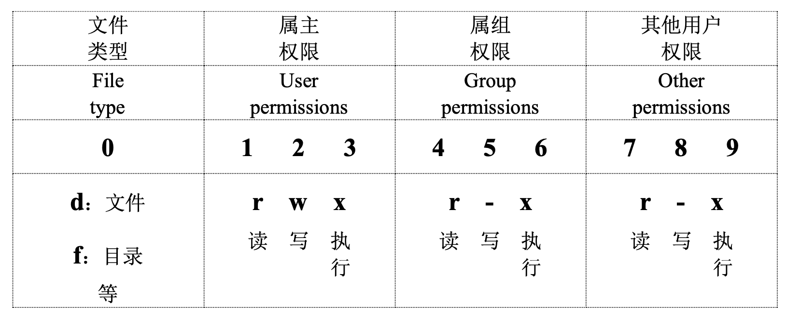

# Linux 常用知识

## Shell

表示“为使用者提供的操作界面”

维基百科给的定义是：

In computing, a **shell** is a computer program which exposes an [operating system](https://en.wikipedia.org/wiki/Operating_system)'s services to a human user or other programs. In general, operating system shells use either a [command-line interface](https://en.wikipedia.org/wiki/Command-line_interface) (CLI) or [graphical user interface](https://en.wikipedia.org/wiki/Graphical_user_interface) (GUI), depending on a computer's role and particular operation. It is named a shell because it is the outermost layer around the operating system.

我们由此可以知道，Shell也会泛指所有为用户提供操作界面的程序，分为两类：命令行（CLI）与图形界面（GUI）。


分类：

1. sh

> sh全称为Bourne Shell，来自于1977年底的Unix v7版。二进制文件位置为`/bin/sh`。

2. bash

> bash全称为Bourne-Again Shell，是在1989年对sh的重写版，替代了sh。二进制文件位置为`/bin/bash`。
>
> Linux的默认终端bash

3. zsh

> Zsh即Z shell，是一款可用作交互式登录的shell及脚本编写的命令解释器。Zsh对Bourne shell做出了大量改进，同时加入了Bash、ksh及tcsh的某些功能。
>
> 提高了交互的效率，以及丰富的插件。比如：
>
> - 强大的补全功能
>
> - - 使用tab键可以补全命令，补全命令后的参数等，还自带命令的解释
>   - kill命令还可以补全进程pid
>
> - 跳转不用cd，直接输入路径
>
> - 历史命令，敲出命令的前几个字母，按上下箭头就可以查看这个前缀的历史命令
>
> - 完善的插件机制以及丰富的生态，和oh my zsh一起食用更佳


```sh
(base) ➜  ~ cat /etc/shells
# List of acceptable shells for chpass(1).
# Ftpd will not allow users to connect who are not using
# one of these shells.

/bin/bash
/bin/csh
/bin/dash
/bin/ksh
/bin/sh
/bin/tcsh
/bin/zsh

(base) ➜  ~ echo $0
-zsh
```


### Zsh的配置文件

- `.zshenv`：包含设置命令搜索路径的命令，以及配置其他重要的环境变量，通常把$PATH等变量写在这里，无论是在交互shell，或者运行程序都会读取此文件。
- `.zprofile`：和.zlogin类似，在.zshrc之前加载。
- `.zshrc`：源自交互式shell，读取并执行该文件，包含设置别名、函数、选项、键绑定等命令。
- `.zlogin`：源自登录shell，包含仅在登录shell中执行的命令，用于设置终端类型并运行一系列外部命令（`fortune`、`msgs`等）。
- `.zlogout`：退出终端的时候读取，用于做一些清理工作。对标bash_logout。
- `.zsh_history`：保存了历史命令。在Shell为Zsh时，每次敲击命令时，都会保存在这个文件里。

加载顺序：$.zshenv \rightarrow .zprofile \rightarrow .zshrc \rightarrow .zlogin \rightarrow .zlogout$

## chsh

改变终端命令程序，与以上部分知识相结合

```sh
chsh /bin/zsh
chsh /bin/bash
```

## curl wget fetch
`curl` 常用的命令行工具，用来请求 `Web` 服务器，意思是客户端（client）的 URL 工具的
不带任何参数时，发出 `GET` 请求

语法：
```sh
curl [options] [URL...]
```


| Category   | Description                                                | Paramater | Description |
| ---------- | ---------------------------------------------------------- | --------- | ----------- |
| auth       | Different types of authentication methods                  |           |             |
| connection | Low level networking operations                            |           |             |
| curl       | The command line tool itself                               |           |             |
| dns        | General DNS options                                        |           |             |
| file       | FILE protocol options                                      |           |             |
| ftp        | FTP protocol options                                       |           |             |
| http       | HTTP and HTTPS protocol options                            |           |             |
| imap       | IMAP protocol options                                      |           |             |
| misc       | Options that don't fit into any other category             |           |             |
| output     | Filesystem output                                          |           |             |
| pop3       | POP3 protocol options                                      |           |             |
| post       | HTTP Post specific options                                 |           |             |
| proxy      | All options related to proxies                             |           |             |
| scp        | SCP protocol options                                       |           |             |
| sftp       | SFTP protocol options                                      |           |             |
| smtp       | SMTP protocol options                                      |           |             |
| ssh        | SSH protocol options                                       |           |             |
| telnet     | TELNET protocol options                                    |           |             |
| tftp       | TFTP protocol options                                      |           |             |
| tls        | All TLS/SSL related options                                |           |             |
| upload     | All options for uploads                                    |           |             |
| verbose    | Options related to any kind of command line output of curl |           |             |


## echo

用于字符串的输出

```sh
echo [-neE] [ARGUMENTS]
```

- 当-n 选项，则取消尾随换行符
- 如果-e 选项，则将解释以下反斜杠转义字符:
- \ 显示反斜杠字符
- \a 警报(BEL)
- \b 显示退格字符
- \c 禁止任何进一步的输出
- \e 显示转义字符
- \f 显示窗体提要字符
- \n 显示新行
- \r 显示回车
- \t 显示水平标签
- \v 显示垂直标签
- 这个-E 项禁用转义字符的解释。这是默认值

显示变量 变量名前加$


## 文件查看或处理

### cat

### grep

### vim


## 文件基本属性

在 Linux 中第一个字符代表这个文件是目录、文件或链接文件等等。

- 当为 **d** 则是目录
- 当为 **-** 则是文件；
- 若是 **l** 则表示为链接文档(link file)；
- 若是 **b** 则表示为装置文件里面的可供储存的接口设备(可随机存取装置)；
- 若是 **c** 则表示为装置文件里面的串行端口设备，例如键盘、鼠标(一次性读取装置)。

接下来的字符中，以三个为一组，且均为 **rwx** 的三个参数的组合。其中， **r** 代表可读(read)、 **w** 代表可写(write)、 **x** 代表可执行(execute)。 要注意的是，这三个权限的位置不会改变，如果没有权限，就会出现减号 **-** 而已。



按文件所有者、文件所有者同组用户和其他用户来规定不同的文件访问权限。

### chgrp

更改文件属组

语法：

```sh
chgrp [-R] 属组名 文件名
```

参数选项

- -R：递归更改文件属组，在更改某个目录文件的属组时，加上-R的参数，那么该目录下的所有文件的属组都会更改。

### chmod

更改文件的九个权限

文件属性有两种设置方法，一种是数字，一种是符号。

文件的基本权限就有九个，分别是 **owner/group/others(拥有者/组/其他)** 三种身份各有自己的 **read/write/execute** 权限。

可以使用数字来代表各个权限，各权限的分数对照表如下：

- r:4
- w:2
- x:1

每种身份(owner/group/others)各自的三个权限(r/w/x)分数是需要累加的，例如当权限为： **-rwxr-x---** 分数则是：

- owner = rwx = 4+2+1 = 7
- group = r-x = 4+0+1 = 5
- others= --- = 0+0+0 = 0

#### 第一种语法

变更权限的指令 chmod 的语法：

```sh
chmod [-R] xyz 文件或目录
```

选项与参数：

- **xyz** : 就是刚刚提到的数字类型的权限属性，为 **rwx** 属性数值的相加。
- **-R** : 进行递归(recursive)的持续变更，以及连同次目录下的所有文件都会变更


#### 第二种语法

可以使用 **u, g, o** 来代表三种身份的权限。

此外， **a** 则代表 **all**，即全部的身份。读写的权限可以写成 **r, w, x**，也就是可以使用下表的方式来看：

| chmod | u <br />g <br />o <br />a | +(加入) <br />-(除去) <br />=(设定) | r <br />w <br />x | 文件或目录 |
| :---: | :------------------------ | :---------------------------------- | :---------------- | :--------: |

如果我们需要将文件权限设置为 **-rwxr-xr--** ，可以使用 `chmod u=rwx,g=rx,o=r 文件名` 来设定:

### chown

更改文件属主，也可以同时更改文件属组

语法：

```sh
chown [–R] 属主名 文件名
chown [-R] 属主名：属组名 文件名
```

## 网络与进程管理

### ifconfig

查看网络接口属性

```sh
(base) ➜  ~ ifconfig  

en0: flags=8863<UP,BROADCAST,SMART,RUNNING,SIMPLEX,MULTICAST> mtu 1500
	options=6463<RXCSUM,TXCSUM,TSO4,TSO6,CHANNEL_IO,PARTIAL_CSUM,ZEROINVERT_CSUM>
	ether 6c:b1:33:a4:28:16 
	inet6 fe80::c1:bc0d:e4ac:b8ec%en0 prefixlen 64 secured scopeid 0xf 
	inet 10.254.32.128 netmask 0xfffffc00 broadcast 10.254.35.255
	nd6 options=201<PERFORMNUD,DAD>
	media: autoselect
	status: active
```

### hostname

查看主机名

```sh
(base) ➜  ~ hostname
CHONGANDXU.local
```

### ps

查看所有的进程，可搭配`grep`过滤查找所需的进程

```sh
(base) ➜  ~ ps -ef

(base) ➜  ~ ps -ef | grep redis
  501 24785     1   0 11:24上午 ??         1:03.14 redis-server 0.0.0.0:6379 
  501 28692 27957   0  2:19下午 ttys000    0:00.00 grep --color=auto --exclude-dir=.bzr --exclude-dir=CVS --exclude-dir=.git --exclude-dir=.hg --exclude-dir=.svn --exclude-dir=.idea --exclude-dir=.tox redis
```

### kill

结束指定名称（或pid）的进程

```sh
kill -s name
kill -s pid
```

### top

实时显示CPU进程状态

```sh
(base) ➜  ~ top

Processes: 617 total, 3 running, 614 sleeping, 2893 threads                                         14:24:17
Load Avg: 2.62, 2.27, 2.07  CPU usage: 4.72% user, 5.41% sys, 89.86% idle
SharedLibs: 719M resident, 129M data, 110M linkedit.
MemRegions: 316212 total, 5519M resident, 417M private, 2407M shared.
PhysMem: 15G used (1796M wired, 1923M compressor), 188M unused.
VM: 253T vsize, 4285M framework vsize, 0(0) swapins, 0(0) swapouts.
Networks: packets: 18443934/14G in, 4808086/1738M out. Disks: 4217804/149G read, 4728364/55G written.

PID    COMMAND      %CPU TIME     #TH    #WQ  #PORT MEM    PURG   CMPRS  PGRP  PPID  STATE    BOOSTS
0      kernel_task  17.9 03:53:00 513/8  0    0     9664K  0B     0B     0     0     running   0[0]
```


## export

