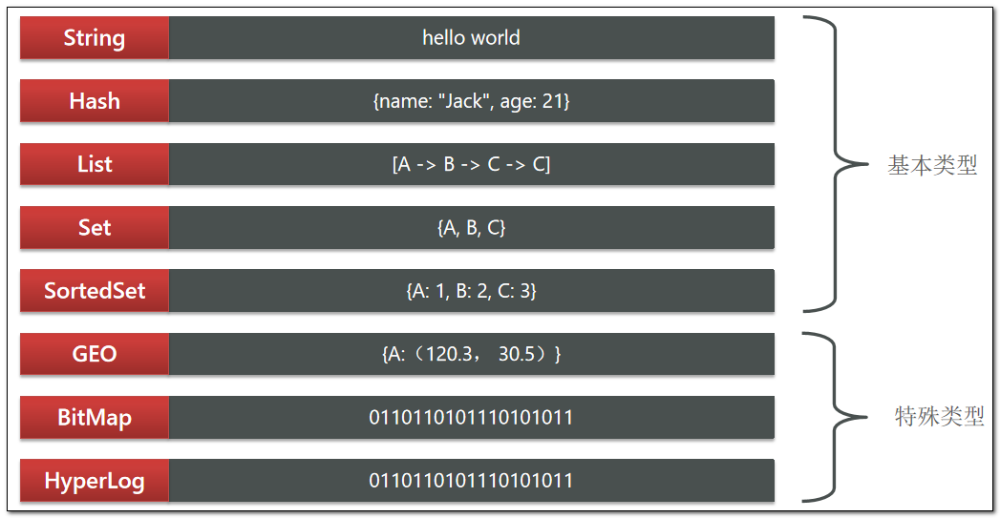

# 一、Redis入门

## 1. 认识NoSQL

### 1.1 什么是NoSQL

---

- NoSQL最常见的解释是"`non-relational`"， 很多人也说它是"***Not Only SQL***"
- NoSQL仅仅是一个概念，泛指**非关系型的数据库**
- 区别于关系数据库，它们不保证关系数据的ACID特性
- NoSQL是一项全新的数据库革命性运动，提倡运用非关系型的数据存储，相对于铺天盖地的关系型数据库运用，这一概念无疑是一种全新的思维的注入
- 常见的NoSQL数据库有：`Redis`、`MemCache`、`MongoDB`等

### 1.2 NoSQL与SQL的差异

---

|          |                            SQL                             |                               NoSQL                               |
| :------: | :--------------------------------------------------------: | :---------------------------------------------------------------: |
| 数据结构 |                           结构化                           |                             非结构化                              |
| 数据关联 |                           关联的                           |                             无关联的                              |
| 查询方式 |                          SQL查询                           |                               非SQL                               |
| 事务特性 |                            ACID                            |                               BASE                                |
| 存储方式 |                            磁盘                            |                               内存                                |
|  扩展性  |                            垂直                            |                               水平                                |
| 使用场景 | 1）数据结构固定<br>2）相关业务对数据安全性、一致性要求较高 | 1）数据结构不固定<br>2）对一致性、安全性要求不高<br>3）对性能要求 |

## 2. 认识Redis

> Redis诞生于2009年全称是Remote Dictionary Server，远程词典服务器，是一个基于内存的键值型NoSQL数据库。

**Redis的特征：**

- 键值（`key-value`）型，value支持多种不同数据结构，功能丰富
- 单线程，每个命令具备原子性
- 低延迟，速度快（基于内存、IO多路复用、良好的编码）。
- 支持数据持久化
- 支持主从集群、分片集群
- 支持多语言客户端


## 3. 安装Redis

### 3.1 前置准备

---

首先安装 `homebrew`

```sh
brew --version
```

使用以上命令可以查看 `homebrew` 的安装情况

### 3.2 安装Redis依赖

---

使用终端

```sh
brew install redis
```

## 4. 启动Redis

> Redis的启动方式有很多种，例如：**前台启动**、**后台启动**、**开机自启**
>

### 4.1 前台启动（不推荐）

---

> **这种启动属于前台启动，会阻塞整个会话窗口，窗口关闭或者按下`CTRL + C`则Redis停止。不推荐使用。**

- **安装完成后，在任意目录输入`redis-server`命令即可启动Redis**

  ```sh
  redis-server
  ```

### 4.2 后台启动（不推荐）

---

> **如果要让Redis以后台方式启动，则必须修改Redis配置文件，配置文件所在目录就是之前我们解压的安装包下**

- **因为我们要修改配置文件，因此我们需要先将原文件备份一份**

  ```sh
  cd /opt/homebrew/etc
  cp redis.conf redis.conf.bak
  ```
  
- **然后修改`redis.conf`文件中的一些配置**

  ```sh
  # 允许访问的地址，默认是127.0.0.1，会导致只能在本地访问。修改为0.0.0.0则可以在任意IP访问，生产环境不要设置为0.0.0.0
  bind 0.0.0.0
  # 守护进程，修改为yes后即可后台运行
  daemonize yes 
  # 密码，设置后访问Redis必须输入密码
  requirepass Root@159
  ```

- **Redis其他常用配置**

  ```sh
  # 监听的端口
  port 6379
  # 工作目录，默认是当前目录，也就是运行redis-server时的命令，日志、持久化等文件会保存在这个目录
  dir .
  # 数据库数量，设置为1，代表只使用1个库，默认有16个库，编号0~15
  databases 1
  # 设置redis能够使用的最大内存
  maxmemory 512mb
  # 日志文件，默认为空，不记录日志，可以指定日志文件名
  logfile "redis.log"
  ```

- **启动Redis**

  ```sh
  # 进入redis配置文件目录 
  cd /opt/homebrew/etc
  # 启动
  redis-server redis.conf
  ```

- **停止Redis服务**

  ```sh
  # 通过kill命令直接杀死进程
  kill -9 redis进程pid
  ```

  ```sh
  # 利用redis-cli来执行 shutdown 命令，即可停止 Redis 服务，
  # 因为之前配置了密码，因此需要通过 -a 来指定密码
  redis-cli -a 132537 shutdown
  ```

  

### 4.3 开机自启（推荐）

---

> **我们也可以通过配置来实现开机自启**

- **现在，使用 `brew service` 命令来操作redis了**

  ```sh
  # 启动
  brew services start redis
  # 停止
  brew services stop redis
  # 重启
  brew services restart redis
  # 查看状态
  brew services info redis
  ```

# 二、Redis常见命令

> 我们可以通过Redis的中文文档：[Commands | Redis](https://redis.io/commands/)，来学习各种命令。
>
> 也可以通过菜鸟教程官网来学习：[Redis 命令 | 菜鸟教程 (runoob.com)](https://www.runoob.com/redis/redis-commands.html)

## 2.1 Redis数据结构介绍

> **Redis是一个key-value的数据库，key一般是String类型，不过value的类型多种多样**




## 2.2 通用命令

> **通用指令是部分数据类型的，都可以使用的指令，常见的有如下表格所示**

|  指令  |                        描述                        |
| :----: | :------------------------------------------------: |
|  KEYS  | 查看符合模板的所有key，不建议在生产环境设备上使用  |
|  DEL   |                 删除一个指定的key                  |
| EXISTS |                  判断key是否存在                   |
| EXPIRE | 给一个key设置有效期，有效期到期时该key会被自动删除 |
|  TTL   |              查看一个KEY的剩余有效期               |

**可以通过`help [command] `可以查看一个命令的具体用法！**


## 2.3 String类型

> **String类型，也就是字符串类型，是Redis中最简单的存储类型。**

其value是字符串，不过根据字符串的格式不同，又可以分为3类：

- `string`：普通字符串
- `int`：整数类型，可以做自增、自减操作
- `float`：浮点类型，可以做自增、自减操作


> 不管是哪种格式，底层都是字节数组形式存储，只不过是编码方式不同。字符串类型的最大空间不能超过**512m**.

|  KEY  |    VALUE    |
| :---: | :---------: |
|  msg  | hello world |
|  num  |     10      |
| score |    92.5     |


> **String的常见命令有如下表格所示**

|    命令     |                              描述                              |
| :---------: | :------------------------------------------------------------: |
|     SET     |          添加或者修改已经存在的一个String类型的键值对          |
|     GET     |                  根据key获取String类型的value                  |
|    MSET     |                 批量添加多个String类型的键值对                 |
|    MGET     |              根据多个key获取多个String类型的value              |
|    INCR     |                      让一个整型的key自增1                      |
|   INCRBY    | 让一个整型的key自增并指定步长，例如：incrby num 2 让num值自增2 |
| INCRBYFLOAT |               让一个浮点类型的数字自增并指定步长               |
|    SETNX    |  添加一个String类型的键值对，前提是这个key不存在，否则不执行   |
|  **SETEX**  |           添加一个String类型的键值对，并且指定有效期           |


> **Redis的key允许有多个单词形成层级结构，多个单词之间用” ：“隔开，格式如下：**

```tex
项目名:业务名:类型:id
```

这个格式并非固定，也可以根据自己的需求来删除或添加词条。

例如我们的项目名称叫 `heima`，有`user`和`product`两种不同类型的数据，我们可以这样定义key：

- **user**相关的key：`heima:user:1`
- **product**相关的key：`heima:product:1`

如果Value是一个Java对象，例如一个User对象，则可以将对象序列化为JSON字符串后存储

|       KEY       |                   VALUE                   |
| :-------------: | :---------------------------------------: |
|  heima:user:1   |    {"id":1, "name": "Jack", "age": 21}    |
| heima:product:1 | {"id":1, "name": "小米11", "price": 4999} |


## 2.4 Hash类型

> **Hash类型，也叫散列，其value是一个无序字典，类似于Java中的`HashMap`结构。**

- **Hash结构可以将对象中的每个字段独立存储，可以针对单个字段做CRUD**

  

- **Hash的常见命令有：**

  |         命令         |                               描述                                |
  | :------------------: | :---------------------------------------------------------------: |
  | HSET key field value |                添加或者修改hash类型key的field的值                 |
  |    HGET key field    |                  获取一个hash类型key的field的值                   |
  |   HMSET(已经弃用)    |          hmset 和 hset 效果相同 ，4.0之后hmset可以弃用了          |
  |        HMGET         |                批量获取多个hash类型key的field的值                 |
  |       HGETALL        |            获取一个hash类型的key中的所有的field和value            |
  |        HKEYS         |               获取一个hash类型的key中的所有的field                |
  |        HVALS         |               获取一个hash类型的key中的所有的value                |
  |       HINCRBY        |              让一个hash类型key的字段值自增并指定步长              |
  |        HSETNX        | 添加一个hash类型的key的field值，前提是这个field不存在，否则不执行 |

  

## 2.5 List类型

> **Redis中的List类型与Java中的LinkedList类似，可以看做是一个双向链表结构。既可以支持正向检索和也可以支持反向检索。**

**特征也与`LinkedList`类似：**

- 有序
- 元素可以重复
- 插入和删除快
- 查询速度一般

常用来存储一个有序数据，例如：朋友圈点赞列表，评论列表等.

> **List的常见命令有**

|            命令            |                                描述                                 |
| :------------------------: | :-----------------------------------------------------------------: |
|   LPUSH key  element ...   |                    向列表左侧插入一个或多个元素                     |
|          LPOP key          |            移除并返回列表左侧的第一个元素，没有则返回nil            |
| **RPUSH key  element ...** |                    向列表右侧插入一个或多个元素                     |
|          RPOP key          |                   移除并返回列表右侧的第一个元素                    |
|    LRANGE key star end     |                    返回一段角标范围内的所有元素                     |
|        BLPOP和BRPOP        | 与LPOP和RPOP类似，只不过在没有元素时等待指定时间，而不是直接返回nil |


> **思考问题**

- **如何利用List结构模拟一个栈?**

  - 先进后出，入口和出口在同一边

- **如何利用List结构模拟一个队列?**

  - 先进先出，入口和出口在不同边

- **如何利用List结构模拟一个阻塞队列?**

  - 入口和出口在不同边
  - 出队时采用BLPOP或BRPOP

  

## 2.6 Set类型

> **Redis的Set结构与Java中的HashSet类似，可以看做是一个value为null的HashMap。因为也是一个hash表，因此具备与HashSet类似的特征**

- 无序
- 元素不可重复
- 查找快
- 支持交集、并集、差集等功能

> **Set的常见命令有**

|         命令         |            描述             |
| :------------------: | :-------------------------: |
| SADD key member ...  |  向set中添加一个或多个元素  |
| SREM key member ...  |     移除set中的指定元素     |
|      SCARD key       |     返回set中元素的个数     |
| SISMEMBER key member | 判断一个元素是否存在于set中 |
|       SMEMBERS       |     获取set中的所有元素     |
| SINTER key1 key2 ... |     求key1与key2的交集      |
| SDIFF key1 key2 ...  |     求key1与key2的差集      |
| SUNION key1 key2 ..  |     求key1和key2的并集      |

> **交集、差集、并集图示**


## 2.7 SortedSet类型

> **Redis的SortedSet是一个可排序的set集合，与Java中的TreeSet有些类似，但底层数据结构却差别很大。SortedSet中的每一个元素都带有一个score属性，可以基于score属性对元素排序，底层的实现是一个跳表（SkipList）加 hash表。**

**SortedSet具备下列特性：**

- 可排序
- 元素不重复
- 查询速度快

因为SortedSet的可排序特性，经常被用来实现排行榜这样的功能。

> **SortedSet的常见命令有**

|             命令             |                             描述                             |
| :--------------------------: | :----------------------------------------------------------: |
|    ZADD key score member     | 添加一个或多个元素到sorted set ，如果已经存在则更新其score值 |
|       ZREM key member        |                删除sorted set中的一个指定元素                |
|      ZSCORE key member       |             获取sorted set中的指定元素的score值              |
|       ZRANK key member       |              获取sorted set 中的指定元素的排名               |
|          ZCARD key           |                  获取sorted set中的元素个数                  |
|      ZCOUNT key min max      |           统计score值在给定范围内的所有元素的个数            |
| ZINCRBY key increment member |    让sorted set中的指定元素自增，步长为指定的increment值     |
|      ZRANGE key min max      |          按照score排序后，获取指定排名范围内的元素           |
|  ZRANGEBYSCORE key min max   |          按照score排序后，获取指定score范围内的元素          |
|    ZDIFF、ZINTER、ZUNION     |                      求差集、交集、并集                      |

**注意：所有的排名默认都是升序，如果要降序则在命令的Z后面添加`REV`即可**


# 三、Redis客户端

> 安装完成Redis，我们就可以操作Redis，实现数据的CRUD了。这需要用到Redis客户端，包括：
>

- **命令行客户端**
- **图形化桌面客户端**
- **编程客户端**


## 3.1 命令行客户端

- **Redis安装完成后就自带了命令行客户端：`redis-cli`，使用方式如下：**

  ```sh
  redis-cli [options] [commonds]
  ```

- **其中常见的`options`有：**

  - `-h 127.0.0.1`：指定要连接的redis节点的IP地址，默认是127.0.0.1
  - `-p 6379`：指定要连接的redis节点的端口，默认是6379
  - `-a 132537`：指定redis的访问密码 

- **其中的`commonds`就是Redis的操作命令，例如：**
  - `ping`：与redis服务端做心跳测试，服务端正常会返回`pong`
  - 不指定commond时，会进入`redis-cli`的交互控制台：


## 3.2 图形化客户端

Navicat 16.2 版本以上已支持 Redis 图形化界面及操作

> 下载地址：https://navicat.com.cn/download/navicat-premium


## 3.3 Java客户端


### 3.3.1 Jedis快速入门

---

> Jedis的官网地址： https://github.com/redis/jedis，我们先来个快速入门：

- **新建一个Maven工程并引入以下依赖**

  ```xml
  <!--引入Jedis依赖-->
  <dependency>
      <groupId>redis.clients</groupId>
      <artifactId>jedis</artifactId>
      <version></version>
  </dependency>
  ```
  
- **编写测试类并与Redis建立连接**

  ```java
  private Jedis jedis;
  
  @BeforeEach //被该注解修饰的方法每次执行其他方法前自动执行
  void setUp(){
      // 1. 获取连接
      jedis = new Jedis("192.168.0.1",6379);
      // 2. 设置密码
      jedis.auth("132537");
      // 3. 选择库（默认是下标为0的库）
      jedis.select(0);
  }
  ```

- **编写一个操作数据的方法（这里以操作String类型为例）**

  ```java
  @Test
  public void testString(){
      // 1.往redis中存放一条String类型的数据并获取返回结果
      String result = jedis.set("url", "https://www.github.com");
      System.out.println("result = " + result);
  
      // 2.从redis中获取一条数据
      String url = jedis.get("url");
      System.out.println("url = " + url);
  }
  ```

- **最后不要忘记编写一个释放资源的方法**

  ```java
  @AfterEach //被该注解修饰的方法会在每次执行其他方法后执行
  void tearDown(){
      // 1.释放资源
      if (jedis != null){
          jedis.close();
      }
  }
  ```

- **执行`testString()`方法后测试结果如图所示**

  


### 3.3.2 Jedis连接池

---

> **Jedis本身是线程不安全的，并且频繁的创建和销毁连接会有性能损耗，因此我们推荐大家使用Jedis连接池代替Jedis的直连方式**

```java
public class JedisConnectionFactory {
    private static final JedisPool jedisPool;

    static {
        // 配置连接池
        JedisPoolConfig jedisPoolConfig = new JedisPoolConfig();
        // 最大连接数
        jedisPoolConfig.setMaxTotal(8);
        // 最大空闲连接
        jedisPoolConfig.setMaxIdle(8);
        // 最小空闲连接
        jedisPoolConfig.setMinIdle(0);
        // 设置最长等待时间
        jedisPoolConfig.setMaxWaitMillis(200);
        // 创建连接池对象 参数 config host port timeout password
        jedisPool = new JedisPool(jedisPoolConfig, "192.168.0.1", 6379, 1000, "132537");
    }

    // 获取 Jedis 连接池中的资源
    public static Jedis getJedis() {
        return jedisPool.getResource();
    }
}

```


### 3.3.3 SpringDataRedis介绍

---

> **SpringData是Spring中数据操作的模块，包含对各种数据库的集成，其中对Redis的集成模块就叫做`SpringDataRedis`**
>
> **官网地址**：https://spring.io/projects/spring-data-redis

- 提供了对不同Redis客户端的整合（`Lettuce`和`Jedis`）
- 提供了`RedisTemplate`统一API来操作Redis
- 支持Redis的发布订阅模型
- 支持Redis哨兵和Redis集群
- 支持基于Lettuce的响应式编程
- 支持基于JDK、JSON、字符串、Spring对象的数据序列化及反序列化
- 支持基于Redis的`JDKCollection`实现

> **SpringDataRedis中提供了RedisTemplate工具类，其中封装了各种对Redis的操作。并且将不同数据类型的操作API封装到了不同的类型中：**


### 3.3.4 SpringDataRedis快速入门

---

> **`SpringBoot`已经提供了对`SpringDataRedis`的支持，使用非常简单**

- **首先新建一个Spring Boot工程**

- **然后引入连接池依赖**

  ```xml
  <!--连接池依赖-->
  <dependency>
      <groupId>org.apache.commons</groupId>
      <artifactId>commons-pool2</artifactId>
  </dependency>
  ```

- **编写配置文件`application.yml`（连接池的配置在实际开发中是根据需求来的）**

  ```yml
  spring:
    data:
      redis:
        host: 192.168.0.1 #指定redis所在的host
        port: 6379  #指定redis的端口
        password: 111111  #设置redis密码
        lettuce:
          pool:
            max-active: 8 #最大连接数
            max-idle: 8 #最大空闲数
            min-idle: 0 #最小空闲数
            max-wait: 100ms #连接等待时间
  ```

- **编写测试类执行测试方法**

  ```java
  @SpringBootTest(classes=***.class)
  class RedisTest {
  
  	@Resource
  	private RedisTemplate redisTemplate;
  
  	@Test
  	void testString() {
  		// 1.通过RedisTemplate获取操作String类型的ValueOperations对象
  		ValueOperations ops = redisTemplate.opsForValue();
  		// 2.插入一条数据
  		ops.set("blogName","Vz-Blog");
  		
  		// 3.获取数据
  		String blogName = (String) ops.get("blogName");
  		System.out.println("blogName = " + blogName);
  	}
  }
  ```

  

### 3.3.5 RedisSerializer配置

---

> **RedisTemplate可以接收任意Object作为值写入Redis，只不过写入前会把Object序列化为字节形式，`默认是采用JDK序列化`，得到的结果是这样的**


**缺点：**

- 可读性差
- 内存占用较大


> **那么如何解决以上的问题呢？我们可以通过自定义RedisTemplate序列化的方式来解决。**

- **编写一个配置类`RedisConfig`**

  ```java
  @Configuration
  public class RedisConfig {
      @Resource
      private RedisConnectionFactory connectionFactory;
  
      @Bean
      public RedisTemplate<String,Object> redisTemplate(){
          RedisTemplate<String, Object> template = new RedisTemplate<>();
          template.setConnectionFactory(connectionFactory);
          template.setKeySerializer(new StringRedisSerializer());
          template.setValueSerializer(new GenericJackson2JsonRedisSerializer());
          template.setHashKeySerializer(new StringRedisSerializer());
          template.setHashValueSerializer(new GenericJackson2JsonRedisSerializer());
          return template;
      }
  }
  ```
  
- **此时我们已经将RedisTemplate的key设置为`String序列化`，value设置为`Json序列化`的方式，再来执行方法测试**

  

- **由于我们设置的value序列化方式是Json的，因此我们可以直接向redis中插入一个对象**

  ```java
  @Test
  void testSaveUser() {
      redisTemplate.opsForValue().set("user:100", new User("Vz", 21));
      User user = (User) redisTemplate.opsForValue().get("user:100");
      System.out.println("User = " + user);
  }
  ```

  

  尽管Json序列化可以满足我们的需求，但是依旧存在一些问题。

  如上图所示，为了在反序列化时知道对象的类型，JSON序列化器会将类的class类型写入json结果中，存入Redis，会带来额外的内存开销。

  那么我们如何解决这个问题呢？我们可以通过下文的`StringRedisTemplate`来解决这个问题。


### 3.3.6 StringRedisTemplate

---

> **为了节省内存空间，我们并不会使用JSON序列化器来处理value，而是统一使用String序列化器，要求只能存储String类型的key和value。当需要存储Java对象时，手动完成对象的序列化和反序列化。**


> **Spring默认提供了一个StringRedisTemplate类，它的key和value的序列化方式默认就是String方式。省去了我们自定义RedisTemplate的过程**

- **我们可以直接编写一个测试类使用StringRedisTemplate来执行以下方法**

  ```java
  @SpringBootTest
  class RedisStringTemplateTest {
  
  	@Resource
  	private StringRedisTemplate stringRedisTemplate;
  
  	@Test
  	void testSaveUser() throws JsonProcessingException {
  		// 1.创建一个Json序列化对象
  		ObjectMapper objectMapper = new ObjectMapper();
  		// 2.将要存入的对象通过Json序列化对象转换为字符串
  		String userJson1 = objectMapper.writeValueAsString(new User("Vz", 21));
  		// 3.通过StringRedisTemplate将数据存入redis
  		stringRedisTemplate.opsForValue().set("user:100",userJson1);
  		// 4.通过key取出value
  		String userJson2 = stringRedisTemplate.opsForValue().get("user:100");
  		// 5.由于取出的值是String类型的Json字符串，因此我们需要通过Json序列化对象来转换为java对象
  		User user = objectMapper.readValue(userJson2, User.class);
  		// 6.打印结果
  		System.out.println("user = " + user);
  	}
  
  }
  ```

- **执行完毕回到Redis的图形化客户端查看结果**

  


### 3.3.7 总结

---

> RedisTemplate的两种序列化实践方案，两种方案各有各的优缺点，可以根据实际情况选择使用。

方案一：

1. 自定义RedisTemplate
2. 修改RedisTemplate的序列化器配置为GenericJackson2JsonRedisSerializer

方案二：

1. 使用StringRedisTemplate
2. 写入Redis时，手动把对象序列化为JSON
3. 读取Redis时，手动把读取到的JSON反序列化为对象


# 四、缓存

缓存就是数据交换的缓冲区，是存贮数据的临时场所，一般读写性能较高

作用：

1. 降低后端负载
2. 提高读写效率，较低响应时间

成本：

1. 数据一致性成本
2. 代码维护成本
3. 运维成本


## 4.1 缓存更新

1. 低一致性需求——使用Redis自带的内存淘汰机制
2. 高一致性需求——主动更新，并以超时剔除作为兜底方案
   - 读操作
     - 缓存命中则直接返回
     - 缓存未命中则查询数据库，并写入缓存，设置超时时间
   - 写操作
     - 先写数据库，然后再删除缓存
     - 要确保数据库与缓存操作的原子性


## 4.2 缓存穿透

缓存穿透是指客户端请求的数据在缓存中和数据库中都不存在，这样缓存永远不会生效，这些请求都会打到数据库

常见解决方案：

- 缓存空对象
  - 优点：实现简单，维护方便
  - 缺点：
    - 额外的内存消耗
    - 可能造成短期的不一致
- 布隆过滤
  - 优点：内存占用少，没有多余key
  - 缺点：
    - 实现复杂
    - 存在误判可能


## 4.3 缓存雪崩

缓存雪崩是指同一时间大量的缓存Key同时失效或者Redis服务宕机，导致大量请求到达数据库，带来巨大压力

常见解决方案：

- **设置不同的过期时间:** 为缓存设置随机的过期时间，这样可以避免大量缓存同时过期。
- **使用持久层的缓存:** 对于一些不经常变化的数据，可以使用持久层的缓存，如Redis持久化，这样即使缓存服务重启，数据也不会全部失效。
- **设置缓存更新锁:** 当缓存失效时，不是所有请求都去更新缓存，而是使用某种锁机制（如分布式锁），保证只有一个请求去构建新的缓存，其他请求等待或者使用旧的缓存。
- **预缓存机制:** 定期更新缓存内容，而不是等到缓存过期。
- **提供备用缓存:** 设置一个备用缓存，当主缓存不可用时，可以使用备用缓存。
- **限流降级:** 在系统访问量剧增时，启动限流和降级机制，保护数据库和缓存系统。
- **异步队列:** 使用异步队列缓存重建请求，均摊数据库的压力。
- **监控告警:** 监控缓存的使用情况和性能指标，一旦出现异常，立即通知到相关人员进行处理。


## 4.4 缓存击穿

缓存击穿是指一个热点的键在缓存中突然失效（例如过期），在这个键再次被更新到缓存之前，所有对这个键的请求都会直接查询数据库。如果这个键非常热门，突然的大量请求可能会对数据库造成巨大压力。

**解决方案**:

- **设置热点数据永远不过期:** 对于热点数据，可以设置为永不过期，或者使用逻辑过期，即数据有一个逻辑过期时间，在过期之后可以异步更新缓存。
- **使用互斥锁(Mutex Lock):** 在缓存失效后，不是每个请求都去数据库加载数据，而是使用锁或其他同步机制保证只有一个请求去数据库查询，并更新缓存，其他请求等待缓存更新后再从缓存中获取数据。
