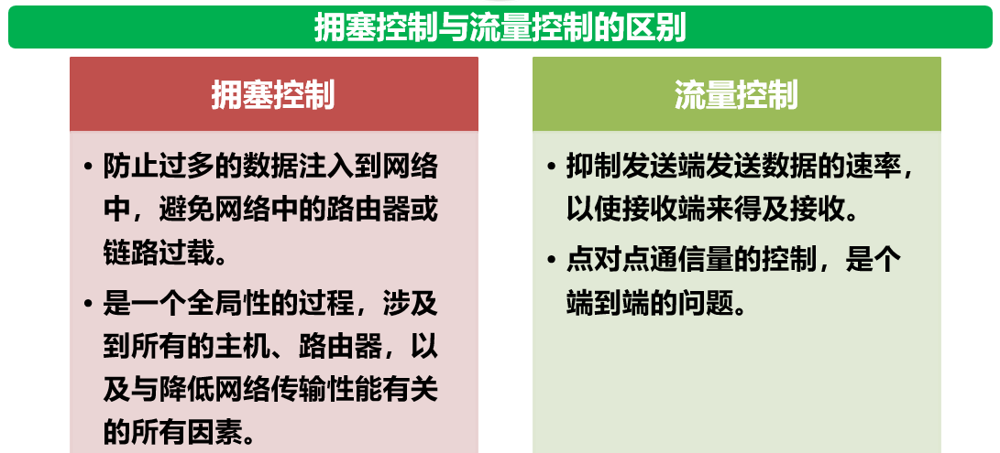

# 第一章 概述
## 1.1 计算机网络在信息时代中的作用
**互联网的两个重要基本特点**：连通性和共享
## 1.2 互联网概述
### 1.2.1 网络的网络
计算机网络（简称网络）由若干 **节点** 和连接这些节点的 **链路** 组成  
有多个网络通过一些路由器相互连接起来，称为互联网
【网络把许多计算机连接在一起，而互联网则把许多网络通过一些路由器连接在一起，与网络相连的计算机常称为主机】
### 1.2.2 互联网基础结构发展的三个阶段
1. 第一阶段：从单个网络 **ARPANET** 向互联网发展的过程
2. 第二阶段：三级结构的互联网（主干网、地区网、校园网或者企业网）
3. 第三阶段：逐渐形成了全球范围的多层次 **ISP** 结构的互联网
## 1.3 互联网的组成
### 1.3.1 边缘部分
边缘部分（处在互联网边缘的部分就是连接在互联网上的所有主机，这些主机又称为端系统）
> “主机A的某个进程与主机B上的另一个进程进行通信”——“简称计算机之间通信”
> 通信方式通常分为两大类：客户-服务器方式(C/S)和对等方式(P2P)
>> - 客户-服务器方式(C/S)
>> 客户是服务请求方，服务器是服务提供方【客户A向服务器B发出请求服务，服务器B向客户A提供服务】
>> - 对等方式(P2P)
>> 两台主机都运行了对等连接软件(P2P软件)，平等的对等连接通信
### 1.3.2 核心部分
在网络核心部分起特殊作用的是路由器。路由器是实现分组交换的关键构件，其任务是转发收到的分组，这是网络核心部分最重要的功能。
1. 电路交换
三个步骤：“建立连接（占用通信资源）”——“通话（一直占用通信资源）”——“释放连接（归还通信资源）”  
特点：在通话的全部时间内，通话的两个用户始终占用端到端的通信资源，线路的传输效率往往很低
>整个报文的比特流连续地从源点直达终点
2. 分组交换
采用存储转发技术，将发送的整块数据称为一个 **报文** 。报文划分为一个个更小的等长数据段，在每个数据段之前加上一些必要的控制信息组成的 **首部** ，就构成了一个 **分组** ，又称为 **包** 。  
主机是为用户进行信息处理的。路由器是用来转发分组，即进行分组交换。
> 特点：单个分组（报文的一部分）传送到相邻节点，存储下来后查找转发表，转发到下一个节点
3. 报文交换
> 特点：整个报文先传送到相邻节点，全部存储下来后查找转发表，转发到下一个节点

## 1.6 计算机网络的性能
### 1.6.1 性能指标
1. 速率：数据的传输速率，也称数据率或比特率，单位 bit/s
2. 带宽：某信道的最高数据率，单位 bit/s【时域】
3. 吞吐量：表示在单位时间内通过某个网络(或信道、接口)的实际数据量
4. 时延【重点计算】
    - 发送时延：是主机或路由器发送数据帧所需要的时间
    > 发送时延的计算公式为：
    > 发送时延=数据帧长度(bit)/发送速率(bit/s)
    - 传播时延：电磁波在信道中传播一定的距离需要花费的时间
    > 传输时延的计算公式为：
    > 传输时延=信道长度(m)/电磁波在信道上的传播速率(m/s)
    - 处理时延：主机或路由器在收到分组时要花费一定的时间进行处理
    - 排队时延：分组在经过网络传输时，要经过许多路由器。分组在路由器中要在输入输出队列中等待，产生了排队时延
    > - 总时延 = 发送时延 + 传输时延 + 处理时延 + 排队时延 
5. 时延带宽积 = 传播时延*带宽 单位 bit
6. 往返时间 RTT 【重点】

    > 有效数据率 = 数据长度 / (发送时间+RTT)
7. 利用率：信道利用率和网络利用率
    - 信道利用率指出某信道有百分之几的时间是被利用的（有数据通过）
    - 网络利用率指全网络的信道利用率的加权平均值。
    $$
    D= \frac{D_0}{1-U} \\
    D 表示网络当前的时延 \\
    D_0 表示网络空闲时的时延 \\
    U 表示现在的网络利用率
    $$
    > 信道利用率或网络利用率过高就会产生非常大的时延

## 1.7 计算机网络体系结构
### 1.7.1 计算机网络体系结构的形成
开放系统互连基本参考模型 **OSI/RM** 与 **TCP/IP**


### 1.7.2 协议与划分层次 
为网络中的数据交换而建立的规则、标准或约定称为网络协议  
网络协议的三要素：  

1. **语法**：数据与控制信息的结构或格式
2. **语义**：需要发出何种控制信息，完成何种动作以及做出何种响应
3. **同步**：事件实现顺序的详细说明
### 1.7.3 具有五层协议的体系结构
1. 应用层(第五层，最高层)
> 应用层的 **任务** 是通过应用进程间的交互来完成特定网络应用  

应用层协议定义的是应用进程间通信和交互的规则【这里的进程是指主机中正在运行的程序】  
对于不同的网络应用需要有不同的应用层协议【比如：DNS HTTP SMTP】

> 应用层交互的数据单元称为 **报文**

2. 运输层(第四层)
> 运输层的任务就是负责向 **两台主机中进程之间的通信** 提供 **通用的数据传输协议**

由于一台主机可同时运行多个进程，因此运输层有 **复用** 和 **分用** 的功能
- 复用：多个应用层进程可同时使用下面运输层的服务
- 分用：运输层把收到的信息分别交付上面应用层中的相应进程

> 运输层主要使用以下两层协议：
>> - 传输控制协议 TCP —— 提供 **面向连接** 、 **可靠的** 数据传输服务，其数据传输的单位是 **报文段**
>> - 用户数据报协议 UDP —— 提供 **无连接** 的 **尽最大努力** 的数据传输服务(不保证数据传输的可靠性)，其数据传输的单位是 **用户数据报**

3. 网络层(第三层)【互联网的网络层也叫做网际层或IP层】
> 网络层负责为分组交换网上的不同 **主机** 提供 **通信服务**  

在发送数据时，网络层把运输层产生的 **报文段(TCP)** 或者 **用户数据报(UDP)** 封装成 **分组** 或 **包** 进行传送。  
在TCP/IP体系中，由于网络层使用 IP 协议，因此分组也叫 **IP数据报** ，或简称数据报

> 网络层的具体任务有两个
>> - 第一：通过一定的算法，在互联网中的每一个路由器上生成一个用来转发分组的转发表
>> - 第二：每一个路由器在接收到一个分组时，依据转发表中指明的路径把分组转发到下一个路由器

4. 数据链路层(第二层)【简称链路层】
在两个相邻节点之间传送数据时，数据链路层将网络层交下来的 **IP 数据报** 封装成 **帧** ，在两个相邻节点间的链路上传送 **帧**。  
每帧包括 **数据** 和必要的 **控制信息** (如同步信息、地址信息、差错控制)

5. 物理层(第一层)
物理层上所传数据的单位是 **比特(bite)**
物理层要考虑用多大的电压代表“1”和“0”，以及接收方如何识别发送方所发送的比特。  
物理层还要确定连接电缆的插头应该有多少根引脚以及各引脚应如何连接。

# 第二章 物理层
## 2.1 物理层的基本概念
物理层考虑的是怎样才能在连接各种计算机的传输媒体上传输数控比特流，而不是指具体的传输媒体。  
物理层的作用是尽可能地屏蔽掉这些传输媒体和通信手段的差异。  
用于物理层的协议也常称为物理层 **规程**

## 2.2 数据通信的基础知识
### 2.2.1 数据通信系统的模型
一个数据通信系统可划分为三大部分：
> 1. 源系统(发送端、发送方)
> 2. 传输系统(传输网络)
> 3. 目的系统(接收端、接收方)

通信的目的是传送 **消息**。语音、文字、图像、视频等都是消息。  
**数据** 是运送消息的实体。

根据信号中代表消息的参数的取值方式不同，信号可分为以下两大类：【重点】
(1) 模拟信号(连续信号)：代表消息的参数取值是连续的
(2) 数字信号(离散信号)：代表消息的参数取值是离散的

### 2.2.2 有关信道的几个基本概念
从通信的双方信息交互的方式来看：【重点】
1. 单向通信(单工通信)：只能有一个方向的通信而没有反方向的交互。比如无线电、有线电、电视广播【一条信道】
2. 双向交替通信(半双工通信)：通信的双方都可以发送信息，但不能双方同时发送或同时接收。这种通信方式是一方发送另一方接受，过一段时间可以再反过来。【两条信道，每个方向各一条】
3. 双向同时通信(全双工通信)：通信的双方可以同时发送和接收消息。【两条信道，每个方向各一条】  

来自信源的信号常称为 **基带信号**
>调制可分为两大类：
>> - 基带调制（编码），仅仅对基带信号的波形进行变换，使它能够与信道特性。变换后的信号依然是基带信号。
>>> 1. 不归零制：正电平代表1，负电平代表0
>>> 2. 归零制：正脉冲代表1，负脉冲代表0
>>> 3. 曼彻斯特编码：位周期中心的向上跳变代表0，位中期中心的向下跳变代表。也可反过来定义。
>>> 4. 差分曼彻斯特编码：在每一位的中心处始终都有跳变。位开始边界有跳变代表0，而位开始边界没有跳变代表1。

>> - 带通调制
>>> 1. 调幅(AM)：载波的振幅随基带数字信号而变化。例如0和1分别对应于无载波或有载波输出
>>> 2. 调频(FM)，即载波的频率随基带数字信号而变化。例如，0或1分别对应于频率f1或f2。
>>> 3. 调相(PM)，即载波的初始相位随基带数字信号而变化。例如，0或1分别对应于相位0度或180度。


### 2.2.3 信道的极限容量
信噪比：信号的平均功率和噪声的平均功率之比，常记为 S/N，并用分贝(dB)作为度量单位
$$
信噪比(dB)=10*log_{10}{(S/N)} (dB)
$$

在1948年，信息论的创始人香农(Shannon)推导出了著名的香农公式。香农公式指出：信道的极限信息传输速率C是
$$
C=W* log_2{(1+S/N)} (bit/s)
$$
式中，W为信道的带宽（以Hz为单位）；S为信道内所传信号的平均功率；N为信道内部的高斯噪声功率。  
> 香农公式表明，信道的带宽或信道中的信噪比越大，信息的极限传输速率就越高。

## 2.3 物理层下面的传输媒体
传输媒体也称为传输介质或传输媒介，分为两大类，即导引型传输媒体【有线】和非导引型传输媒体【无线】
### 2.3.1 导引型传输媒体
1. 双绞线
2. 同轴电缆
3. 光缆：通信容量非常大；传输损耗小，中继距离长，对远距离传输特别经济；抗雷电和电磁干扰性能好；无串音干扰，保密性好，也不易被窃听或截取数据；体积小，重量轻。
### 2.3.2 非导引型传输媒介
自由空间称为“非导引型传输媒介”，微波接力通信、卫星通信、红外通信、激光通信

## 2.4 信道复用技术
### 2.4.1 频分复用、时分复用和统计时分复用
1. 频分复用FDM
频分复用的各路信号在同样的时间占用不用的带宽资源【频率带宽】
2. 时分复用TDM
时分复用将时间划分为一段段等长的时分复用帧(TDM帧)。每一路信号在每一个TDM帧中占用固定序号的时隙。时分复用的所有用户是在不同的时间占用同样的频带宽度。


使用FDM或TDM的复用技术，可以让多个用户（可以处在不同地点）共享信道资源。FDMA，频分多址；TDMA，时分多址。

> 注意：FDMA或TDMA中的“MA”表明“多址”，意思是强调这种复用信道可以让多个用户(可以在不同地点接入进来)。而“FD”或“TD”则表示所使用的复用技术是“频分复用”或“时分复用”。但术语FDM或TDM则说明实在频域还是在时域进行复用，而并不强调复用的信道是用于多个用户还是一个用户。

### 2.4.2 波分复用
**波分复用WDM** 就是 **光的频分复用**  
在一根光纤上复用几十路或更多路数的光载波信号，即为 **密集波分复用 DWDM** 
光复用器--掺铒光纤放大器EDFA--光分用器

### 2.4.3 码分复用
> **码分复用CDM** 是另一种共享信道的方法。当码分复用信道为多个不同地址的用户所共享时，就称为 **码分多址CDMA**

使用CDMA的每一个站被指派一个唯一的 m bit 码片序列。  
一个站如果要发送比特 1 ，则发送它自己的 m bit 码片序列。  
如果要发送比特 0 ，则发送该码片序列的二进制反码。  

S站要发送信息的数据率为 b bit/s，由于每一个比特要转换成 m 个比特的码片，因此S站实际上发送的数据率提高到 mb bit/s，同时S站所占用的频带宽度也提高到原来数值的m倍。这种通信方式即扩频通信方式中的直接序列扩频。

> 扩频通信通常两大类： **直接序列扩频DSSS** , **跳频扩频HSSS**

CDMA系统的一个重要而特点就是这种体制给每个站分配的码片不仅必须各不相同，并且还必须互相 **正交**。各站码片反码的向量内积也为0。任何一个码片向量与自己的规格化内积都是1 。在实用的系统中是使用伪随机码序列。

## 2.6 宽带接入技术【有线】
### 2.6.1 ADSL技术
> 非对称数字用户线 ADSL 技术是用数字技术对现有 **模拟电话的用户线** 进行改造，使它能够承载宽带数字业务。

ADSL技术把 0~4 kHz 低端频谱留给传统电话使用，而把原来没有被利用的高端频谱留给用户上网使用。  

由于当时用户上网主要是从互联网下载各种文档，而向互联网发送的信息量一般都不太大，因此ADSL的下行（ISP到用户）带宽都远远大于上行（从用户到ISP）带宽。“非对称”这个名词的意义于此。

> ADSL的 **传输距离** 取决于 **数据率** 和 **用户线的线径** 。数据率越大，线径越小，传送距离越短。ADSL的最高数据传输速率还与实际的用户线上的 **信噪比** 密切相关。

ADSL在用户线的两端各安装一个ADSL调制解调器（采用方案：离散多音调DMT调制技术）。DMT调制技术采用频分复用的方法。ADSL不能保证固定的数据率。  

基于ADSL的接入网由以下三大部分组成：**数字用户线接入复用器DSLAM**（包括许多ADSL调制解调器，又称为接入端接端元ATU）、用户线、和用户家中的一些设施。

ADSL不适合于企业。所以有几种技术变型：
1. **SDSL** ——对称DSL，即SDSL，将带宽平均分配到下行和上行两个方向
2. **HDSL** ——使用一对线或两对线的对称DSL叫作 HDSL，用来取代 T1 线路的高速数字用户线
3. **VDSL** ——ADSL的快速版本，用于短距离传输，即 **甚高速数字用户线**

### 2.6.2 光纤同轴混合网（HFC网）
> HFC网是目前覆盖面很广的有线电视网的基础行开发的一种居民宽带接入网，除可传送电视节目外，还能提供电话、数据和其他宽带交互业务。

---

HFC网把原有线电视网中的同轴电缆主干部分改换为光纤。
光纤从头端连接到光纤节点。
在光纤节点，光信号转换为电信号，然后通过同轴电缆传送到每个用户家庭。
从头端到用户家庭所需的放大器数目也就减少到仅 4 ~ 5 个。
连接到一个光纤节点的典型用户数是500左右，但不超过2000 。


---

为了使用户能够利用HFC网接入到互联网，以及在上行信道中传送交互数字电视所需的一些信息，我们还需要增加一个为HFC网使用的调制解调器，称为 **电缆调制解调器** 。

### 2.6.3 FTTx技术
> 多种宽带接入方式称为FTTx，表示 Fiber To The ... 。

这里的字母 x 可代表不同的光纤接入地点。例如，光电进行转换的地方，可以在用户家中（这时 x 就是 H，光纤到户），光纤到路边(FTTC)，光纤到小区(FTTZ)，光纤到大楼(FTTB)，光纤到楼层(FTTF)，光纤到办公室(FTTO)，光纤到桌面(FTTD)

为了有效地利用光纤资源，在光纤主干和广大用户之间，还需要铺置一段中间地转换装置即 **光配线网ODN** ，使得数十个家庭用户能够共享一根光纤干线。
无源光配线网常称为 **无源光网络PON**，“无源”表明在光配线网中无须配置电源。

> 图中，**光线路终端OLT** 是连接到光纤干线的终端设备。OLT把收到的下行数据发放无源的 **1:N 光分路器** ，然后用广播方式向所有用户端的 **光网络单元ONU** 发送。


光配线网采用波分复用，上行和下行分别使用不同的波长。

无源光网络PON的种类很多：
1. 以太网无源光网络 EPON：与现有以太网的兼容性好，并且成本低，扩展性强，管理方便。
2. 吉比特无源光网络 GPON：采用通用封装方法，可承载多业务，对各种业务类型都能够提供服务质量保证，总体性能比EPON好。

# 第三章 数据链路层
- 数据链路层使用的信道主要有以下两种类型：
    1. 点对点通信：PPP协议
    2. 广播通信：CSMA/CD协议
- 数据链路层的三个基本问题：封装成帧、透明传输和差错检测
- 以太网MAC层的硬件地址
- 适配器、转发器、集线器、网桥、以太网交换机的作用以及使用场合
## 3.1 数据链路层的几个共同问题
### 3.1.1 数据链路和帧
- 链路【物理链路】：就是从一个节点到相邻节点的一段物理路线（有线或无线），中间没有任何其他的交换节点。链路只是一条路径的组成部分
- 数据链路【逻辑链路】：把实现控制数据传输的协议的硬件和软件加到链路上，就构成了数据链路。典型实现：网络适配器
- 点对点信道的数据链路层的协议数据单元——帧
### 3.1.2 三个基本问题
1. 封装成帧：在一段数据的前后分别添加首部和尾部，构成一个帧
    
    - 首部和尾部的一个重要作用就是进行 **帧定界**(确定帧的界限)
    - 用控制字符作为帧定界符
        - 控制字符 SOH 放在一帧的最前面，表示帧的首部开始
        - 控制字符 EOT 放在一帧的末尾，表示帧的结束
        

2. 透明传输：
    问题：如果数据中的某个字节的二进制代码敲好和SOH或EOT一样，数据链路层就会错误地“找到帧的边界”，导致错误 

    > 透明：指某一个实际存在的事物看起来却不存在一样  
    > - “在数据链路层透明传输数据表示”：无论发送什么样的比特组合数据，这些数据都能够按照原样没有差错地通过这个数据链路层

    使用“ **字节填充** ”或“ **字符填充** ”解决透明传输的问题：发送端的数据链路层在数据中出现控制字符“SOH”或“EOT”的前面插入一个转义字符“ESC”。而在接收端的数据链路层在把数据送往网络层之前删除这个插入的转义字符。
    

3. 差错检测：比特在传输过程中可能会产生差错，1可能变成0，0可能变成1，这就是比特差错。  
在一段时间内，传输错误的比特占所传输比特总数的比率称为 **误码率 BER**
> 使用 **循环冗余检验 CRC** 的检错技术
- 在发送端，先把数据划分为组。假定每组k个比特
- CRC运算在每组数据 M 后面再添加供差错检测用的 n 位 **冗余码FCS**，然后构成一个帧发送出去，一共发送 (k+n) 位
> 冗余码的计算
> 1. 用二进制的模 2 运算进行 2n 乘 M 的运算，这相当于在 M 后面添加 n 个 0。
> 2. 得到的 (k + n) 位的数除以事先选定好的长度为 (n + 1) 位的除数 P，得出商是 Q ，余数是 R，余数 R 比除数 P 少 1 位，即 R 是 n 位。 
> 3. 将余数 R 作为冗余码拼接在数据 M 后面，一起发送出去。


注意：
- 仅用循环冗余检验 CRC 差错检测技术只能做到无差错接受 (accept)。
- 即：“凡是接受的帧（即不包括丢弃的帧），我们都能以非常接近于 1 的概率认为这些帧在传输过程中没有产生差错”。
- 即：“凡是接收端数据链路层接受的帧均无差错”。

## 3.2 点对点协议PPP
### 3.2.1 PPP协议的特点
PPP协议就是用户计算机和ISP进行通信时所使用的数据链路层协议。
组成部分：
1. 一个将IP数据报封装到串行链路的方法
2. 一个用来建立、配置和测试数据链路连接的链路控制协议LCP
3. 一套网络控制协议NCP
### 3.2.2 PPP协议的帧格式
1. 各字段的意义
    PPP帧的首部和尾部分别为四个字段和两个字段
    - 首部：
        1. 标志字段F：0x7E，表示一个帧的开始，1字节
        2. 地址字段A：0xFF，1字节
        3. 控制字段C：0x03，1字节
        4. 协议字段：2字节，0x0021，信息字段为IP数据报；0xC021，信息字段为PPP链路控制协议LCP的数据；0x8021，信息字段为网络控制数据
    - 尾部：
        1. FCS：使用CRC的帧检测序列
        2. 标志字段F：0x7E，表示一个帧的结束，1字节
    
    

2. 字节填充【异步传输】
当PPP使用异步传输时，将转义符定义为 0x7D ，并使用字节填充
信息字段中出现 0x7E,0x7D,ASCII码的控制字符(即数值小于0x20的字符)，需要在其字符前插入转义符，小于0x20的字符编码并改变。

3. 零比特填充【同步传输】
PPP协议使用同步传输(一连串的比特连续传送)，采用零比特填充方法来实现透明传输。  
发送端在信息字段的5个连续1之后，填入一个0，保证信息字段不会出现6个连续1

### 3.2.3 PPP协议的工作状态
PPP链路的初始化过程：
- 用户拨号接入 ISP 后，就建立了一条从用户个人电脑到 ISP 的物理连接。
- 用户个人电脑向 ISP 发送一系列的链路控制协议 LCP 分组（封装成多个 PPP 帧），以便建立LCP连接。
- 之后进行网络层配置。网络控制协议 NCP 给新接入的用户个人电脑分配一个临时的 IP 地址。
- 当用户通信完毕时，NCP 释放网络层连接，收回原来分配出去的IP地址。LCP 释放数据链路层连接。最后释放的是物理层的连接。

## 3.3 使用广播信道的数据链路层
### 3.3.1 局域网的数据链路层
>- 局域网最主要的特点：
    1. 网络为一个单位所拥有；
    2. 地理范围和站点数目均有限。 

>- 局域网具有如下主要优点：
    1. 具有广播功能，从一个站点可很方便地访问全网。
    2. 便于系统的扩展和逐渐地演变，各设备的位置可灵活调整和改变。
    3. 提高了系统的可靠性、可用性和生存性。

局域网可按拓扑结构进行分类：星形网、环形网、总线网
局域网使用的传输媒介：双绞线、光纤

>如何使众多用户能够合理而方便地共享通信媒体资源，不互相干扰：
>> 1. 静态划分信道：频分复用、时分复用、波分复用、码分复用
>> 2. 动态媒体接入控制（多点接入），特点是信道并非在用户通信时固定分配给用户:
>>    - 随机接入：所有的用户可随机地发送信号。(**会发生碰撞**)
>>    - 受控接入：用户不能随机地发送信息而必须服从一定地控制，典型代表 **探询（轮询）**

### 3.2.2 CSMA/CD协议
**载波监听 多点接入 / 碰撞检测** 要点：
- 多点接入：说明这是总线型网络。许多计算机以多点接入的方式连接在一根总线上。
- 载波监听：即“边发送边监听”。不管在想要发送数据之前，还是在发送数据之中，每个站都必须不停地检测信道。
- 碰撞检测：适配器边发送数据，边检测信道上的信号电压的变化情况。电压摆动值超过一定的门限值时，就认为总线上至少有两个站同时在发送数据，表明产生了碰撞（或冲突）。


- 以太网采用截断二进制指数退避 (truncated binary exponential backoff) 算法确定碰撞后重传的时机。(发生碰撞的站停止发送数据后，要退避一个随机时间后再发送数据)
    - 以太网的端到端往返时延 2τ 称为争用期，或碰撞窗口。具体的争用期时间 = 51.2 μs。10 M bit/s 以太网。也可以用比特时间单位
    - 从整数集合 [0, 1, … , (2^k - 1)] 中随机地取出一个数，记为 r。
    重传所需的时延 =  r * 争用期。
    - 参数 k = Min[重传次数, 10]
    - 当重传达 16 次仍不能成功时即丢弃该帧，并向高层报告。 
> 举例：
第 1 次冲突重传时：k = 1，r  为 {0，1} 集合中的任何一个数。
第 2 次冲突重传时：k = 2，r  为 {0，1，2，3} 集合中的任何一个数。
第 3 次冲突重传时：k = 3，r  为 {0，1，2，3，4，5，6，7} 集合中的任何一个数。

> 若连续多次发生冲突，表明可能有较多的站参与争用信道。
上述退避算法可使重传需要推迟的平均时间随重传次数而增大（称为动态退避），因而减小发生碰撞的概率，有利于整个系统的稳定。

> 争用期的长度 = 51.2 μs。
> 对于 10 Mbit/s 以太网，在争用期内可发送 512 bit，即 64 字节。

> 以太网在发送数据时，若前 64 字节没有发生冲突，则后续的数据就不会发生冲突。
> 以太网规定了最短有效帧长为 64 字节。凡长度小于 64 字节的帧都是由于冲突而异常中止的无效帧，应当立即将其丢弃。

> 以太网最大端到端单程时延必须小于争用期的一半 (即 25.6 μs)，相当于以太网的最大端到端长度约为 5 km。

强化碰撞：人为干扰信号
发送站检测到冲突后，立即停止发送数据帧，接着就发送 32 或 48 比特的人为干扰信号 (jamming signal) 。
以太网还规定了帧间最小间隔为 9.6 μs。

### 3.3.5 以太网的MAC层
1. MAC层的硬件地址
    硬件地址又称为物理地址或MAC地址
    IEEE 802 标准为局域网规定了一种 48 位的全球地址（简称为地址）是指局域网上的每一台计算机中固化在适配器的 ROM 中的地址。

    - 48位的MAC地址(EUI-48)
        - IEEE 注册管理机构 RA 负责向厂家分配前 3 个字节 (即高 24 位)，称为组织唯一标识符 OUI (Organizationally Unique Identifier)。
        - 厂家自行指派后 3 个字节 (即低 24 位)，称为扩展标识符 (extended identifier)。
        - 必须保证生产出的适配器没有重复地址。
        - 地址被固化在适配器的 ROM 中。

    - 适配器具有 **过滤功能**
        - 每收到一个 MAC 帧，先用硬件检查帧中的 MAC 地址。
        - 如果是发往本站的帧则收下，然后再进行其他的处理。
        > 发往本站的帧有三种：
        > 单播帧(一对一) ，即收到的帧的MAC地址与本站的MAC地址相同
        > 广播帧(一对全体)，即发送给本局域网上所有站点的帧(全1地址)
        > 多播帧(一对多)，即发送给本局域网上一部分站点的帧

        - 否则就将此帧丢弃，不再进行其他的处理。

2. MAC帧的格式
    最常用的 MAC 帧是以太网 V2 的格式。
    
    > 当数据字段的长度小于 46 字节时，应在数据字段的后面加入整数字节的填充字段，以保证以太网的 MAC 帧长不小于 64 字节。 

    为了达到比特同步，在传输媒体上实际传送的要比 MAC 帧还多 8 个字节

    由硬件在帧的前面插入 8 字节。第一个字段共 7 个字节，是前同步码，用来迅速实现 MAC 帧的比特同步。第二个字段 1 个字节是帧开始定界符，表示后面的信息就是 MAC 帧。 

# 第四章 网络层
## 4.1 网络层的几个重要概念

### 4.1.1 网络层提供的两种服务——虚电路、数据报

|对比的方面|虚电路服务|数据报服务|
|:-----:|:-----:|:-----:|
|思路|可靠通信应当由网络来保证|可靠通信应当由用户主机来保证|
|连接的建立|必须有|不需要|
|终点地址|仅在连接建立阶段使用，每个分组使用短的虚电路号|每个分组都有终点的完整地址，即IP地址|
|分组的转发|属于同一条虚电路的分组均按照同一路由进行转发|每个分组独立查找转发表进行转发|
|分组的顺序|总是按发送顺序到达终点|到达终点的顺序不一定按发送的顺序|
|端到端的差错处理和流量控制|可以由网络负责，也可以由用户主机负责|由用户主机负责|

### 4.1.2 网络层的两个层面
路由器之间传送的信息有以下两大类：
1. 第一类是 **转发源主机和目的主机之间所传送的数据**
2. 第二类是 **传送路由信息**

可把网络层抽象地划分为 **数据层面（转发层面）** 和 **控制层面**
> - **数据层面**
>> 1. 每一个路由器根据本路由器生成的转发表，把收到的分组，从查找到的对应接口转发出去
>> 2. 独立工作
>> 3. 采用硬件进行转发，快

> - **控制层面**
>> 1. 根据路由选择协议所用的路由算法计算路由，创建出本路由器的路由表
>> 2. 许多路由器协同动作
>> 3. 采用软件计算，慢

## 4.2 网际协议IP
与网际协议 IPv4 配套的 3 个协议：
1. 地址解析协议 ARP (Address Resolution Protocol)
2. 网际控制报文协议 ICMP (Internet Control Message Protocol)
3. 网际组管理协议 IGMP (Internet Group Management Protocol)


### 4.2.1 虚拟互连网络
没有一种单一的网络能够适应所有用户的需求
> 使用 **中间设备** 将网络互相连接起来
>> 1. 物理层使用的中间设备为 **转发器**【一般不称为网络互连】
>> 2. 数据链路层使用的中间设备为 **网桥** 或 **桥接器**，以及 **交换机**【一般不称为网络互连】
>> 3. 网络层使用的中间设备为 **路由器**【网络互连】
>> 4. 在网络层以上使用的中间设备为 **网关**

> **我们讨论的网络互连，都是指用路由器进行网络互连和路由选择。**

由于参加互连的计算机网络都使用相同的网际协议IP，因此可以把互连以后的计算机网络看成如图所示的一个虚拟互连网络——这种使用协议IP的虚拟互连网络可简称为IP网。

> 交付：
> 主机 H1 先要查找自己的转发表，看目的主机 H2 是否就在本网络上
>> - 如是，则不需要经过任何路由器而是 **直接交付**，任务完成
>> - 如不是，则必须把 IP 数据报发送给某个路由器 R1，R1在查找了自己的转发表后，知道应当把数据报转发给 R2 进行 **间接交付**。以此类推，最后一个路由器 R5 知道自己是和 H2 连接在同一网络上，不需要再使用别的路由器转发了，于是就把数据报 **直接交付** 目的主机 H2

### 4.2.2 IP地址
1. IP地址及其表示方法
整个的互联网就是一个单一、抽象的网络。IP地址就是给连接到互联网上的每一台主机（或路由器）的每一个接口，分配一个在全世界范围内是唯一的32位的标识符。
>32位的IP地址采用两级结构，由两个字段组成。
>
>> - 第一个字段是 **网络号** ，它标志主机（或路由器）所连接到的网络。一个网络号在整个互联网范围内必须是唯一的。
>> - 第二个字段是主机号，它标志该主机（对路由器来说，就是标志该路由器）。一个主机号在所连接的网络（即前面的网络号所指明的网络）中必须是唯一的。
>
>由此可见，一个IP地址在整个互联网范围内是唯一的。

> 具体规定：IP地址中的前n位是主机所连接的网络号，而 IP 地址中后面的 (32-n) 位是主机号。

2. 分类的IP地址
A类：n=8，单播地址，地址空间有 2^31 个地址，占整个IP地址空间的50%
B类：n=16，单播地址，地址空间有 2^30 个地址，占整个IP地址空间的25%
C类：n=24，单播地址，地址空间有 2^29 个地址，占整个IP地址空间的25%
D类：多播地址，D类地址占整个IP地址空间的6.25%
E类：保留地址，E类地址占整个IP地址空间的6.25%


- A类地址，第一：网络号为全0的IP地址有特殊的用途，表示“本网络”；第二：网络号为127(即01111111)保留作为本地软件 **环回测试** 本主机的进程之间的通信之用。A类地址可指派的网络号是126个（即2^7-2）。A类地址的每一个网络上的最大主机数是 2^24-2
- B类地址，可指派的网络数为 2^14 ，B类地址的每一个网络上的最大主机数 2^16-2
- C类地址，可指派的网络数为 2^21 ，每一个C类地址的最大主机数是 2^8-2

全0和全1的主机号一般不指派。

3. 无分类编址 CIDR
这种编址软件的全名是 **无分类域间路由选择 CIDR**
> 1)网络前缀
> > CIDR把以上的网络号改称为 “ **网络前缀** ”（简称“前缀”），用来指明网络，剩下的后面部分仍然是主机号，用来指明主机。
> > CIDR使用 “**斜线记法**”，或称为 **CIDR记法**，即在IP地址后面加上斜线 “/” ，斜线后面是网络前缀所占的位置。
> >
> > > 例如：CIDR表示的一个IP地址 128.14.35.7/20 ，二进制IP地址的前20位是 **网络前缀(相当于网络号)**，剩下后面12位是主机号。
>
> 2)地址块
> > CIDR把 **网络前缀都相同** 的所有连续的IP地址组成一个 “ **CIDR地址块** ”。 
> > 
> | 注意：|                                                   |
> |----------------|-----------------------------------------------------------------------------|
> | 128.14.35.7/20 | 是IP地址，同时指明了网络前缀为20位。该地址是 128.14.32.0/20 地址块中的一个地址。|
> | 128.14.32.0/20 | 是包含有多个 IP 地址的地址块，同时也是这个地址块中主机号为全 0 的 IP 地址。 |
> | 128.14.35.7    | 是 IP 地址，但未指明网络前缀长度，不知道其网络地址。                        |
> | 128.14.32.0    | 不能指明一个网络地址，因为无法知道网络前缀是多少。                          |
> 3) 地址掩码
> > 又称子网掩码，32位，让机器从IP地址迅速算出网络地址
> > 由一连串1和接着的一连串0构成，**而1的个数就是网络前缀的长度**
> 

> 三个特殊的CIDR地址块

|网络前缀长度|点分十进制|说明|
|---|---|---|
|/32|255.255.255.255|就是一个IP地址。这个特殊地址用于主机路由|
|/31|255.255.255.254|只有两个IP地址，其主机号分别为0和1.这个地址块用于点对点链路|
|/0|0.0.0.0|同时IP地址也全是0，即0.0.0.0/0。用于默认路由|

> 路由聚合
一个大的CIDR地址块中往往包含很多小地址块，所以在路由器的转发表中就利用较大的一个CIDR地址块来代替许多挺小的地址块。这种方法称为路由聚合。

4. IP地址的特点
- (1) 每个 IP 地址都由网络前缀和主机号两部分组成。
    - IP 地址是一种分等级的地址结构。
    - 方便了 IP 地址的分配和管理。
    - 实现路由聚合，减小了转发表所占的存储空间，以及查找转发表的时间。
- (2) IP 地址是标志一台主机（或路由器）和一条链路的接口。
    - 当一台主机同时连接到两个网络上时，该主机就必须同时具有两个相应的 IP 地址，其网络号必须是不同的。这种主机称为多归属主机 (multihomed host)。
    - 一个路由器至少应当连接到两个网络，因此一个路由器至少应当有两个不同的 IP 地址。
- (3) 转发器或交换机连接起来的若干个局域网仍为一个网络
    - 按照互联网的观点，一个网络（或子网）是指具有相同网络前缀的主机的集合。
    - 转发器或交换机连接起来的若干个局域网都具有同样的网络号，它们仍为一个网络。
    - 具有不同网络号的局域网必须使用路由器进行互连。
- (4) 在 IP 地址中，所有分配到网络前缀的网络都是平等的。
    - 互联网同等对待每一个 IP 地址，不管是范围很小的局域网，还是可能覆盖很大地理范围的广域网

### 4.2.3 IP地址与MAC地址
|IP地址|MAC地址|
|---|---|
||固化在网卡上的ROM中|
|虚拟地址、软件地址、逻辑地址|硬件地址、物理地址|
|网络层和以上各层使用|数据链路层使用|
|放在IP数据报的首部|放在MAC帧的首部|

强调：
在 IP 层抽象的互联网上只能看到 IP 数据报。
在局域网的链路层，只能看见 MAC 帧。

### 4.2.4 地址解析协议ARP
实现IP通信时使用了两个地址
1. IP地址（网络层地址）
2. MAC地址（数据链路层地址）

地址解析协议ARP通过一个主机（或路由器）的IP地址，解析出其相应的MAC地址
- 要点1：（通过在主机的 **ARP高速缓存** 中存放一个从IP地址到MAC地址的映射表，并且这个映射表还经常动态刷新【新增或超时删除】）
- 要点2：
- 要点3：
    - 本局域网上广播发送 ARP 请求（路由器不转发 ARP 请求）。
    - ARP 请求分组：包含发送方硬件地址 / 发送方 IP 地址 / 目标方硬件地址(未知时填 0) / 目标方 IP 地址。
    - 单播 ARP 响应分组：包含发送方硬件地址 / 发送方 IP地址 / 目标方硬件地址 / 目标方 IP 地址。
    - ARP 分组封装在以太网帧中传输。

ARP 用于解决同一个局域网上的主机或路由器的 IP 地址和 MAC 地址的映射问题。

### 4.2.5 IP数据报的格式
IP数据报由首部和数据两部分组成


> 首部
>> - 固定部分
>>> 1. 版本——占 4 位，指 IP 协议的版本。目前的 IP 协议版本号为 4 (即 IPv4)。
>>> 2. 首部长度——占 4 位，可表示的最大数值是 15 个单位(一个单位为 4 字节)，因此 IP 的首部长度的最大值是 60 字节。
>>> 3. 区分服务——占 8 位，用来获得更好的服务。只有在使用区分服务（DiffServ）时，这个字段才起作用。在一般的情况下都不使用这个字段 
>>> 4. 总长度——占 16 位，指首部和数据之和的长度，单位为字节，因此数据报的最大长度为 65535 字节。总长度必须不超过最大传送单元 MTU。 
>>> 5. 标识——占 16 位，它是一个计数器，用来产生 IP 数据报的标识。 
>>> 6. 标志——占 3 位，目前只有前两位有意义。标志字段的最低位是 MF (More Fragment)。MF=1 表示后面还有分片，MF=0 表示最后一个分片。标志字段中间的一位是 DF (Don't Fragment) 。只有当 DF=0 时才允许分片。 
>>> 7. 片偏移——占 13 位，指出：较长的分组在分片后，某片在原分组中的相对位置。片偏移以 8 个字节为偏移单位。

.png)
>>> 8. 生存时间——占 8 位，记为 TTL (Time To Live)，指数据报在网络中可通过的路由器数的最大值。
>>> 9. 协议——占 8 位，指出此数据报携带的数据使用何种协议，以便目的主机的 IP 层将数据部分上交给那个协议进行处理
>>> 10. 首部检验和——占16位，这个字段只检验数据报的首部，但不包括数据部分；数据报每经过一个路由器，路由器都要重新计算一下首部检验和
>>> 11. 源地址——
>>> 12. 目的地址——
>> - 可变部分：IP 首部的可变部分就是一个选项字段，用来支持排错、测量以及安全等措施，内容很丰富。
>>> 1. 可选字段——
>>> 2. 填充——

## 4.3 IP层转发分组的过程
### 4.3.1 基于终点的转发
分组在互联网上传送和转发是基于分组首部中的目的地址的，因此这种转发方式称为基于终点的转发。

### 4.3.2 最长前缀匹配
> 查找转发表的过程就是逐行寻找前缀匹配。
- 使用 CIDR 时，在查找转发表时可能会得到不止一个匹配结果。 
- 最长前缀匹配 (longest-prefix matching) 原则：选择前缀最长的一个作为匹配的前缀。
- 网络前缀越长，其地址块就越小，因而路由就越具体。
- 把前缀最长的排在转发表的第 1 行。

> 实际转发表中的 2 种特殊的路由
- 主机路由 (host route) 
    - 又叫做特定主机路由。
    - 是对特定目的主机的 IP 地址专门指明的一个路由。
    - 网络前缀就是 a.b.c.d/32
    - 放在转发表的最前面。
- 默认路由 (default route)
    - 不管分组的最终目的网络在哪里，都由指定的路由器 R 来处理
    - 用特殊前缀 0.0.0.0/0 表示。

### 4.3.3 使用二叉线索查找转发表
- 二叉线索 (binary trie)：一种特殊结构的树，可以快速在转发表中找到匹配的叶节点。
- 从二叉线索的根节点自顶向下的深度最多有 32 层，每一层对应于 IP 地址中的一位。
- 为简化二叉线索的结构，可以用唯一前缀 (unique prefix) 来构造二叉线索。
- 为了提高二叉线索的查找速度，广泛使用了各种压缩技术。 

## 4.4 网际控制报文协议 ICMP
为了更有效地转发IP数据报和提高交付成功的机会，在网际层使用ICMP。ICMP允许主机或路由器报告差错情况和提供有关异常情况的报告。
ICMP是互联网的标准协议。

### 4.4.1 ICMP报文的种类
ICMP差错报告报文和ICMP询问报文

### 4.4.2 ICMP的应用实例
PING (Packet InterNet Groper) 
- 用来测试两个主机之间的连通性。
- 使用了 ICMP 回送请求与回送回答报文。
- 是应用层直接使用网络层 ICMP 的例子，没有通过运输层的 TCP 或 UDP。 

Traceroute
- 这是UNIX操作系统中名字。在 Windows 操作系统中这个命令是 tracert。
- 用来跟踪一个分组从源点到终点的路径。
- 它利用 IP 数据报中的 TTL 字段、ICMP 时间超过差错报告报文和ICMP 终点不可达差错报告报文实现对从源点到终点的路径的跟踪。

## 4.5 IPv6
### 4.5.1  IPv6 的基本首部
IPv6 仍支持无连接的传送。
将协议数据单元 PDU 称为分组 (packet) 。

>主要变化：
> 1. 更大的地址空间。 将地址从 IPv4 的 32 位 增大到了 128 位。 
> 2. 扩展的地址层次结构。可以划分为更多的层次。 
> 3. 灵活的首部格式。定义了许多可选的扩展首部。
> 4. 改进的选项。允许数据报包含有选项的控制信息，其选项放在有效载荷中。
> 5. 允许协议继续扩充。更好地适应新的应用。
> 6. 支持即插即用（即自动配置）。不需要使用 DHCP。
> 7. 支持资源的预分配。支持实时视像等要求保证一定的带宽和时延的应用。
> 8. IPv6 首部改为 8 字节对齐。首部长度必须是 8 字节的整数倍。

IPv6数据报由两大部分组成：
- 基本首部 (base header)
- 有效载荷 (payload)。有效载荷也称为净负荷。有效载荷允许有零个或多个扩展首部 (extension header)，再后面是数据部分。

### 4.5.2 IPv6的地址
一个IPv6数据报的目的地址可以是以下三种基本类型：
1. 单播，传统的点对点
2. 多播，一点对多点，数据包发送到一组计算机中的每一个
3. 任播，终点是一组计算机，但数据报只交付给其中的一个

IPv6把实现IPv6的主机和路由器均称为节点。
IPv6给节点的每一个接口指派一个IPv6地址。

104.230.140.100.255.255.255.255.0.0.17.128.150.10.255.255

IPv6使用冒号十六进制记法，它把每个16位的值用十六进制值表示，各值之间用冒号分隔。

1. 允许把数字前面的0省略。上面就把0000中的前三个0省略。
68E6:8C64:FFFF:FFFF:0:1180:960A:FFFF

2. 允许零压缩，即一连串连续的零可以用一对冒号所取代。
FF05:0:0:0:0:0:0:B3  
->  FF05::B3
为了保证零压缩有一个不含混的解释，规定在任一地址中只能使用一次零压缩

3. 冒号十六进制记法可结合使用点分十进制记法的后缀。
0:0:0:0:0:0:128.10.2.1
-> ::128.10.2.1

>IPv6的地址分类：
> 1. 未表明地址
> 2. 环回地址
> 3. 多播地址
> 4. 本地站点单播地址
> 5. 本地链路单播地址
> 6. 全球单播地址

## 4.6 互联网的路由选择协议
### 4.6.1 有关路由选择协议的几个基本概念
1. 理想的路由算法
（1）算法必须是正确的和完整的
（2）算法在计算上应简单
（3）算法应能适应通信量和网络拓扑的变化
（4）算法应具有稳定性
（5）算法应是公平的
（6）算法应是最佳的：只能相对于某一种特定要求下得出的比较合理的选择而已

2. 分层次的路由选择协议
把整个互联网划分为许多较小的 **自治系统**，记为 AS
自治系统AS是在单一技术管理下的许多网络、IP地址以及路由器，而这些路由器使用一种自治系统内部的路由选择协议和共同的度量。
> 路由选择协议分为两大类：
>> 1. 内部网关协议IGP——比如RIP、OSPF
>> 2. 外部网关协议EGP——比如BGP-4

> 自治系统之间的路由选择叫作域间路由选择
> 自治系统内部的路由选择叫作域内路由选择


### 4.6.2 内部网关协议RIP
1. 协议RIP的工作原理
> RIP是一种分布式的基于距离向量的路由选择协议，是互联网的标准协议，其最大优点是简单。
> 协议RIP的距离也称跳数。
> RIP允许一条路径最多只能包含15个网路。距离=16时相当于不可达。
RIP只适用于小型网络。

> 特点:
>> 1. 仅和相邻路由器交换信息
>> 2. 路由器交换的信息是当前本路由器所知道的全部信息，即自己现在的路由表。
>> 3. 按固定的时间间隔交换路由信息

2. 距离向量算法
> (1) 修改 RIP 报文中的所有项目（即路由）：把“下一跳”字段中的地址都改为 X，并把所有的“距离”字段的值加 1。
> (2) 对修改后的 RIP 报文中的每一个项目，重复以下步骤：
>> 若路由表中没有目的网络N，则把该项目添加到路由表中。
>>> 若路由表中网络 N 的下一跳路由器为 X，则用收到的项目替换原路由表中的项目。
>>>> 若收到项目中的距离小于路由表中的距离，则用收到项目更新原路由表中的项目。
>>>>
> (3) 若 3 分钟还未收到相邻路由器的更新路由表，则把此相邻路由器记为不可达路由器，即将距离置为 16（表示不可达）。
> (4) 返回。
算法基础：Bellman-Ford 算法（或 Ford-Fulkerson 算法）。
算法要点：
设 X 是结点 A 到 B 的最短路径上的一个结点。
若把路径 A→B 拆成两段路径 A→X 和 X→B，则每一段路径 A→X 和 X→B 也都分别是结点 A 到 X 和结点 X 到 B 的最短路径

```
修改 Y 发来的更新路由表中：把“下一跳”字段中的地址都改为 Y，并把所有的“距离”字段的值加 1。
Y发来的路由更新表中的目标网络在本路由器X路由表中没有，则添加
目标网络有，下一跳的路由器一样，则更新替换原来的X路由表
目标网络有，下一跳的路由器不一样，用距离小的路由表替换
```

RIP2报文使用 UDP 传送（使用 UDP 端口 520）

- 组成：首部和路由 2 个部分。
- 路由部分：由若干个路由信息组成。每个路由信息共 20 个字节。
    - 地址族标识符（又称为地址类别）字段用来标志所使用的地址协议。
    - 路由标记填入自治系统的号码。
    - 后面为具体路由，指出某个网络地址、该网络的子网掩码、下一跳路由器地址以及到此网络的距离。 
- 一个 RIP 报文最多可包括 25 个路由，因而 RIP 报文的最大长度是 4+20 x25=504 字节。如超过，必须再用一个 RIP 报文来传送。
- RIP2 具有简单的鉴别功能。

3. 坏消息传播得慢
RIP 协议特点：好消息传播得快，坏消息传播得慢。  
问题：坏消息传播得慢（慢收敛）。

RIP协议的优缺点
- 优点：
    1. 实现简单，开销较小。
- 缺点：
    1. 网络规模有限。最大距离为 15（16 表示不可达）。
    2. 交换的路由信息为完整路由表，开销较大。 
    3. 坏消息传播得慢，收敛时间过长。


### 4.6.3 内部网关协议OSPF
1. 基本特点
- 采用洪泛法 (flooding)，向本自治系统中所有路由器发送信息。
- 发送的信息是与本路由器相邻的所有路由器的链路状态，但这只是路由器所知道的部分信息。
    - 链路状态：说明本路由器都和哪些路由器相邻，以及该链路的度量 (metric)。 
- 当链路状态发生变化或每隔一段时间（如30分钟），路由器才用洪泛法向所有路由器发送此信息。 

> 链路状态数据库 (link-state database) 
> - 每个路由器最终都能建立。
> - 全网的拓扑结构图。
> - 在全网范围内是一致的（这称为链路状态数据库的同步）。
> - 每个路由器使用链路状态数据库中的数据构造自己的路由表（例如，使用Dijkstra的最短路径路由算法）。
>>链路状态数据库能较快地进行更新，使各个路由器能及时更新其路由表。
重要优点：OSPF 更新过程收敛速度快。

OSPF 将自治系统划分为两种不同的区域 (area)
- 主干区域 (backbone area) 标识符= 0.0.0.0，作用=用来连通其他下层区域。 

区域边界路由器 ABR
主干路由器 BR
自治系统边界路由器 ASBR 

> 划分区域优点和缺点
优点：
减少了整个网络上的通信量。
减少了需要维护的状态数量。
缺点：
交换信息的种类增多了。
使 OSPF 协议更加复杂了。

> 其他特点
>> 对于不同类型的业务可计算出不同的路由。
>> 可实现多路径间的负载均衡（load balancing）。
>> 所有在 OSPF 路由器之间交换的分组都具有鉴别的功能。
>> 支持可变长度的子网划分和无分类编址 CIDR。
>> 32 位的序号，序号越大状态就越新。全部序号空间在 600 年内不会产生重复号。

2. OSPF的五种分组类型
    1. 问候 (Hello) 分组。
    2. 数据库描述 (Database Description) 分组。
    3. 链路状态请求 (Link State Request) 分组。
    4. 链路状态更新 (Link State Update) 分组。
    5. 链路状态确认 (Link State Acknowledgment)分组。 

### 4.6.4 外部网关协议BGP
BGP 是不同自治系统的路由器之间交换路由信息的协议。
1. 协议 BGP 的主要特点
- 用于自治系统 AS 之间的路由选择。
- 只能是力求选择出一条能够到达目的网络且比较好的路由（不能兜圈子），而并非要计算出一条最佳路由。
    - 互联网的规模太大，使得自治系统AS之间路由选择非常困难。
    - 自治系统AS之间的路由选择必须考虑有关策略。
- 采用了路径向量 (path vector) 路由选择协议。

2. BGP路由
在一个自治系统AS中有两种不同功能的路由器，即 **边界路由器（边界网关）** 和 **内部路由器**

在 AS 之间， BGP 发言者在半永久性 TCP 连接（端口号为179）上建立 BGP 会话(session)。这种连接又称为 eBGP 连接。
在 AS 内部，任何相互通信的两个路由器之间必须有一个逻辑连接（也使用 TCP 连接）。AS 内部所有的路由器之间的通信是全连通的。这种连接常称为 iBGP 连接。
eBGP (external BGP) 连接：运行 eBGP 协议，在不同 AS 之间交换路由信息。
iBGP (internal BGP) 连接：运行 iBGP 协议， 在 AS 内部的路由器之间交换 BGP 路由信息。

> BGP 路由 = [ 前缀, BGP属性 ] = [ 前缀, AS-PATH, NEXT-HOP ]
> - 前缀：指明到哪一个子网（用 CIDR 记法表示）。
> - BGP 属性：最重要的两个属性是
>    - 自治系统路径 AS-PATH 
>    - 下一跳 NEXT-HOP。

3. 三种不同的自治系统AS
末梢AS
穿越AS
对等AS

4. BGP的路由选择


5. BGP的四种报文


### 4.6.5 路由器的构成
1. 路由器的结构
可划分为两大部分： **路由选择部分** 和 **分组转发部分**

| |路由选择部分|分组转发部分|
|:------:|:------:|:------:|
|别称|控制部分、控制层面|数据层面|
|核心构件|路由选择处理机|交换结构、输入端口、输出端口|
|任务|根据所选定的路由选择协议构造出路由表，同时定期地和相邻路由器交换路由信息并不断地更新和维护路由表|交换组织的作用就是根据转发表对分组进行处理，将某个输入端口进入的分组从一个合适的输出端口转发出去|

转发：涉及一个路由器
路由选择：涉及很多路由器

## 4.7 IP多播
### 4.7.1 IP多播的基本概念
在互联网上进行多播就叫做 IP 多播。
互联网范围的多播要靠路由器来实现。
能够运行多播协议的路由器称为多播路由器 (multicast router)。
多播路由器也可以转发普通的单播 IP 数据报。
多播地址只能用于目的地址，不能用于源地址。

### 4.7.2 在局域网上进行硬件多播

### 4.7.3 网际组管理协议 IGMP 和多播路由选择协议
1. IP多播需要两种协议
- 网际组管理协议 IGMP (Internet Group Management Protocol)——使多播路由器知道多播组成员信息（有无成员）。
- 多播路由选择协议——使多播路由器协同工作，把多播数据报用最小代价传送给多播组的所有成员。

## 4.8 虚拟专用网VPN和网络地址转换NAT

## 4.9 多协议标签交换 MPLS
MPLS (MultiProtocol Label Switching)：互联网建议标准。
多协议：在 MPLS 的上层可以采用多种协议。
标签：MPLS 利用面向连接技术，使每个分组携带一个叫做标签 (label) 的小整数。标签交换路由器用标签值检索转发表，实现分组的快速转发。

MPLS 并没有取代 IP，而是作为一种 IP 增强技术。

特点：
- 支持面向连接的服务质量；
- 支持流量工程，平衡网络负载；
- 有效地支持虚拟专用网 VPN。


# 第五章 运输层
## 5.1 运输层协议概述
### 5.1.1 进程之间的通信
运输层向它上面的应用层提供服务，属于面向通信部分的最高层，同时也是用户功能中的最底层。
通信的两端应当是两个主机中的应用进程。
端到端的通信是应用进程之间的通信。
运输层重要的功能——**复用、分用**
运输层对收到的报文进行差错检测
运输层的两种运输协议：**面向连接的TCP** 和 **面向无连接的UDP**
TCP 的逻辑通信信道相当于一条全双工的可靠信道
UDP 的逻辑通信信道仍然是一条不可靠信道

### 5.1.2 运输层的两个主要协议
两个对等运输实体在通信时传送的数据单位叫作运输协议数据单元 TPDU (Transport Protocol Data Unit)。
TCP 传送的数据单位协议是 TCP 报文段 (segment)。
UDP 传送的数据单位协议是 UDP 报文或用户数据报。 


### 5.1.3 运输层的端口
复用：应用进程都可以通过运输层再传送到 IP 层（网络层）。
分用：运输层从 IP 层收到发送给应用进程的数据后，必须分别交付给指明的各应用进程。

如何指明各应用进程？？？
解决方法：在运输层使用协议端口号 (protocol port number)，或通常简称为端口 (port)。把端口设为通信的抽象终点。

> 软件端口
> > - 协议栈层间的抽象的协议端口。
> > - 是应用层的各种协议进程与运输实体进行层间交互的地点。
> > - 不同系统实现端口的方法可以不同。
>
> 硬件端口
>
> > - 不同硬件设备进行交互的接口。

TCP/IP 运输层端口的标志
- 端口用一个 16 位端口号进行标志，允许有 65,535 个不同的端口号。
- 端口号只具有本地意义，只是为了标志本计算机应用层中的各进程。
- 在互联网中，不同计算机的相同端口号没有联系。
- 由此可见，两个计算机中的进程要互相通信，不仅必须知道对方的端口号，而且还要知道对方的 IP 地址。


## 5.2 用户数据报协议UDP
### 5.2.1 UDP概述
UDP 只在 IP 的数据报服务之上增加了一些功能：
1. 复用和分用
2. 差错检测

> UDP 的主要特点
> 1. **无连接**。发送数据之前不需要建立连接。
> 2. **使用尽最大努力交付**。即不保证可靠交付。
> 3. **面向报文**。UDP 一次传送和交付一个完整的报文。 
> 4. **没有拥塞控制**。网络出现的拥塞不会使源主机的发送速率降低。很适合多媒体通信的要求。 
> 5. 支持**一对一、一对多、多对一、多对多**等交互通信。
> 6. **首部开销小**，只有 8 个字节。

> 总结：UDP通信的特点：**简单方便，但不可靠**

---

解释：UDP是面向报文的
发送方 UDP 对应用层交下来的报文，既不合并，也不拆分，按照样发送。
接收方 UDP 对 IP 层交上来的 UDP 用户数据报，去除首部后就原封不动地交付上层的应用进程，一次交付一个完整的报文。

应用程序必须选择合适大小的报文。
若报文太长，IP 层在传送时可能要进行分片，降低 IP 层的效率。
若报文太短，会使 IP 数据报的首部的相对长度太大，降低 IP 层的效率。

---

### 5.2.2 UDP的首部格式

(1) 源端口：源端口号。在需要对方回信时选用。不需要时可用全 0。
(2) 目的端口：目的端口号。终点交付报文时必须使用。
(3) 长度：UDP 用户数据报的长度，其最小值是 8（仅有首部）。
(4) 检验和：检测 UDP 用户数据报在传输中是否有错。有错就丢弃。


## 5.3 传输控制协议TCP概述
### 5.3.1 TCP最主要的特点
TCP 是 **面向连接** 的运输层协议，在无连接的、不可靠的 IP 网络服务基础之上提供 **可靠** 交付的服务。为此，在 IP 的数据报服务基础之上，增加了保证可靠性的一系列措施。

> 1. CP 是面向连接的运输层协议。
> 2. 每一条 TCP 连接只能有两个端点 (endpoint)，每一条 TCP 连接只能是点对点的（一对一）。 
> 3. TCP 提供可靠交付的服务。
> 4. TCP 提供全双工通信。
> 5. 面向字节流
>   - TCP 中的“流”(stream) 指的是流入或流出进程的字节序列。
>   - 面向字节流：虽然应用程序和 TCP 的交互是一次一个数据块，但 TCP 把应用程序交下来的数据看成仅仅是一连串无结构的字节流。

TCP 不保证接收方应用程序所收到的数据块和发送方应用程序所发出的数据块具有对应大小的关系。
但接收方应用程序收到的字节流必须和发送方应用程序发出的字节流完全一样。

### 5.3.2 TCP的连接
TCP把连接作为最基本的抽象

TCP连接的端点叫作 **套接字** 或者 **插口**
端口号拼接到IP地址即构成了套接字

> 套接字socket=(IP地址:端口号)

**每一条TCP连接唯一地被通信两端地两个端点(即套接字对)所确定**
$$
TCP连接:: = \{ socket_1,socket_2 \} = \{ (IP_1:port_1),(IP_2:port_2)\}
$$

TCP 连接就是由协议软件所提供的一种抽象。
TCP 连接的端点是抽象的套接字，即（IP 地址：端口号）。
同一个 IP 地址可以有多个不同的 TCP 连接。
同一个端口号也可以出现在多个不同的 TCP 连接中。

## 5.4 可靠传输的工作原理
### 5.4.1 停止等待协议
每发送完一个分组就停止发送，等待对方的确认。在收到确认后再发送下一个分组。
全双工通信的双方既是发送方也是接收方。
假设仅考虑 A 发送数据，而 B 接收数据并发送确认。因此 A 叫做发送方，而 B 叫做接收方。

1. 无差错情况

2. 出现差错——两种情况：
    - B 接收 M1 时检测出了差错，就丢弃 M1，其他什么也不做（不通知 A 收到有差错的分组）。
    - M1 在传输过程中丢失了，这时 B 当然什么都不知道，也什么都不做。
    - 在这两种情况下，B 都不会发送任何信息。

> 超时重传
>> A 为每一个已发送的分组设置一个超时计时器。
>> A 只要在超时计时器到期之前收到了相应的确认，就撤销该超时计时器，继续发送下一个分组 M2 。
>> 若 A 在超时计时器规定时间内没有收到 B 的确认，就认为分组错误或丢失，就重发该分组。

3. 确认丢失和确认迟到
>确认丢失
>>    若 B 所发送的对 M1 的确认丢失了，那么 A 在设定的超时重传时间内将不会收到确认，因此 A 在超时计时器到期后重传 M1。
>>    假定 B 正确收到了 A 重传的分组 M1。这时 B 应采取两个行动：
>>>   (1) 丢弃这个重复的分组 M1，不向上层交付。
>>>   (2) 向 A 发送确认。

> 确认迟到
>> B 对分组 M1 的确认迟到了，因此 A 在超时计时器到期后重传 M1。
>> B 会收到重复的 M1，丢弃重复的 M1，并重传确认分组。
>> A 会收到重复的确认。对重复的确认的处理：丢弃。

4. 信道利用率
$$
U=\frac{T_D}{T_D+RTT+T_A}
$$

当往返时间 RTT 远大于分组发送时间 TD 时，信道的利用率会非常低。

-----

要点：
停止等待。发送方每次只发送一个分组。在收到确认后再发送下一个分组。
暂存：在发送完一个分组后，发送方必须暂存已发送的分组的副本，以备重发。
编号。对发送的每个分组和确认都进行编号。
超时重传。发送方为发送的每个分组设置一个超时计时器。若超时计时器超时位收到确认，发送方会自动超时重传分组。
超时计时器的重传时间应当比数据在分组传输的平均往返时间更长一些，防止不必要的重传。
简单，但信道利用率太低。

提高信道利用率即使用流水线传输

-----

### 5.4.2 连续ARQ协议
滑动窗口协议是TCP协议的精髓所在。

- 发送窗口：发送方维持一个发送窗口，位于发送窗口内的分组都可被连续发送出去，而不需要等待对方的确认。
- 发送窗口滑动：发送方每收到一个确认，就把发送窗口向前滑动一个分组的位置。
- 累积确认：接收方对按序到达的最后一个分组发送确认，表示：到这个分组为止的所有分组都已正确收到了。

连续 ARQ 协议采用 Go-back-N（回退N）。
Go-back-N（回退N）：表示需要再退回来重传已发送过的 N 个分组。
当通信线路质量不好时，连续 ARQ 协议会带来负面的影响。


## 5.5 TCP报文段的首部格式
TCP 虽然是面向字节流的，但 TCP 传送的数据单元却是报文段。
一个 TCP 报文段分为首部和数据两部分，而 TCP 的全部功能都体现在它首部中各字段的作用。
TCP 报文段首部的前 20 个字节是固定的，后面有 4n 字节是根据需要而增加的选项 (n 是整数)。因此 TCP 首部的最小长度是 20 字节。

- 源端口和目的端口：各占 2 字节。端口是运输层与应用层的服务接口。运输层的复用和分用功能通过端口实现。 
- 序号：占 4 字节。TCP 连接中传送的数据流中的每一个字节都有一个序号。序号字段的值则指的是本报文段所发送的数据的第一个字节的序号。 
- 确认号：占 4 字节，是期望收到对方的下一个报文段的数据的第一个字节的序号。 
- 数据偏移（即首部长度）：占 4 位，指出 TCP 报文段的数据起始处距离 TCP 报文段的起始处有多远。单位是 32 位字（以 4 字节为计算单位）。 
- 保留：占 6 位，保留为今后使用，但目前应置为 0。 
- **紧急 URG：控制位。当 URG = 1 时，表明紧急指针字段有效，告诉系统此报文段中有紧急数据，应尽快传送 (相当于高优先级的数据)。** 
- **确认 ACK：控制位。只有当 ACK =1 时，确认号字段才有效。当 ACK =0 时，确认号无效。** 
- **推送 PSH (PuSH) ：控制位。接收 TCP 收到 PSH = 1 的报文段后，就尽快（即“推送”向前）交付接收应用进程，而不再等到整个缓存都填满后再交付。**
- **复位 RST (ReSeT) ：控制位。当 RST=1 时，表明 TCP 连接中出现严重差错（如主机崩溃或其他原因），必须释放连接，然后再重新建立运输连接。**
- **同步 SYN (SYNchronization) ：控制位。同步 SYN = 1 表示这是一个连接请求或连接接受报文。 当 SYN = 1，ACK = 0 时，表明这是一个连接请求报文段。当 SYN = 1，ACK = 1 时，表明这是一个连接接受报文段。**
- **终止 FIN (FINish) ：控制位。用来释放一个连接。FIN=1 表明此报文段的发送端的数据已发送完毕，并要求释放运输连接。**
- 窗口：占 2 字节。窗口值告诉对方：从本报文段首部中的确认号算起，接收方目前允许对方发送的数据量（以字节为单位）。
- 检验和：占 2 字节。检验和字段检验的范围包括首部和数据这两部分。在计算检验和时，要在 TCP 报文段的前面加上 12 字节的伪首部。
- 紧急指针：占 2 字节。在 URG = 1时，指出本报文段中的紧急数据的字节数（紧急数据结束后就是普通数据），指出了紧急数据的末尾在报文段中的位置。 
- 选项：长度可变，最长可达 40 字节。 
- 填充：使整个 TCP 首部长度是 4 字节的整数倍。

MSS (Maximum Segment Size)是 TCP 报文段中的数据字段的最大长度。
数据字段加上 TCP 首部才等于整个的 TCP 报文段。所以，MSS是“TCP 报文段长度减去 TCP 首部长度”。


窗口扩大选项：占 3 字节，其中一个字节表示移位值 S。
新的窗口值位数从 16 增大到 (16 + S)，相当于把窗口值向左移动 S 位。
移位值允许使用的最大值是 14，窗口最大值增大到 2(16 + 14) – 1 = 230 – 1。
窗口扩大选项可以在双方初始建立 TCP 连接时进行协商。


时间戳：占 10 字节。最主要的 2 个字段：时间戳值字段（4字节）和时间戳回送回答字段（4字节）。
2 个主要功能：
- 计算往返时间 RTT
- 防止序号绕回 PAWS (Protect Against Wrapped Sequence numbers)。
    - 序号重复时，为了使接收方能够把新报文段和迟到很久的旧报文段区分开，可以在报文段中加上时间戳。

## 5.6 TCP可靠传输的实现
### 5.6.1 以字节为单位的滑动窗口
- TCP 使用流水线传输和滑动窗口协议实现高效、可靠的传输。
- TCP 的滑动窗口是以字节为单位的。
- 发送方 A 和接收方 B 分别维持一个发送窗口和一个接收窗口。
- 发送窗口：在没有收到确认的情况下，发送方可以连续把窗口内的数据全部发送出去。凡是已经发送过的数据，在未收到确认之前都必须暂时保留，以便在超时重传时使用。
- 接收窗口：只允许接收落入窗口内的数据。

发送窗口：
A 根据 B 给出的窗口值，构造出自己的发送窗口。
发送窗口里面的序号表示允许发送的序号。
窗口越大，发送方就可以在收到对方确认之前连续发送更多的数据，因而可能获得更高的传输效率。

!发送窗口[](./pictures/发送窗口.png)

### 5.6.2 超时重传时间的选择
TCP 发送方在规定的时间内没有收到确认就要重传已发送的报文段。
但重传时间的选择是 TCP 最复杂的问题之一。
互联网环境复杂，IP 数据报所选择的路由变化很大，导致运输层的往返时间 (RTT) 的变化也很大。

---

重传时间不能太短，否则会引起很多报文段的不必要的重传，使网络负荷增大。
重传时间不能过长，会使网络的空闲时间增大，降低了传输效率。

---

TCP 采用了一种自适应算法，它记录一个报文段发出的时间，以及收到相应确认的时间。这两个时间之差就是报文段的往返时间 RTT。

---


### 5.6.3 选择确认 SACK
问题：若收到的报文段无差错，只是未按序号，中间还缺少一些序号的数据，那么能否设法只传送缺少的数据而不重传已经正确到达接收方的数据？
解决：选择确认 SACK  (Selective ACK) 

如果要使用选择确认，在建立 TCP 连接时，要在 TCP 首部的选项中加上允许 SACK 选项，且双方必须事先商定好。
如果使用选择确认，原来首部中的确认号的用法仍然不变（累积确认）。只是在 TCP 首部中都增加了 SACK 选项，以便报告收到的不连续的字节块的边界。


## 5.7 TCP的流量控制
### 5.7.1 利用滑动窗口实现流量控制
持续计时器  (persistence timer)：只要 TCP 连接的一方收到对方的零窗口通知，就启动该持续计时器。
- 若持续计时器设置的时间到期，就发送一个零窗口探测报文段（仅携带 1 字节的数据），对方在确认这个探测报文段时给出当前窗口值。
- 若窗口仍然是零，收到这个报文段的一方就重新设置持续计时器。
- 若窗口不是零，则死锁的僵局就可以打破了。 

### 5.7.2 TCP 的传输效率
控制TCP发送报文段的时机：三种机制
1. TCP 维持一个变量，它等于最大报文段长度 MSS。只要缓存中存放的数据达到 MSS 字节时，就组装成一个 TCP 报文段发送出去。
2. 由发送方的应用进程指明要求发送报文段，即 TCP 支持的推送 (push) 操作。
3. 发送方的一个计时器期限到了，这时就把当前已有的缓存数据装入报文段（但长度不能超过 MSS）发送出去。

糊涂窗口综合症：每次仅发送一个字节或很少几个字节的数据时，有效数据传输效率变得很低的现象。

发送方糊涂窗口综合症
发送方 TCP 每次接收到一字节的数据后就发送。
发送一个字节需要形成 41 字节长的 IP 数据报。效率很低。
解决方法：使用 Nagle 算法。

接收方糊涂窗口综合症
原因：接收方应用进程消耗数据太慢，例如：每次只读取一个字节。
解决方法：让接收方等待一段时间，使得或者接收缓存已有足够空间容纳一个最长的报文段，或者等到接收缓存已有一半空闲的空间。只要出现这两种情况之一，接收方就发出确认报文，并向发送方通知当前的窗口大小。

上述两种方法可配合使用，使得在发送方不发送很小的报文段的同时，接收方也不要在缓存刚刚有了一点小的空间就急忙把这个很小的窗口大小信息通知给发送方。

## 5.8 TCP的拥塞控制
### 5.8.1 拥塞控制的一般原理
在某段时间，若对网络中某资源的需求超过了该资源所能提供的可用部分，网络的性能就要明显变坏，整个网络的吞吐量将随输入负荷的增大而下降。这种现象称为拥塞 (congestion)。
最坏结果：系统崩溃。

拥塞产生的原因
1. 节点缓存容量太小；
2. 链路容量不足；
3. 处理机处理速率太慢；
4. 拥塞本身会进一步加剧拥塞；

出现网络拥塞的条件：
对资源的需求＞可用资源



拥塞控制的一般原理
拥塞控制的前提：网络能够承受现有的网络负荷。
实践证明，拥塞控制是很难设计的，因为它是一个动态问题。
分组的丢失是网络发生拥塞的征兆，而不是原因。
在许多情况下，甚至正是拥塞控制本身成为引起网络性能恶化、甚至发生死锁的原因。


闭环控制措施：
1. 监测：主要指标有：
    由于缺少缓存空间而被丢弃的分组的百分数；
    平均队列长度；
    超时重传的分组数；
    平均分组时延；
    分组时延的标准差，等等。
    这些指标的上升都标志着拥塞的增长。

2. 传送
    将拥塞发生的信息传送到产生分组的源站。
    在路由器转发的分组中保留一个比特或字段，用该比特或字段的值表示网络没有拥塞或产生了拥塞。
    周期性地发出探测分组等。

3. 调整
    过于频繁，会使系统产生不稳定的振荡。
    过于迟缓，不具有任何实用价值。
    选择正确的时间常数是相当困难的。

### 5.8.2 TCP 的拥塞控制方法
TCP 采用基于滑动窗口的方法进行拥塞控制，属于闭环控制方法。
TCP 发送方维持一个拥塞窗口 cwnd (Congestion Window)
拥塞窗口的大小取决于网络的拥塞程度，并且是动态变化的。
发送端利用拥塞窗口根据网络的拥塞情况调整发送的数据量。
发送窗口大小不仅取决于接收方窗口，还取决于网络的拥塞状况。

真正的发送窗口值：
真正的发送窗口值 = Min (接收方通知的窗口值，拥塞窗口值)

控制拥塞窗口变化的原则
只要网络没有出现拥塞，拥塞窗口就可以再增大一些，以便把更多的分组发送出去，提高网络的利用率。
但只要网络出现拥塞或有可能出现拥塞，就必须把拥塞窗口减小一些，以减少注入到网络中的分组数，缓解网络出现的拥塞。

发送方判断拥塞的方法：隐式反馈


---

TCP 拥塞控制算法
四种拥塞控制算法（ RFC 5681） ：
- 慢开始 (slow-start)
- 拥塞避免 (congestion avoidance)
- 快重传 (fast retransmit)
- 快恢复 (fast recovery)

1. 慢开始

- 拥塞窗口 cwnd 增大：在每收到一个对新的报文段的确认，就把拥塞窗口增加最多一个发送方的最大报文段 SMSS  (Sender Maximum Segment Size) 的数值。

$$
拥塞窗口 cwnd 每次的增加量 = min (N, SMSS)   (5-8) \\
其中 N 是原先未被确认的、但现在被刚收到的确认报文段所确认的字节数。
$$

发送方每收到一个对新报文段的确认（重传的不算在内）就使 cwnd 加 1。 

> 传输轮次（transmission round）
> > 一个传输轮次所经历的时间其实就是往返时间 RTT。
> > 传输轮次强调：把拥塞窗口 cwnd 所允许发送的报文段都连续发送出去，并收到了对已发送的最后一个字节的确认。
> >
> > > 例如：拥塞窗口 cwnd = 4，这时的往返时间 RTT 就是发送方连续发送 4 个报文段，并收到这 4 个报文段的确认，总共经历的时间。 

---

慢开始门限 ssthresh
防止拥塞窗口 cwnd 增长过大引起网络拥塞。
用法：
1. 当 cwnd < ssthresh 时，使用慢开始算法。
2. 当 cwnd > ssthresh 时，停止使用慢开始算法，改用拥塞避免算法。
3. 当 cwnd = ssthresh 时，既可使用慢开始算法，也可使用拥塞避免算法。

---

2. 拥塞避免
    - 目的：让拥塞窗口 cwnd 缓慢地增大，避免出现拥塞。
    - 拥塞窗口 cwnd 增大：每经过一个往返时间 RTT（不管在此期间收到了多少确认），发送方的拥塞窗口 cwnd = cwnd + 1。
    - 具有加法增大 AI (Additive Increase) 特点：使拥塞窗口 cwnd 按线性规律缓慢增长。

**注意：**
拥塞避免并非完全避免拥塞，而是让拥塞窗口增长得缓慢些，使网络不容易出现拥塞。

每经过一个往返时间 RTT，发送方就把拥塞窗口 cwnd 加 1。 

当网络出现拥塞时
- 无论在慢开始阶段还是在拥塞避免阶段，只要发送方判断网络出现拥塞（重传定时器超时）：
    1. ssthresh = max (cwnd/2，2)
    2. cwnd = 1
    3. 执行慢开始算法
- 目的：迅速减少主机发送到网络中的分组数，使得发生拥塞的路由器有足够时间把队列中积压的分组处理完毕。 

---

3. 快重传 FR (Fast Retransmission) 算法
目的：让发送方尽早知道发生了个别报文段的丢失。
发送方只要连续收到三个重复的确认，就立即进行重传（即“快重传”），这样就不会出现超时。
使用快重传可以使整个网络的吞吐量提高约 20%。
快重传算法要求接收方立即发送确认，即使收到了失序的报文段，也要立即发出对已收到的报文段的重复确认。

**注意：**
快重传并非取消重传计时器，而是在某些情况下可以更早地（更快地）重传丢失的报文段。 

---

4. 快恢复 FR (Fast Recovery)算法
   当发送端收到连续三个重复的确认时，不执行慢开始算法，而是执行快恢复算法 FR (Fast Recovery) 算法：
    1. 慢开始门限 ssthresh = 当前拥塞窗口 cwnd / 2 ；
    2. 乘法减小 MD (Multiplicative Decrease) 拥塞窗口。新拥塞窗口 cwnd = 慢开始门限 ssthresh ；
    3. 执行拥塞避免算法，使拥塞窗口缓慢地线性增大（加法增大 AI）。 

二者合在一起就是所谓的 AIMD 算法，使 TCP 性能有明显改进。

---


发送窗口的上限值 = Min [rwnd, cwnd]                 (5-9)
当 rwnd < cwnd 时，是接收方的接收能力限制发送窗口的最大值。
当 cwnd < rwnd 时，是网络拥塞限制发送窗口的最大值。 

## 5.9 TCP 的运输连接管理
TCP 是面向连接的协议。

TCP 连接有三个阶段：
1. 连接建立
2. 数据传送
3. 连接释放

TCP 的连接管理就是使 TCP 连接的建立和释放都能正常地进行。


### 5.9.1 TCP的连接建立
TCP 建立连接的过程叫做握手。
采用 **三报文** 握手：在客户和服务器之间交换三个 TCP 报文段，以防止已失效的连接请求报文段突然又传送到了，因而产生 TCP 连接建立错误。

### 5.9.2 TCP的连接释放
TCP 连接释放过程比较复杂。
数据传输结束后，通信的双方都可释放连接。
TCP 连接释放过程是四报文握手。


# 第六章 应用层

## 6.1 域名系统DNS
### 6.1.1 域名系统概述
域名系统 DNS (Domain Name System) ：
- 互联网使用的命名系统。
- 用来把人们使用的机器名字（域名）转换为 IP 地址。
- 为互联网的各种网络应用提供了核心服务。

域名采用层次树状结构的命名方法：www.myschool.edu。
DNS 是一个联机分布式数据库系统，采用客户服务器方式。
域名到 IP 地址的解析是由若干个域名服务器程序共同完成。
域名服务器程序在专设的结点上运行，运行该程序的机器称为域名服务器。 


### 6.1.2 互联网的域名结构
命名方法：层次树状结构方法。
任何一个连接在互联网上的主机或路由器，都有一个唯一的层次结构的名字，即域名 (domain name)。

---

域 (domain)：
- 名字空间中一个可被管理的划分。
- 可以划分为子域，而子域还可继续划分为子域的子域，这样就形成了顶级域、二级域、三级域，等等。

---

域名结构：层次结构。由标号 (label) 序列组成，各标号之间用点（.）隔开，各标号分别代表不同级别的域名。


---

全球顶级域名


根——顶级域名——二级域名——三级域名——四级域名
域名数的树叶就是计算机的名字，它不能继续再往下划分子域了

### 6.1.3 域名服务器
实现域名系统使用分布在各地的域名服务器（DNS 服务器）。
一个服务器所负责管辖的（或有权限的）范围叫做区 (zone)。
各单位根据具体情况来划分自己管辖范围的区。但在一个区中的所有节点必须是能够连通的。
每一个区设置相应的权限域名服务器，用来保存该区中的所有主机的域名到 IP 地址的映射。

> DNS 服务器的管辖范围不是以“域”为单位，而是以“区”为单位。 


---

根据所起的作用，分为四种类型：
1. 根域名服务器 
2. 顶级域名服务器 
3. 权限域名服务器 
4. 本地域名服务器 

---

1. 根域名服务器
最高层次，最为重要。
所有根域名服务器都知道所有的顶级域名服务器的域名和 IP 地址。
不管是哪一个本地域名服务器，若要对互联网上任何一个域名进行解析，只要自己无法解析，就首先求助于根域名服务器。
若所有的根域名服务器都瘫痪了，整个互联网中的 DNS 系统就无法工作了。

根域名服务器共有 13 套装置，构成 13 组根域名服务器
总共只有 13 个不同IP地址的域名
根域名服务器分布在全世界。
为了提供更可靠的服务，在每一个地点的根域名服务器往往由多台机器组成。
根域名服务器采用任播 (anycast) 技术，当DNS 客户向某个根域名服务器发出查询报文时，路由器能找到离这个 DNS 客户最近的一个根域名服务器。

>注意：
>根域名服务器并不直接把域名转换成 IP 地址（根域名服务器也没有存放这种信息），而是告诉本地域名服务器下一步应当找哪一个顶级域名服务器进行查询。

---

2. 顶级域名服务器
顶级域名服务器（即 TLD 服务器）负责管理在该顶级域名服务器注册的所有二级域名。
当收到 DNS 查询请求时，就给出相应的回答（可能是最后的结果，也可能是下一步应当找的域名服务器的 IP 地址）。 

---

3. 权限域名服务器
负责一个区（zone）的域名服务器。
当一个权限域名服务器还不能给出最后的查询回答时，就会告诉发出查询请求的 DNS 客户，下一步应当找哪一个权限域名服务器。 

---

4. 本地域名服务器
非常重要。
当一个主机发出 DNS 查询请求时，该查询请求报文就发送给本地域名服务器。
每一个互联网服务提供者 ISP 或一个大学，都可以拥有一个本地域名服务器。
当所要查询的主机也属于同一个本地 ISP 时，该本地域名服务器立即就能将所查询的主机名转换为它的 IP 地址，而不需要再去询问其他的域名服务器。
本地域名服务器有时也称为默认域名服务器。

---


## 6.2 文件传输协议
### 6.2.1 FTP概述
文件传送协议 FTP (File Transfer Protocol) 是互联网上使用得最广泛的文件传送协议。
提供交互式的访问，允许客户指明文件的类型与格式，并允许文件具有存取权限。
屏蔽了各计算机系统的细节，因而适合于在异构网络中任意计算机之间传送文件。
是文件共享协议的一个大类。 

---

**文件共享协议**

- 文件传送协议：FTP， TFTP 等。
    - 复制整个文件。对文件副本进行访问。
        - 若要存取一个文件，就必须先获得一个本地文件副本。
        - 若要修改文件，只能对文件副本进行修改，然后再将修改后的文件副本传回到原节点。
- 联机访问 (on-line access) 协议：NFS 等。
    - 允许同时对一个文件进行存取。
    - 远地共享文件访问，如同对本地文件的访问一样。
    - 透明存取，不需要对该应用程序作明显的改动。
    - 由操作系统负责。

### 6.2.2 FTP的基本工作原理


## 6.4 万维网
WWW:是一个大规模的、联机式的信息储藏所
URL:统一资源定位符
HTTP:使用超文本传送协议 HTTP 
HTML:超文本标记语言

## 6.5 电子邮件
电子邮件系统的组成：三个主要构件
用户代理，邮件服务器，以及邮件发送和读取协议。


邮件读取协议除了POP3还有IMAP网际报文存取协议

## 6.6 动态主机配置协议 DHCP
- 动态主机配置协议 DHCP (Dynamic Host Configuration Protocol) 提供了即插即用连网 (plug-and-play networking) 的机制，允许一台计算机加入网络和获取 IP 地址，而不用手工配置。
- DHCP 给运行服务器软件、且位置固定的计算机指派一个永久地址，给运行客户端软件的计算机分配一个临时地址。

## 6.7 简单网络管理协议 SNMP
- 简单网络管理协议 SNMP (Simple Network Management Protocol) 中的管理程序和代理程序按客户服务器方式工作。
- 管理程序运行 SNMP 客户程序，向某个代理程序发出请求 (或命令)。
- 代理程序运行 SNMP 服务器程序，返回响应 (或执行某个动作)。
- 在网管系统中，往往是一个（或少数几个）客户程序与很多的服务器程序进行交互。
