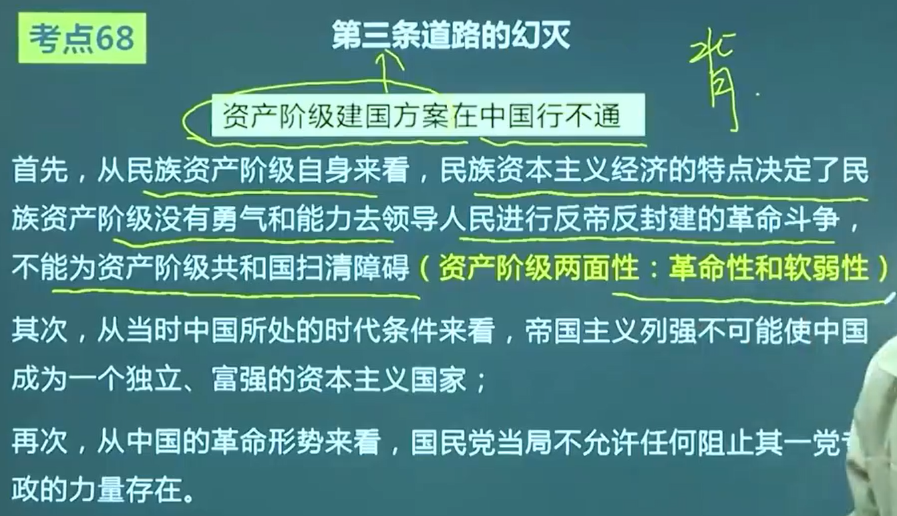

# 史纲
## 统一战线
| 时间 | 时期 | 标志性事件 |  统一战线 |
|:---:|:---:|:---:|:---:|
| 1925-1927 | 大革命时期 | 五卅运动   | 国民革命统一战线 (国共合作统一战线) |
| 1927-1937 | 土地革命战争时期 | 八七会议 | 工农民主统一战线 |
| 1937-1945 | 全面抗日战争时期 | 西安事变 | 抗日民族统一战线 |
| 1945-1949 | 解放战争时期 | 国民党进攻中原解放区 | 人民民主统一战线 |

 

## 毛泽东发表的文章
| 时期 | 时间 | 毛泽东发表的文章 | 核心观点 |
|:---:|---|:---:|:---:|
|大革命时期|1926年9月|《国民革命与农民运动》|“农民问题乃是国民革命的中心问题” “所谓国民革命运动，其大部分即是农民运动”|
|土地革命时期（早期）|1928年10月、11月|《中国的红色政权为什么能过够存在？》 《井冈山的斗争》|论证了红色政权能够长期存在并发展的主客观条件，提出 **工农武装割据** 的思想|
|土地革命时期（早期）|1930年1月|《星星之火，可以燎原》|进一步阐明了中国革命只能走与资本主义国家不同的道路 党的工作重心从城市转移到农村，在农村开展游击战争，深入进行土地革命，建立和发展红色政权，待条件成熟时再夺取全国政权的中国革命新道路的思想|
|土地革命（早期）|1930年5月|《反对本本主义》|1. 阐明了坚持 **辩证唯物主义的思想路线** 即坚持理论与实际相结合的原则的极端重要性【 **思想路线初步阐明** 】  2. 提出了“没有调查，没有发言权”和“中国革命斗争的胜利要靠中国同志了解中国情况”的重要思想|
|土地革命【后期】|1935年12月|《论反对日本帝国主义的策略》| 阐明党的 **抗日民族统一战线** ， **系统解决了党的政治路线** | 
|土地革命【后期】|1936年12月|《中国革命战争的战略问题》|中国革命战争战略|
|抗日战争时期|1937年夏|《实践论》《矛盾论》|1. 总结中国共产党的历史经验   2. 揭露和批评党内的主观主义尤其是 **教条主义错误**   3. 深入论证马列主义基本原理与中国具体实际相结合的原则   4. **【科学系统阐明党的思想路线】**|
|抗日战争时期|1938年5月或6月|《论持久战》|一方面，日本是强国，中国是弱国，决定持久战   另一方面，日本小国，发动落后的、野蛮的侵略战争，在国际上失道寡助；而中国大国，发动进步的、正义的反侵略战争，在国际上得道多助。
|解放战争时期|1949年6月30日|《论人民民主专政》|必须利用一切于国计民生有利而不是有害的城乡资本主义因素，团结民族资产阶级。但是民族资产阶级不能充当革命的领导者，也不应在国家政权中占主要的地位。经验就是，工人阶级（经过共产党）领导的以工农联盟为基础的人民民主专政。|
|社会主义初级阶段|1956年4月|《论十大关系》|开始探索中国自己的社会主义建设道路的标志——(马克思主义与中国道路 **第二次结合** 的开始)|
|社会主义初级阶段|1957年2月|《关于正确处理人民内部矛盾的问题》|第一，关于社会主义社会两类不同性质的社会矛盾（敌我矛盾+ **人民内部矛盾** 【主要】  ）   第二，关于社会主义社会的基本矛盾（生产力和生产关系 + 经济基础与上层建筑） 性质为 **非对抗性的**|
|社会主义初级阶段|1957年4月|《一九五七年夏季的形势》|“六又”政治局面（集中民主+纪律自由+又有统一意志又有个人心情舒畅、生动活泼的政治局面）| 

 

## 中共会议
|  会议  |  时期  |  时间  |  内容  |  意义  |
|---|---|---|---|:---:|
|中共一大|新民主主义革命时期|1921年7月|确定党的名称为“中国共产党”   通过了中国共产党第一个纲领，消灭阶级、废除资本私有制以及联合第三国际|①有了一个先进的、坚强的政党作为凝聚自己力量的领导核心   ②确立了目标：把实现共产主义作为党的最高理想和最终目标  ③深刻改变了近代以后中华民族发展的方向和进程；深刻改变了中国人民和中华民族的前途和命运；深刻改变了世界发展的趋势和格局|
|中共二大|新民主主义革命时期|1922年|第一次提出了反帝反封建的民主革命纲领，为中国人民指出了明确的斗争目标   采取群众路线|工人运动：  第一：1922年1月香港海员罢工为起点，1923年2月京汉铁路工人罢工为终点，掀起了第一次工人运动高潮 第二：1022年9月：安源路矿工人大罢工，中国共产党第一次独立领导并取得完全胜利的工人斗争|
|中共三大|新民主主义革命时期|1923年6月|党内合作，共产党员以个人名义加入国民党||
|八七会议|土地革命时期|1927年8月7日|第一：会议彻底清算了大革命后期的陈独秀右倾机会主义错误 第二：确定了 **土地革命和武装反抗国民党反动统治** 的总方针。 **土地革命** 是 **中国资产阶级民主革命** 的 **中心问题**   第三：政权是从枪杆子中取得的   第四：选出以瞿秋白为首的中央临时政治局 | 在中国革命处于严重危机情况下，八七会议的及时召开，并制定出继续革命斗争的正确方针，为挽救党和革命作出巨大贡献。 **中国革命从此开始了从大革命失败到土地革命战争兴起的转折** 。|
|古田会议|土地革命时期|1929年|纠正党内错误思想，确定了 **思想建党、政治建军原则**   **中国的红军是一个执行革命的政治任务的武装集团**   红军必须担负打仗、筹款和做群众工作的任务，必须加强政治工作 | 重要里程碑，创造性地解决了在农村环境中、在党组织和军队以农民为主要成分的条件下，如何保持党的无产阶级先锋队性质和建设党领导的新型人民军队的重大问题|
|遵义会议|局部抗日战争时期|1935年1月|解决了当时具有决定意义的军事问题和组织问题|1. 开始确立以毛泽东为代表的马克思主义的正确路线在中共中央的领导地位   2. 挽救了中国共产党、挽救了中国工农红军、挽救了中国革命   3. 是党的历史上一个生死攸关的转折点   4. 标志着中国共产党在政治上开始走向成熟|
|瓦窑堡会议①|局部抗日战争时期|1935年12月|1. 提出建立 **抗日民族统一战线** 的方针   2. 批评了党内长期存在的“左”倾冒险主义、 **关门主义** 的错误   3. 制定了抗日民族统一战线的策略方针| 为抗日战争的到来作了思想上和理论上的准备|
|瓦窑堡会议②|局部抗日战争时期|1935年12月| 提出党的 **抗日民族统一战线** 的新政策   1. 阐明建立抗日民族统一战线的可能性（3个阶级）   2. 批判了“左”倾关门主义错误，强调共产党在抗日民族统一战线中的领导作用   3. 建立广泛的抗日民族统一战线的具体政策，决定以“人民共和国”口号代表“工农共和国”| 为抗日战争的到来作了思想上和理论上的准备|
|瓦窑堡会议③|局部抗日战争时期|1935年12月|制定了“发展进步势力，争取中间势力，孤立顽固势力”的策略总方针| 进步势力：工人、农民、城市小资产阶级  中间势力：民族资产阶级、开明绅士和地方实力派   顽固势力：大地主、大资产阶级的抗日派（蒋介石为代表的国民党亲美英派）   贯彻 **又联合又斗争** 的政策，同顽固派作斗争时，坚持 **有理有节** 的原则  |
|洛川会议|全面抗日战争时期|1937年8月|制定了 **抗日救国十大纲领** ，强调要打倒日本帝国主义，关键在于使已经发动的抗战成为 **全面的全民族的抗战**||
|六届六中全会|全面抗日战争时期|1938年9月至11月|《论新阶段》的政治报告，毛泽东首先明确提出了“马克思主义中国化”的命题|延安整风运动成为全党共识|
|六届七中全会|全面抗日战争时期|1945年|通过《关于若干历史问题的决议》，运用了辩证唯物主义和历史唯物主义对党的斗争历史经验和教训作了科学总结和概括（肯定毛泽东代表的马克思列宁主义路线，肯定刘少奇的正确路线、清算王明“左倾”思想）|标志着整风运动的胜利结束，为党的第七次全国代表大会的胜利召开在思想上作了充分准备|
|中共七大|全面抗日战争时期|1945年4月20日|《论联合政府》和《愚公移山》报告，确定了党的政治路线，总结党建设的历史经验，三大作风（理论和实践、和人民群众紧密地联系在一起、自我批评），正式命名“毛泽东思想”，并将其确立为党的指导思想并写入党章|马克思主义中国化的第一次飞跃|
|中共七届二中全会|解放战争时期（后期），建国前夕|1949年3月|内容有：   （1）提出迅速夺取全国胜利的方针   （2）党的工作重心必须从乡村转移到城市   （3）指出中国由农业国转变为工业国、由新民主主义社会转变为社会主义社会的总任务和主要途径   （4）提出“两个务必”思想，即“务必使同志们继续地保持谦虚、谨慎、不骄、不躁地作风，务必使同志们继续地保持艰苦奋斗的作风”||
|中国人民政治协商会议第一次全体会议|建国前夕|1949年9月|会议通过了《中国人民政治协商会议组织法》《中华人民共和国中央人民政府组织法》《中国人民政治协商会议共同纲领》   《共同纲领》为 **临时宪法**||
|中共八大|社会主义初级阶段|1956年9月|（1）国情：社会主义制度在我国已经基本上建立起来；  （2）国内主要矛盾：人民对于经济文化迅速发展的需要同当前经济文化不能满足人民需要的状况之间的矛盾；   （3）主要任务：集中力量发展社会生产力，实现国家工业化，逐步满足人民日益增长的物质和文化需要；   （4）方针：既反保守又反冒进，在综合平稳中稳步前进的方针；   （5）思想：陈云提出“三个主体，三个补充”的思想，即国家经营和集体经营是主体，一定数量的个体经营为补充；计划生产为主体，一定范围的自由生产为补充；国家市场是主体，一定范围的自由市场为补充。   （6）中共八大后，1956年12月，毛泽东提出，可以消灭了资本主义，又搞资本主义，称作“新经济政策”。||
|中共十一届三中全会|社会主义初级阶段|1978年11月|会议前召开的中共中央工作会议，邓小平发表《解放思想，实事求是，团结一致向前看》的重要讲话，把解放思想、实事求是，坚持实践标准提到党的思想路线的高度，为冲破“两个凡是”禁锢，克服思想僵化状态，重新确立党的思想路线 奠定了基础 ，因而成为开辟中国特色社会主义新道路、开创中国特色社会主义新理论的 宣言书| 会议形成了以邓小平为核心的党的中央领导集体，揭开了社会主义改革开放的序幕。中国进入了改革开放和社会主义现代化建设的历史新时期。|
|中共十一届六中全会|社会主义初级阶段|1981年|①通过了《关于建国以来党的若干历史问题的决议》，科学地评价了毛泽东和毛泽东思想的历史地位   ②对毛泽东思想的科学体系和活的灵魂（即 **实事求是**、**群众路线**、**独立自主** ）做了实质上概括   ③初步提出了在中国建设什么样的社会主义和怎样建设社会主义的问题| 决议的通过，标志着党在指导思想上拨乱反正的胜利完成 |
|中共十二大|社会主义初级阶段|1982年|①第一次提出了“建设有中国特色的社会主义”命题。这一重大崭新命题，回答了进入改革开放新时期后走什么样的道路这一全党和全国人民最为关心的重大问题，成为指引改革开放和社会主义现代化建设的伟大旗帜。  ②大会提出党在新的历史时期的总任务。这是党中央在总结历史经验基础上作出的一个历史性决策。||
|十二届三中全会|社会主义初级阶段|1984年|指出我国社会主义经济是在公有制基础上的有计划的商品经济||
|中共十三大|社会主义初级阶段|1987年|①第一次比较系统地阐述了关于社会主义初级阶段的理论，明确概括和全面阐发了党在社会主义初级阶段的基本路线   ②制定了经济体制改革和政治体制改革的基本任务和奋斗目标，**制定了“三步走”的发展战略** 。| **第一次对中国特色社会主义理论进行系统的概括，也标志着邓小平理论轮廓的形成。** |
|南方谈话|社会主义初级阶段|1992年| ①计划和市场都是经济手段，不是社会主义与资本主义的本质区别。  ②阐明了社会主义本质。社会主义的本质，是解放生产力，发展生产力，消灭剥削，消除两极分化，最终达到共同富裕。  ③提出了“发展才是硬道理”的重要论断。  ④提出了判断改革开放和各项工作成败得失的“三个有利于”标准。  ⑤强调加强党的建设。  ⑥关于社会主义初级阶段的长期性和前途。|南方谈话是邓小平理论的集大成之作，从理论上深刻回答了当时困扰和束缚人们思想的一系列重大问题，推进改革开放和社会主义现代化建设进入新阶段，**邓小平理论也逐步走向成熟**。|
|中共十四大|社会主义初级阶段|1992年| **明确以建立社会主义市场经济体制为我国经济体制改革的目标** ||
|中共十五大|社会主义初级阶段|1997年|①将邓小平理论，同马克思列宁主义、毛泽东思想一道确立为中国共产党的指导思想，并写入修改后的《中国共产党章程》  ② **确立党在社会主义初级阶段的基本纲领**。||

## 不同时期的土地政策

|时期|土地政策|对待各个阶级的态度|是否是“耕者有其田”|
|---|---|---|---|
|太平天国|《天朝田亩制度》|  |  |
|辛亥革命（孙中山）|三民主义（民生主义），平均地权|
|大革命时期|新三民主义（“平均地权，节制资本”）| | ✔ |
|土地革命|《井冈山土地法》  **《兴国土地法》** |坚定依靠贫农、雇农 联合中农  限制富农  保护中小工商业者 消灭地主阶级| ✔ |
|抗日战争时期|。。。|减租减息，发展生产（土地政策）   1. 一方面，地主要减租减息以改善农民的生活   2. 另一方面，农民要交租交息以照顾地主、富农的利益    削弱封建土地剥削 |  ×  |
|解放战争时期|《五四指示》|采取各种适当方法，使地主阶级剥削农名而占有的土地转移到农民手中   绝不可侵犯中农土地   一般不变动富农土地（征收富农多余土地）    废除封建土地剥削  |✔|
|解放战争时期|《中国土地法大纲》|废除封建土地制度；乡村中一切地主的土地及公地，由农村农会接收|✔|
|新中国成立|《中华人民共和国土地改革法》|废除地主阶级封建剥削的土地所有制，实行农民的土地所有制   保存富农经济|

 

## 第三条道路的幻灭

 

## 两次国共合作的区别
|合作|阶级构成|合作方式|共同纲领|
|---|---|---|---|
|第一次国共合作|工农、小资、民资|无政权合作、无军队合作|新三民主义|
|第二次国共合作|工农、小资、民资、亲英美派大地主大资产阶级|有政权和军队的合作|无共同纲领，临时协商|

 

# 毛中特

### 中国革命的三大问题： 
- 首要问题：分清敌友
- 基本问题：农民问题
- 中心问题：无产阶级的领导权

---

新民主主义革命道路——农村包围城市、武装夺取政权的道路  
根本在于处理 **土地革命** 、 **武装斗争** 、 **农村革命根据地建设** 三者之间的关系。  
- 土地革命：基本内容
- 武装斗争：主要形式
- 农村革命根据地建设：依托

---

### 新民主主义革命的三大法宝：
1. 统一战线
    - 必要性
      - 一方面，是由中国半殖民地半封建社会的阶级状况所决定的。（两头小中间大，无产阶级和地主大资产阶级只占少数，最广大的人民是农民、城市小资产阶级等）
      - 另一方面，建立最广泛的统一战线，也是由中国革命的长期性、残酷性及其发展的不平衡性所决定的。
    - 可能性
      - 无产阶级及其政党利用这些矛盾建立和发展统一战线提供了可能性。（统一战线两个联盟：工农联盟、与民族资产阶级的联盟）
2. 武装斗争
3. 党的建设

---

###  总路线
| 时期  | 总路线  |  文章或会议  |
|---|---|:---:|
| 新民主主义时期  | 无产阶级领导的，人民大众的，反对帝国主义、封建主义和官僚资本主义的革命  | 第一次提出新民主主义革命的科学概念和总路线的内容：《中国革命和中国共产党》    完整表述总路线的内容：《在晋绥干部会议上的讲话》 | 
| 社会主义改造阶段（过渡时期） | 一化三改：社会主义工业化，对个体农业、手工业和资本主义工商业的社会主义改造| 1953年6月中央政治局会议|
| 社会主义初级阶段（如今） | 一个中心、两个基本点   一个中心，指以经济建设为中心；  两个基本点，指坚持四项基本原则，坚持改革开放  | 1987年中共第十三次全国代表大会 |

### 邓小平理论的形成条件
1. 时代背景：和平与发展成为时代主题
2. 历史根据：社会主义建设的经验教训
3. 现实依据：改革开放和现代化建设的实践

### 邓小平理论的形成过程
1. 十一届三中全会
2. 十二大
3. 十三大
4. 南方谈话
5. 十四大
6. 十五大

### 思想的区别
| 思想 | 活的灵魂 | 精髓 |
| --- | --- | ---|
| 毛泽东思想 | 实事求是、群众路线、独立自主 | 实事求是 |
| 邓小平理论 | 解放思想、实事求是 | 解放思想、实事求是 |

### 社会主要矛盾的演变
新中国成立前我国社会的主要矛盾主要是：人民大众与帝国主义、封建主义和官僚资本主义的矛盾。

新中国成立后我国社会主要矛盾的演变主要经历了五个发展阶段：
  1. 一是新中国成立到土地改革完成前，我国社会主要矛盾是 **人民大众同帝国主义**、**封建主义和国民党残余势力之间** 的矛盾。
  2. 二是从1953年到1956年底，随着土地改革完成，**无产阶级和资产阶级的矛盾** 逐步成为国内的主要矛盾。这一主要矛盾的解决方式就是进行社会主义改造。
  3. 三是社会主义改造基本完成后，党的八大指出：我们国内的主要矛盾，已经是 **人民对于建立先进的工业国的要求同落后的农业国的现实之间的矛盾**，已经是人民对于经济文化迅速发展的需要同当前经济文化不能满足人民需要的状况之间的矛盾。
  4. 四是1981年，党的十一届六中全会通过的《关于建国以来党的若干历史问题的决议》对我国社会主要矛盾作了规范表述：“在社会主义改造基本完成以后，我国所要解决的主要矛盾，是 **人民日益增长的物质文化需要同落后的社会生产之间的矛盾**。”
  5. 五是2017年10月，党的十九大明确提出：“我国社会主要矛盾已经转化为 **人民日益增长的美好生活需要和不平衡不充分的发展之间的矛盾**。”