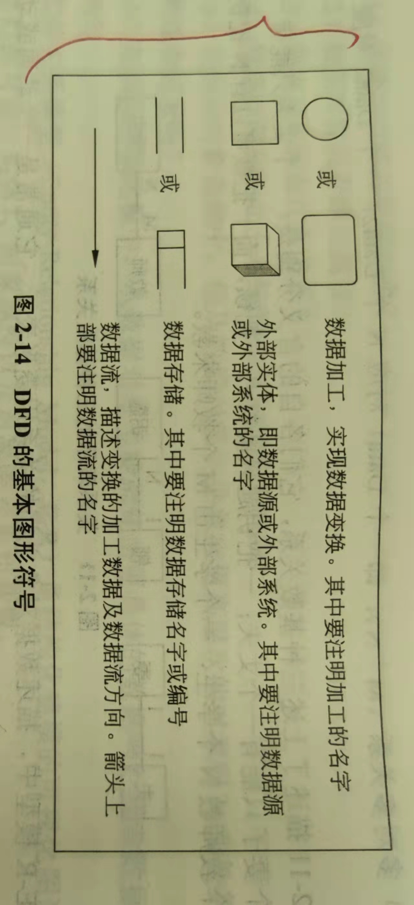
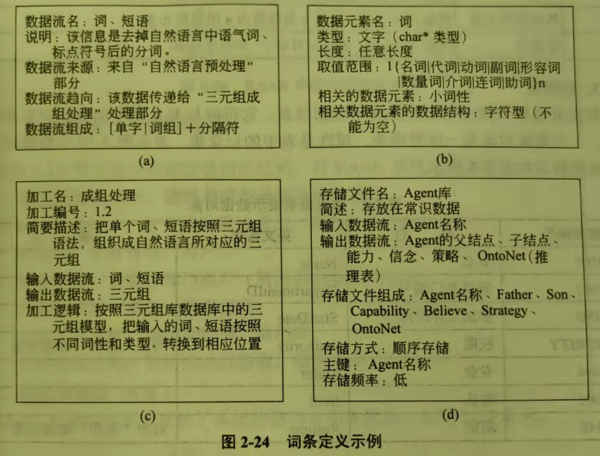
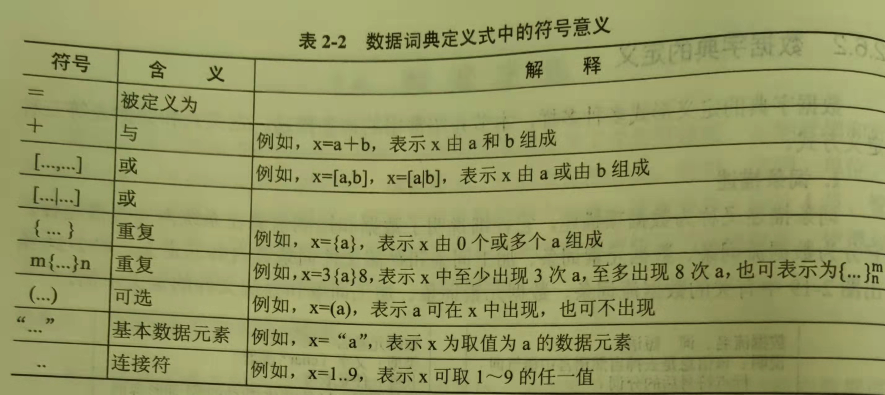
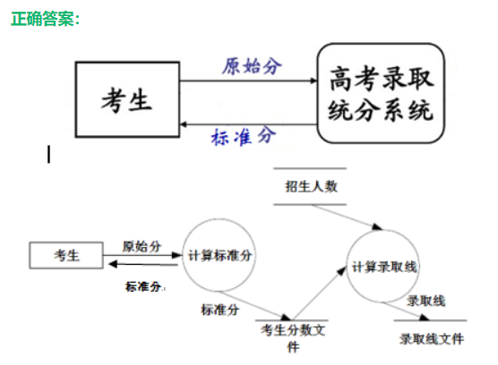
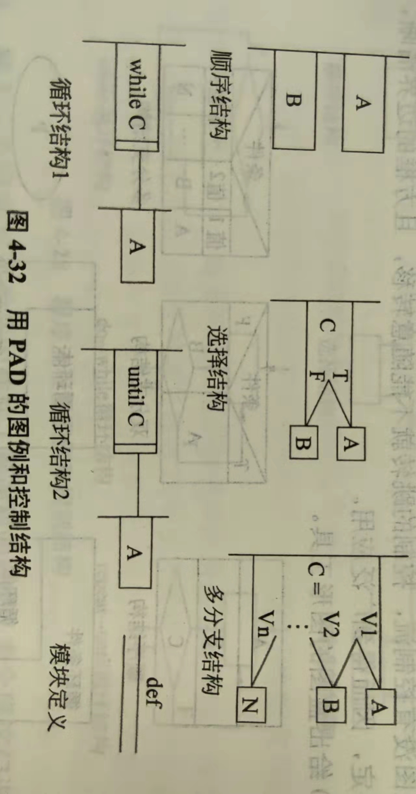
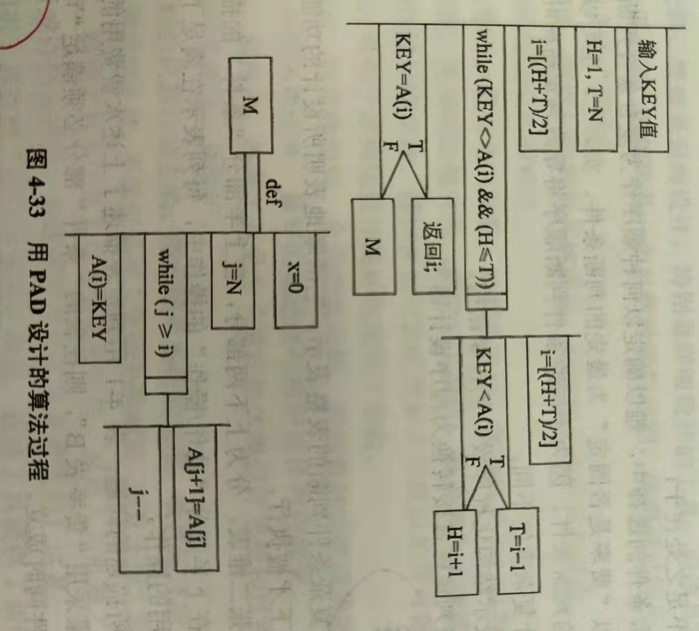

# 第一章 软件工程概述
## 1.1 软件工程的发展历程
**软件危机是指在计算机软件的开发和维护过程中所遇到的一系列严重问题。**  
严重问题主要表现在以下几个方面：
1. 软件开发进度和成本难以控制
2. 软件产品难以满足用户的需求
3. 软件质量难以得到保证
4. 软件产品难以进行维护
5. 软件的文档资料难以管理
6. 软件产品的生产率难以得到提高

**软件危机出现的原因**

1. 对软件开发缺乏正确的理论指导
2. 软件人员与用户缺乏充分交流
3. 对软件开发过程缺乏整体认识
3. 对软件产品缺乏有效一致的质量评价标准

## 1.2 软件工程的概念
软件工程定义：应用计算机科学理论和技术以及工程管理原则和方法，按预算和进度，实现满足用户要求的软件产品的定义、开发、发布和维护的工程或进行研究的科学

软件工程包括三个要素：方法、工具和过程

软件工程的目标是跟踪最新的软件技术发展，修改并制定新的软件开发活动规则，提高和规范软件管理的效率和可操作性，确保软件质量，提高软件生产率，开发出满足用户需求、并最终实现软件的工业化生产。

软件质量由诸多要素衡量：可理解性，功能性，安全性，可靠性，有效性，可扩充性，可维护性，可重用性，可移植性

软件工程实施原则：
1. 做好全面的用户需求分析
2. 选取适宜的开发模型
3. 采用成熟的设计方法
4. 选择高效的开发环境
5. 保证有效的维护过程
6. 重视软件过程管理

## 1.3 软件与软件过程
软件的概念：软件是计算机中与硬件相互依存的另一部分，它包括程序、数据以及相关文档的完整集合。

软件的特点：
1. 软件是逻辑实体而非物理实体
2. 软件是智力产品，生产的过程主要集中在研发上
3. 软件永不磨损，但它会退化，直至被放弃使用
4. 软件开发远未达到软件工程目标所提及的产业化生产
5. 软件越来越复杂，今后将会更加复杂

软件分类：
1. 系统软件：管理计算机所有物理资源
2. 支撑软件：辅助其他软件开发或维护的软件，又称为工具软件或软件开发环境，主要包括数据库连接和数据管理(SQL Server)、程序集成开发环境(Visual Studio)、软件工程辅助开发环境(Visio)，以及其他的系统工具
3. 实时软件：满足严格时间约束条件
4. 嵌入式软件：运行在芯片中的操作系统或开发工具
5. 人工智能软件
6. 应用软件

软件生命周期：
是从可行性分析与计划开始，经过需求分析、设计、实现、测试以及运行和维护等一系列活动，直至报废的时间周期。
1. 可行性与计划阶段
>两个问题：“要解决的问题是什么”+“这个问题是否有解，是否值得解”
2. 需求分析阶段
>主要包括问题定义、需求获取和需求验证
3. 设计阶段
>概要设计（软件结构、全局数据结构、数据库结构和接口）+详细设计（各模块的具体实现算法和彼此的调用关系）
4. 实现阶段
>编码
5. 测试阶段
>单元测试，集成测试，系统测试，确认测试分别对应实现阶段（详细设计），设计阶段（概要设计），需求阶段（需求分析），可行性分析阶段
6. 运行和维护阶段
>软件维护时软件生命周期中最长的阶段，伴随软件的使用而一直存在。主要类型包括（完善性维护、纠错性维护、适应性维护、预防性维护）


```
>可行性分析与计划------------------->系统测试  
>    需求分析------------------>确认测试  
>        概要设计----------->集成测试  
>            详细设计---->单元测试  
>                    编码
```

## 1.4 软件过程模型
软件过程模型，又称软件生命周期模型

1. 瀑布模型  
过程自顶向下，各阶段既相互分离，又相互依赖。  
**一次性单向开发**，难以适应软件需求不明确或出现变动的情况。

2. 原型模型  
**原型模型方式实际上一个大大压缩的瀑布模型。**  
由于最初的原型模型可能离用户最终的系统差别很大而被抛弃，因此原型模型**不适宜开发大型软件项目**，而且被抛弃的系统原型模型的开发成本也影响到原型模型的采用。

3. 增量模型
增量模型是对软件项目的需求以一系列增量方式来开发，也称为增量式开发模型。  
增量模型是一种非整体开发模型，对于系统整体需求，增量模型先将需求分解为若干部分，**每部分都按照瀑布模型进行开发**。  
每次提交的是软件的部分功能。

4. 螺旋模型  
原型模型与瀑布模型相结合，引入了风险分析机制，**适合大型复杂项目的开发**。  
特别适合大型复杂系统的开发，能及时发现开发过程中出现的风险，并能尽早规避风险，或给出消除风险的方案。

## 1.5 软件开发方法
>- 结构化开发方法   
>也称面向功能的软件开发方法或面对数据流的软件开发方法   
>首先提出用结构化分析（SA）对软件进行需求分析，之后用结构化设计（SD）方法进行系统设计，最后用结构化编程（SP）实现软件。

>- 面向对象开发方法  
>面向对象=对象+类+继承+消息

# 第二章 软件需求工程
需求分析的原则：
1. 软件人员要从用户角度考虑软件需求
2. 以流程为主线
3. 尽量重用
4. 划分需求的优先级
5. 需求变更要及时反馈

需求分析的内容：
1. 功能需求
2. 性能需求
3. 领域需求
4. 其他需求

可行性分析的内容：
1. 经济可行性
2. 技术可行性
3. 操作可行性
4. 法律可行性

## 2.5 结构化需求分析和建模
### 2.5.1 概述
结构化需求分析的核心是数据。围绕数据字典，完成功能模型、数据模型和行为模型的结构化建模过程。
- 实体关系模型主要描述数据建模过程
- 数据流图完成对功能、操作流程的抽象和分解，完成功能建模。
- 状态转换图是系统的行为建模，针对系统中的某个核心数据（对象）通过外部事件或条件触发，导致该数据（对象）的状态发生改变
### 2.5.2 面向数据的数据建模：（Entity-Relationship，E-R图）  
>实体关系模型（E-R图）是结构化模型的可视化图形工具，它描述数据对象（实体）、对象属性以及对象间关系和基数

### 2.5.3 面向数据流的功能建模：（Data Flowing Diagram，DFD图）  
>数据流图（DFD）是结构化建模中最流行的功能建模工具，描述从数据输入、数据转换到数据输出的全过程。可以对DFD分层，分层的DFD更进一步刻画了系统的功能分解。
>
>
>
>最上层的DFD称为顶层或0层DFD，又称语境模型，因为它反映的是与系统交互的外部系统或用户。随着系统功能的逐步分解，DFD也逐层细化。1层DFD描述系统各部分（子系统）间数据转换关系。
>
>DFD分层的思想是：**自外向下，自顶向下，逐层细化，逐步精化**

### 2.5.4 面向状态转换的行为建模（Status Transition Diagram，STD）
>1. 状态转换图（STD）：  
>通过扫描系统状态及引起状态转换的事件来表示系统行为。STD同时也反映了事件执行的行为。STD主要由状态、转换和事件的图形符号。
>
>状态是可观察到的行为，是同一数据对象在系统的不同运行时刻所具有的行为属性值，是事件触发后一系列动作的结果。
>STD中的状态分为初态、终态、中间状态和复合状态。
>- 初态：STD的起点，一个STD仅有一个初态，用实心原点表示。
>- 终态：STD的终点，一个STD可以有多个终态，用实心原点和外部圆圈表示。
>- 中间状态：是STD临时的或永久的（存储过程）状态，它包括**名字、状态变量和活动**。状态变量描述状态属性，活动是该状态转换到下一状态时，要执行的事件或动作。
>- 复合状态：也称超级状态，它是多种状态的集合，可以进一步细化。复合状态实际上包括了许多触发事件，需要有详细的需求描述。

>2. 加工逻辑  
>加工逻辑又称过程说明，用于描述DFD中加工部分的流程或算法。加工逻辑的形式主要有过程描述语言、判定树和判定表等。
>过程描述语言（Procedural Description Language，PDL）也称为伪码语言（PL）
>- 顺序结构
>- 选择结构
>- 循环结构
>- 程序注释

## 2.6 数据字典（Data Dictionary，DD）：  
定义方式：
- 词条描述
>词条描述又称为数据项描述，它详细说明了数据和控制信息在系统内的传播途径。它分为数据流词条、数据元素词条、加工词条和存储文件词条等内容的定义。


- 定义式
>如果定义的数据或控制信息具有良好的数据结构，借助（BNF）来清晰、准确、无二义性地定义数据。



- 数据表
>数据表是以二维表的形式来表示数据信息，它可以与E-R图中的数据对象和属性相对应。一个数据对象是一张表，属性是表中的记录集。


- 有一个简化的高考录取统分系统，其主要功能包括计算标准分和计算录取线分。计算标准分是根据输入的考生原始分来计算，并将该标准分保存在考生分数文件中,并通知考生。计算录取线分是根据标准分招生来计算，并将录取线保存在录取线文件中。请根据上述描述，画出该系统的数据流图(至少含两层数据流图)。


# 第三章 软件设计基础
1. 概要设计

    概要设计也称总体设计，主要任务是基于数据流图和数据字典，确定系统的整体软件结构，划分软件体系结构的各子系统或模块，确定他们之间的关系。

    概要设计就是要完成**体系结构设计、界面设计和数据设计。**
    - 体系结构设计：确定各子系统模块间的数据传递与调用关系。**在结构化设计中体现为模块划分**，并通过数据流图和数据字典进行转换。
    - 界面设计：包括与系统交互的人机界面设计，以及模块间、系统与外部系统的接口关系。在结构化设计中，根据数据流条目，定义模块接口与全局的数据结构。
    - 数据设计：包括数据库、数据文件和全局数据结构的定义。在结构化设计中，通过需求阶段的实体关系图与数据字典建立数据模型。

2. 详细设计

    详细设计的任务是在概要设计的基础上，具体实现各部分的细节，直至系统的所有内容都有足够详细的过程描述，使得编码的任务就是将详细设计的内容“翻译”成程序设计语言。

    详细设计的任务就是完成过程设计。

    过程设计包括确定软件各模块内部的具体实现过程与局部数据结构。在结构化设计中，模块独立约束了数据结构与算法相分离的情况，使得两者在设计时必有局部性，减少外部对两者的影响。

3. 模块化设计
    
    模块是程序语言的集合，它拥有独立的命名，以及明确的输入、输出和范围。

- 软件的模块化与分解

- 抽象

    抽象是指对软件设计不同层次的理解，它与分解是解决问题的两个不同方面。分解是对问题细节的表述，抽象则忽略问题的细节，抓住问题的本质。抽象根据对象类型的不同，分为对**实体对象抽象、接口抽象和设计模式抽象**。

- 信息隐藏：封装

- 模块独立性：
>模块独立性由**模块化、分解与抽象、信息隐藏**等要素共同构成。模块独立性是指在软件系统中划分的模块完成一个相对独立的功能，而与其他模块的关联尽量只发生在接口上。因此，**独立性是良好设计的关键，是衡量软件质量的重要指标之一**。
>
>**模块独立性由内聚性和耦合度两个指标来评价**，他们分别描述模块内部和模块间的紧密程度。模块内关联度越高，模块间相关性越低，模块独立性就越强。

>- 内聚性  
>内聚性是指数据内数据与操作之间的紧密。内聚性越强，模块内部元素的关系越紧密，模块独立性越强。  
>内聚性共分为七类：
>1. 偶然内聚:是指模块内的功能因为一些偶然的因素聚集在一起
>2. 逻辑内聚：将逻辑上相关的功能放在同一模块内，由模块参数来决定执行哪一个功能
>3. 时间内聚：各个任务间彼此并无联系，但由于需要在同一时间运行而聚集在一起。典型情况是系统的初始化操作。
>4. 过程内聚：模块内部必须按照过程描述，在同一模块自上而下地组织各任务。如“文件”的“打开/预读”操作在同一过程内完成，保证打开文件的同时，就将初步信息预读到指定位置：“保存/关闭”操作也在同一过程内执行，保证数据保存后自动关闭数据文件
>5. 通信内聚：模块中各成分引用共同的数据，即模块内的功能使用同一输入数据，或共同输出同一数据
>6. 顺序内聚：在模块的各部分中，前一部分的输出是下一部分的输入，它们彼此具有较高的依赖性
>7. 功能内聚： 模块内各部分共同完成一个具体的功能，它们之间紧密联系，不可分割，具有最高的内聚性。
```
       内聚性
低               高
------------------>
偶 逻 时 过 通 顺 功
然 辑 间 程 信 序 能
------------------>
低               高
     模块独立性
```

>- 耦合度  
>耦合度是指模块间的紧密程度。耦合度越低，模块间的紧密程度越松散，模块独立性越强。  
>耦合度共分为六类：
>1. 非直接耦合
>2. 数据耦合
>3. 特征耦合
>4. 控制耦合
>5. 公共耦合
>6. 内容耦合

```
     耦合度
低             高
--------------->
非 数 特 控 公 内
直
接 据 征 制 共 容
--------------->
高             低
   模块独立性
```

- 启发式规则:  
>软件模块化设计的启发式规则，能给软件设计有用的启示，帮助改进软件设计，提高软件质量
>1. 改进软件结构，提高模块独立性
>2. 模块规模适中
>3. 软件结构的宽度、深度、扇出度和扇入度都应适中
>    - 宽度：软件结构中同一层次上的模块数目的最大值。宽度越大，软件复杂度就越高。
>    - 深度：软件结构中同一模块能控制的最深的层数。深度越大，模块分家也就越细，软件复杂度也就越高。
>    - 扇出度：软件结构中同一模块能直接调用的其他模块数目。模块的扇出度越大，说明该模块的控制结构就越复杂。
>    - 扇入度：软件结构中模块被直接调用的模块数目。模块的扇入度越大，说明该模块被共享的次数越多，则该模块的独立性也越强。
>4. 模块的作用域应在模块控制域之内
>5. 设计单入口、单出口的模块，并力争降低模块接口的复杂度
>6. 模块功能可以预测

4. 界面设计

基本原则：
- 提供网页导向
- KISS原则
- 页面设计的个性化

黄金三原则： 
- 置用户于控制之下
- 减少用户的记忆负担
- 保持界面一致

# 第四章 结构化设计方法
## 4.1 结构化设计方法的概述
结构化设计的基础是模块。

结构化设计的基本思想：基于模块独立性和信息隐藏原则，自顶向下，逐步求精，分解与抽象相结合，并应用结构化程序设计技术而进行的软件设计。

结构化设计以数据流图为基础，根据对数据流图理解的不同，以及对数据流图自动边界划分的不同，分为变换分析法、事务分析法和混合分析法。
1. 变换分析法  
>在数据流图中（特别是顶层数据流图），基本的系统数据流经过输入、系统变换、输出，完成对数据的分析处理。

2. 事务分析法  
>事务分析法是特殊的变换分析法，其典型特征是在数据流图的中心有一个“事务中心”，它处理从多条变换输出路径中选择一条活动路径。
>
>基于数据流图分析出数据流的事务中心，并以此为基础进行软件体系结构设计的方法就是事务分析法。

3. 混合分析法
>按照结构化设计中分解的思想，上层数据流图整体反映一个主题：即变换流或事务中心。在对数据流图分解的下层图或各条路径活动中，再确定变换流或事务中心。如此往复迭代，形成混合分析法。

## 4.2 面向数据流的设计方法
面向数据流的设计（DOFD）是基于数据流图自顶向下、逐层分解的过程，它将各级数据流图映射为软件结构图中对应的各层次模块，体现了结构化设计和结构化分析的相互衔接，也体现了自顶向下的模块化设计思想。

### 4.2.1 层次图和结构图
1. 层次图
2. 结构图

### 4.2.2 变换分析法
1. 复审并精化数据流图
2. 划分自动化边界，确定数据流特征，判断数据流是变换流还是事务流
3. 划分数据输入输出边界，分离出处理部分
4. 执行一级分解
>输入模块（子系统），包括所有输入部分，以及经过简单变换的数据和信息  
>输出模块（子系统），包括所有输出部分，以及经过简单变换的数据和信息  
>控制模块（子系统），除输入、输出部分以外的变换操作
>
>MC：主控模块，完成对整个系统的调度、数据传递、I/O操作等功能  
>MI：输入流模块，接受并初步转换所有输入数据   
>MO：输出流模块，产生符合用户需求的输出数据  
>MT：交换流控制模块，对软件内部形式的数据进行加工和处理  
5. 执行二级分解：把一层分级而得到的各子系统模块按照各层数据流图逐层细分，得到系统结构图的原型。
6. 采用启发式规则，精化所得到的初步软件结构，以模块独立性为原则，合并、分解、抽取各模块，得到一个高内聚、低耦合、易实现、易测试、易维护的软件结构图。

### 4.2.3 事务分析法
1. 复审并精化数据流图
2. 确定数据流图特征
3. 设定自动化边界，分离出事务中心和事务路径
4. 执行一级分解
>事务分析法整体结构是两层模式。顶层是系统主控模块，第二层分别是输入模块和事务调度模块。调度模块是事务中心，它的各条活动路径是调用的各事务。
>
>MC：事务中心  
>MI：输入模块  
>H：调度   
5. 执行二级分级
6. 利用启发式规则，精化所得到的初步软件结构

### 4.2.4 混合分析法

## 4.4 结构化详细设计的工具

程序流程图 PDF

盒图 NS

问题分析图 PAD


判定树

判定表

# 第五章 软件实现（自学内容）

# 第六章 软件测试
## 6.1 软件测试基础
>软件测试是在一定软件环境下，以最小的成本来验证系统能否按照需求正确运行，并尽可能多地发现存在的错误。

>软件测试的目的是发现程序中的错误，它既不找出错误发生的位置，也不分析出错的原因。
- 一个好的测试用例和过程可能发现一个尚未发现的错误
- 一个成功的测试用例是发现了一个尚未发现的错误

软件测试原则
1. 应尽早地和不断地进行测试
2. 开发人员应尽可能避免参加测试
3. 注重测试用例的设计和选择
4. 增量式测试
5. 充分注意测试的群集现象
6. 合理安排测试计划，严格执行测试计划
7. 全面统计和分析测试结果
8. 保留测试文档，并及时更新

软件测试技术分类
1. 静态测试和动态测试

- 静态测试的测试对象包括源程序和文档
    - 桌面检查
    - 代码检查
    - 代码走查

- 动态测试的测试对象为源程序
    - 白盒测试：模块内部逻辑结构，实现细节
    - 黑盒测试：把模块作为一个整体进行测试。模块功能是否符合设计，运行是否能正确调用
>就源程序而言，静态是指不运行程序就找出程序中存在的错误，动态是通过运行程序而发现存在的错误。

## 6.2  白盒测试
白盒测试又称为结构测试、逻辑驱动测试或基于程序的测试，是指用于测试代码是否按照设计正确运行的验证技术。它需要详细设计文档作为测试配置

基于设计原则，分为逻辑覆盖、循环测试和路径测试

### 6.2.1 逻辑覆盖
逻辑覆盖是指对程序设计中的逻辑判断条件进行的测试

1. 语句覆盖：最弱
2. 判定覆盖
3. 条件覆盖
4. 判定/条件覆盖
5. 条件组合覆盖
6. 点覆盖
7. 边覆盖

### 6.2.2 循环测试
1. 简单循环
2. 顺序循环
3. 嵌套循环

### 6.2.3 路径测试
测试用例保证测试路径在测试过程中至少被执行一次，而且每个判定分支都至少执行一次

## 6.3 黑盒测试
黑盒测试又称为功能测试或行为测试，只要根据设计说明中的功能设计来测试程序是否按预期实现

### 6.3.1 等价类划分
- 有效等价类
- 无效等价类

### 6.3.2 边界值分析
有效等价类和无效等价类的边界

### 6.3.3 错误推测法
根据测试人员的经验和直觉来推测程序中可能存在的各类错误

### 6.3.4 因果图法

## 6.5 软件测试策略

### 6.5.1 单元测试
单元是软件测试过程中最小的测试单位
- 内容
    - 模块接口
    - 局部数据结构
    - 执行路径
    - 边界条件
    - 异常处理

- 策略
辅助模块（驱动模块 or 桩模块）+被测模块

### 6.5.2 集成测试
集成测试是指在完成单元测试后，将各单元模块依据设计的软件系统结构，按照一定的集成测试策略进行组装的过程。一般情况下，集成测试需要系统概要设计规格说明。
- 内容
    - 各模块间的数据传递是否会丢失
    - 各模块间的数据传递是否按照期望进行传递
    - 各模块组装后，是否能实现所期望的更复杂的功能
    - 各模块组装后，是否出现对全局数据结构、公共数据操作的混乱，以及资源的竞争
    - 各模块组装后，集成的误差是否会被快速放大，直至难以接受

- 策略
    - 非渐增式集成：模块一次性组装
    - 渐增式集成：分为自底向上和自顶向下（深度优先集成）的集成

### 6.5.3 确认测试
确认测试也称为验收测试，是指模拟用户实际操作的环境下（或开发环境下），运用黑盒测试法验证软件有效性是否符合需求。

确认测试阶段发现的错误和问题，与需求分析密切相关。

### 6.5.4 系统测试
1. 系统测试的范围
    - 功能
    - 性能
    - 压力
    - 容量
    - 安全
    - 文档
    - 恢复性
    - 备份
2. α和β测试
- α测试是在开发环境下，由用户和软件开发人员、测试人员共同对系统进行的测试
- β测试是在系统实际用户使用环境下进行的测试，并且整个测试过程都是用户独立进行，不受开发人员和测试人员的影响

## 6.6 调试
软件调试方法
- 试探法
- 归纳法
- 演绎法
- 回溯法

# 第十章 软件维护

>软件维护的分类：
>- 完善性维护
>- 纠错性维护
>- 适应性维护
>- 预防性维护

>软件维护方式：
>- 非结构化维护
>- 结构化维护

>软件维护评审：
>- 软件工程生命周期的各阶段
>- 进行明确的质量保证审查
>- 软件维护过程管理